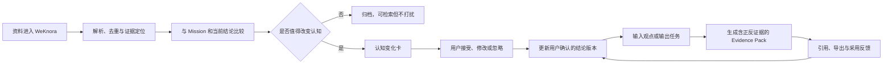

# PRD：FlyWiki 垂直认知顾问（体验验证版）

- 版本：v0.2
- 日期：2026-07-22
- 状态：产品发现 / 本地 Demo 待开发
- 首个垂直领域：AI Agent 与科技产业研究

## 1. Summary

FlyWiki 不应再做一个通用知识库，也不应把“自动生成更多 Wiki 页面”作为核心价值。产品应定位为：

> 面向需要持续研究和输出的个人专业用户，围绕一个明确的知识任务，持续把新资料压缩为认知变化，并在写作或决策时生成可核验、可引用、包含反方证据的证据包。

产品解决三个连续问题：

1. **没时间看和整理**：系统摄取资料、去重、初步理解，只推送会改变当前认知的重要内容。
2. **看过但依然模糊**：系统维护“当前结论—争议—未知”的主题认知，而不是只生成摘要和页面。
3. **输出时重新找证据**：用户从观点或提纲出发，系统组织支持、反驳、限制条件和背景证据，并定位到原文。

首个 Demo 不做心理咨询、投资建议或大型企业知识平台。选择“AI Agent 与科技产业研究顾问”，原因是：

- 可直接复用现有 WeKnora 的 FLY 知识库和用户已有研究资料；
- 用户有真实、持续的产品研究与观点输出任务；
- 相比医疗心理和证券投资，早期验证的合规与误导风险更低；
- 后续可以把验证过的认知循环复制到其他垂直领域。

一句话定位：

> FlyWiki 不是替你收藏更多，而是告诉你哪些新信息值得改变看法，并把改变后的看法连同证据交付给你。

## 2. Contacts

| 角色 | 负责人 | 职责 |
|---|---|---|
| 产品负责人 / 首位设计伙伴 | Fly | 定义知识任务、提供真实资料与输出任务、验收价值 |
| 产品与工程 | 待定 | FlyWiki 编排层、界面与数据模型 |
| 知识引擎 | WeKnora | 文档解析、索引、召回、原文引用、后续企业能力 |
| 本地知识工作流参考 | LLM Wiki | 本地资料、Wiki 编译、Review、Deep Research、Obsidian 兼容 |

## 3. Background

### 3.1 用户问题

目标用户不是缺少搜索或对话工具，而是存在一条断裂的知识工作链：

```text
持续收藏 → 无暇处理 → 偶尔摘要 → 没形成稳定判断 → 输出时重新检索 → 证据散落 → 结论无法积累
```

用户真正要维护的不是“资料库”，而是以下三项资产：

- 我对一个主题当前相信什么；
- 哪些证据支持或挑战这些判断；
- 新信息出现后，哪些判断应被修订。

### 3.2 两款本地产品的实际体验结论

以下数字来自本机当前项目，是发现性样本，不代表通用性能基准。

| 产品 | 已具备的价值 | 本地体验观察 | 对 FlyWiki 的启示 |
|---|---|---|---|
| WeKnora | 企业级资料摄取、解析、混合检索、Agent、Wiki、引用和知识库管理 | FLY 库 14 份文档生成 284 个知识条目、12 个摘要和 297 个图谱节点；问答能说明证据不足并引用原始文件，但回答耗时可超过 1–2 分钟 | 适合作为可靠的知识引擎；前台不应继续堆知识条目，而要按用户任务筛选和组织证据 |
| LLM Wiki | 本地优先、原始资料不可变、自动 Wiki、图谱、Review、Deep Research、Obsidian 兼容 | 当前样本 28 份原始资料生成 267 个 Wiki 文件，同时有 32 个待审核项和 104 个 lint 问题；图谱信息丰富但较难直接服务一次输出 | 适合作为“持续编译知识”的参考；必须防止把阅读债务转化为知识维护债务 |

共同缺口：

1. 两者都以“资料/页面”为主要组织单位，而不是以用户的任务与观点为主要单位。
2. 都能回答并引用，但没有稳定维护“用户确认过的当前结论”。
3. 都缺少从一个观点出发，把证据标为支持、反驳、限制条件和背景的输出工作流。
4. 自动生成内容较多，缺乏“这条信息是否值得打扰用户”的强约束。
5. 图谱更适合探索，不适合作为首屏或核心价值交付。

### 3.3 产品路线判断

#### 不优先做大型 To B 平台

企业知识管理确有需求，但采购通常要求成熟连接器、权限、审计、SLA、部署与服务体系。FlyWiki 当前最独特的能力仍需探索，不应直接与成熟企业 RAG 平台竞争。

后续 To B 的合理入口是“小型专业团队的共同认知任务”，而非替换企业知识库。例如产品战略组、行业研究组或咨询项目组，在 WeKnora 之上增加结论版本、争议和证据包。

#### 不优先做泛 To C 第二大脑

泛知识管理用户的使用频率、付费意愿和成功标准都不清晰。用户容易收藏，却未必持续产出，也就无法验证产品是否真正节省时间。

#### 优先做专业个人用户的垂直研究顾问

首批用户应同时满足：持续摄取同一领域资料、需要形成判断、每月至少输出两次、对引用可信度敏感。先用一个垂直领域建立完整闭环，再扩展领域模板。

### 3.4 高风险垂直领域边界

心理与投资可以是未来方向，但不能以“咨询建议”作为早期 Demo 的承诺。

- **心理领域**：只能定位为心理学知识解释、资料研究和结构化自我反思，不能诊断、治疗或替代专业人员。《精神卫生法》明确规定心理咨询人员不得从事心理治疗或精神障碍诊断、治疗；发现可能患有精神障碍的人员应建议到医疗机构就诊。[国家卫生健康委《中华人民共和国精神卫生法》](https://www.nhc.gov.cn/fzs/c100048/201808/5d03e37b37c944b08d701a0b5722160a.shtml)
- **拟人化心理陪伴**：若产品提供持续拟人互动，还需处理极端情绪、自伤自杀和过度依赖风险。2026 年发布、7 月 15 日施行的暂行办法对此提出了干预和提醒要求。[国家网信办《人工智能拟人化互动服务管理暂行办法》](https://www.cac.gov.cn/2026-04/10/c_1777558395078289.htm)
- **投资领域**：只能做公开信息研究、事实核验和证据组织，不能提供个股分析预测、选择建议、买卖时机或收益承诺。以营利为目的提供此类建议属于证券投资咨询业务，需要相应资格。[中国证监会相关规定](https://www.csrc.gov.cn/csrc/c100028/c1002385/content.shtml)
- **敏感数据**：医疗健康和金融账户信息属于敏感个人信息，处理时需要特定目的、充分必要性、严格保护及单独同意。[《中华人民共和国个人信息保护法》](https://www.cac.gov.cn/2021-08/20/c_1631050028355286.htm)

### 3.5 联网竞品验证后的需求判断

联网研究验证了“资料过载、带引用研究、企业知识检索”存在真实需求：Readwise 与 Mem 采用个人订阅，Elicit 对专业研究按 11–39 美元/月收费，Glean 于 2026 年披露 ARR 超过 3 亿美元，Notion、飞书和 NotebookLM 也已把跨源搜索、研究报告和引用做成平台能力。

但这些信号只能证明基础需求，不能证明 FlyWiki 的差异化需求。仍需单独验证：用户是否愿意维护 Mission 和确认结论，以及变化卡和正反证据包是否显著优于 NotebookLM / 普通 RAG。完整研究见 [《竞品与真需求验证：自进化知识库》](竞品与真需求验证-自进化知识库.md)。

## 4. Objective

### 4.1 产品目标

在 4 周验证期内，先完成 8–12 名目标用户的真实任务取证，再让至少 5 名试用者在固定垂直主题中完成“资料进入—认知修订—带证据输出”的闭环；通过对照实验和真实支付证明系统不仅节省时间，而且优于普通 RAG / NotebookLM 式交付。

### 4.2 成功指标

| 指标 | Demo / 4 周目标 | 说明 |
|---|---:|---|
| 首次清晰时间 | ≤ 10 分钟 | 从选择主题到看到可用的当前结论、争议与未知 |
| 证据准备时间 | 相比原流程降低 ≥ 50% | 针对同等复杂度的真实输出任务计时 |
| 证据采用率 | ≥ 60% | 证据包中最终被用户采用或保留的证据占比 |
| 引用可定位率 | ≥ 98% | 点击后能到达正确原文、页码或段落 |
| 变化卡有效率 | ≥ 70% | 用户认为“值得看”或接受修订的变化卡占比 |
| 信息压缩率 | ≥ 90% | 新生成内容中，默认不推送给用户的低价值内容占比 |
| 持续使用 | 4 周内完成 ≥ 2 个真实输出 | 输出可以是文章、方案或产品判断 |

### 4.3 非目标

- 不在 P0 替换 WeKnora 的知识库、解析或检索能力；
- 不制作通用 Wiki 编辑器或 Obsidian 替代品；
- 不以知识图谱为主界面；
- 不支持任意领域的一站式咨询；
- 不提供心理诊断、治疗建议、投资预测或交易建议；
- 不做企业级连接器、复杂 RBAC、审批、审计和 SLA；
- 不允许模型静默覆盖用户确认过的结论。

## 5. Market Segments

### 5.1 滩头用户

**AI Agent / 科技产业领域的高频研究与输出者**：独立产品经理、创业者、技术内容作者、咨询顾问和研究人员。

共同特征：

- 每周收藏或接收 10 条以上相关资料；
- 对同一主题持续研究，而不是一次性问答；
- 每月至少有两次文章、方案、汇报或决策输出；
- 需要说明“结论依据是什么”，不能只接受模型生成答案；
- 愿意花少量时间确认重要变化，但不愿维护数百个 Wiki 页面。

### 5.2 核心 Job Stories

1. 当我一周收藏了大量 AI 产品、论文和行业信息，却没时间逐条看时，我希望系统只告诉我哪些内容改变了我关心的三个问题，以便我用十分钟掌握变化。
2. 当我对一个主题“似乎懂了但说不清”时，我希望看到当前结论、支持证据、争议和未知，以便知道自己的认知缺口在哪里。
3. 当我要写文章、做方案或判断产品方向时，我希望从观点或提纲生成可核验的证据包，以便快速完成可靠输出。
4. 当新资料与我过去确认的结论冲突时，我希望系统提出修订建议并说明原因，由我决定是否改变看法。

### 5.3 后续市场

| 阶段 | 市场 | 产品形态 |
|---|---|---|
| 1 | AI/科技产业专业个人 | 单人垂直研究顾问 |
| 2 | 小型产品、研究或咨询团队 | 共享知识任务、团队结论与证据包 |
| 3 | 企业部门 | 架设在 WeKnora 之上的认知与证据工作台 |
| 审慎探索 | 心理学知识、投资研究 | 仅限知识教育与研究证据，不跨越诊断/治疗/投顾边界 |

## 6. Value Propositions

### 6.1 核心价值主张

| 用户现状 | FlyWiki 的交付 |
|---|---|
| 收藏越来越多，未读越来越多 | 一份按任务压缩的“本周认知变化”，而不是更多页面 |
| 摘要看过，却无法形成判断 | 一个可维护的当前结论，以及争议、未知和置信度 |
| 输出时从头搜索 | 围绕观点组织的证据包，包含支持、反驳、限制与原文定位 |
| 模型答案不可追责 | 每个关键断言都能回到原始资料，并显示抽取、推理和用户确认层级 |
| 新信息不断出现 | 系统比较新旧证据并提出修订，而不是静默重写知识 |

### 6.2 相对现有产品的差异

- **相对 WeKnora**：WeKnora 管“资料如何可靠进入、检索和引用”；FlyWiki 管“哪些信息值得影响当前任务，以及用户最终相信和采用什么”。
- **相对 LLM Wiki**：LLM Wiki 管“资料如何持续编译成 Wiki”；FlyWiki 管“如何把大量生成知识压缩为少量认知变化，并服务一次真实输出”。
- **相对通用聊天机器人**：聊天给一次性答案；FlyWiki 保留结论版本、冲突、证据和采用反馈，使下一次输出不必重来。

## 7. Solution

### 7.1 核心概念模型

| 对象 | 定义 |
|---|---|
| Mission（知识任务） | 用户长期要回答或决策的目标，例如“持续判断 AI Agent 产品机会” |
| Recurring Question（持续问题） | 判断 Mission 是否变化的 3–5 个长期问题 |
| Source（来源） | 原始网页、文档、论文、视频转录或笔记；原始内容不可被模型改写 |
| Claim（断言） | 可被证据支持或反驳的最小观点 |
| Evidence（证据） | 原文片段及上下文，标记为支持、反驳、限制或背景 |
| Conclusion（当前结论） | 围绕一个持续问题的可读回答，分为系统草案与用户确认版 |
| Change Proposal（认知变化） | 新证据相对当前结论产生的新增、强化、削弱、冲突或替代建议 |
| Output Task（输出任务） | 一次文章、方案、汇报或决策问题 |
| Evidence Pack（证据包） | 按输出观点组织的证据、反证、限制、引用与未解决问题 |

### 7.2 端到端闭环



### 7.3 三个核心界面

#### A. 今日变化

目标：把“有 284 个知识条目”改成“今天只有 3 件事值得你看”。

每张认知变化卡必须显示：

- 影响哪个 Mission 和持续问题；
- 一句话变化：新增、强化、削弱、冲突或替代；
- 相对当前结论的差异；
- 1–3 条关键证据及原文入口；
- 可信度、时效性和来源类型；
- 接受修订、修改后接受、暂不处理、以后不再推送。

默认每天最多 3 张、每周最多 10 张；其余内容自动归档并可检索。

#### B. 主题认知

目标：帮助用户从“有印象”变成“能清楚说出来”。

页面包含：

- 当前回答：用户确认版优先，系统草案明确标识；
- 3–7 个核心断言；
- 对每个断言显示支持、反驳和限制条件；
- 已知争议、未知问题和需要补充的证据；
- 结论版本与修订原因；
- “为什么相信它”入口，可逐层回到完整原文。

#### C. 输出与证据台

目标：从观点出发找证据，而不是从搜索结果拼观点。

用户输入观点、问题或提纲后，系统输出：

- 观点拆分后的可验证断言；
- 每个断言的支持证据；
- 最强反方证据；
- 适用边界与限制条件；
- 推荐引用文本、来源元信息和原文位置；
- 证据不足或来源单一警告；
- 导出为 Markdown，可复制到文章、方案或文档。

### 7.4 P0 功能需求与验收标准

| ID | 需求 | 验收标准 |
|---|---|---|
| FR-01 | 创建 Mission | 用户能定义一个目标和 3–5 个持续问题；没有 Mission 时不自动生成大量前台页面 |
| FR-02 | 同步资料 | 能选择 WeKnora 的 FLY 知识库，同步文档状态、来源元信息、片段和原文位置 |
| FR-03 | 断言与证据抽取 | 对关键内容生成 Claim 和 Evidence；每条证据保留文档、页码/段落和完整上下文 |
| FR-04 | 新颖度与任务相关性评分 | 对重复、弱相关或不改变结论的内容自动归档；每批默认最多晋升 3 张变化卡 |
| FR-05 | 结论基线 | 系统可从现有资料生成草案，用户能编辑并确认；系统草案和用户确认版视觉上不可混淆 |
| FR-06 | 认知变化卡 | 新证据能标记新增、强化、削弱、冲突或替代，并展示新旧差异和证据 |
| FR-07 | 主题认知页 | 能查看当前结论、争议、未知、置信度、证据覆盖和版本历史 |
| FR-08 | 证据包 | 输入一个观点后，能输出支持、反驳、限制和背景四类证据；所有关键引用可回到原文 |
| FR-09 | 采用反馈 | 用户能标记采用、弃用或不准确；系统记录到 Claim/Evidence，但不修改原始资料 |
| FR-10 | 可追溯与失败降级 | 解析失败、扫描件无文本、引用缺失或证据不足时明确提示，禁止用模型常识伪装为库内证据 |
| FR-11 | 内容预算 | 前台不展示自动生成的全量实体和 Wiki；同一事实的重复卡合并，批量任务失败不生成用户待办 |
| FR-12 | 数据控制 | 支持查看数据来源、删除 Mission 派生数据、关闭外部模型调用；敏感领域默认不开启 |
| FR-13 | 来源作用域 | 用户能选择本次任务使用的来源、日期和来源类型；结果显示实际采用与被排除的来源 |
| FR-14 | 研究计划预览 | 复杂任务执行前展示问题拆解、检索范围和输出格式，用户可以修改后再执行 |
| FR-15 | Evidence Matrix | 证据包默认包含 Claim、支持/反驳/限制/背景、原文、来源级别、日期、置信度和采用状态 |
| FR-16 | 周期变化检查 | Mission 可按周检查增量资料；没有超过价值阈值的变化时不通知用户 |
| FR-17 | 冲突与无答案 | 来源冲突、证据不足、信息过期和库中不存在必须作为一级结果，不得被流畅文案掩盖 |
| FR-18 | 对照评测集 | 保存真实任务、标准证据、冲突与无答案样本，持续比较 FlyWiki、普通 RAG 和人工基线 |

### 7.5 首个 Demo 脚本

#### Mission

“持续判断 AI Agent 技术与产品机会，并为 FlyWiki 的产品路线提供证据。”

#### 持续问题

1. 哪些 Agent 能力正在快速商品化，难以成为独立产品壁垒？
2. 哪些垂直场景具有高频任务、专有数据和明确付费结果？
3. 什么证据支持或反驳“自进化知识库应该做垂直顾问而非通用工具”？

#### 演示流程

1. 连接现有 WeKnora FLY 库的 14 份资料。
2. 首次生成不超过 5 个核心断言和 3 张最高价值变化卡。
3. 用户确认一版“当前产品路线判断”。
4. 新增一篇竞品或行业资料，系统说明它强化或挑战了哪条判断。
5. 输入输出任务：“为什么 FlyWiki 首先做 AI/科技研究顾问？”
6. 生成含支持、反方、限制与可点击原文的证据包。
7. 用户采用/弃用证据并导出 Markdown；采用反馈写回认知模型。

### 7.6 技术方案

原则：不合并两套完整产品，不重写成熟能力；先增加一个薄的任务编排和认知状态层。

```text
FlyWiki Web / Desktop
├── 今日变化
├── 主题认知
└── 输出与证据台
        │
FlyWiki Cognition Service
├── Mission / Question / Conclusion 版本
├── Claim / Evidence / Change Proposal
├── 任务相关性、新颖度、冲突与证据覆盖评分
└── Evidence Pack 与采用反馈
        │
WeKnora
├── 文档摄取与解析
├── 检索与重排
├── Wiki / 原文引用
└── 后续权限、空间与企业部署
        │
可选本地适配层
└── LLM Wiki / Obsidian Markdown 导入导出
```

建议：

- P0 只对接 WeKnora API 或数据库中稳定、可追溯的检索结果；不要复制其解析管线。
- FlyWiki 独立保存用户确认的结论和版本，避免上游重新索引时丢失用户认知。
- Evidence 必须保存来源 ID、原文偏移/页码、引用上下文和内容哈希。
- 模型输出分为“抽取事实”“推断关系”“生成表述”三层，并在界面中保留来源与置信标识。
- LLM Wiki 暂作为产品与交互参考；P0 可先支持 Markdown 导出，不要求运行时双向同步。

### 7.7 质量与安全要求

1. **证据优先**：回答可以不完整，但不得伪造库内证据。
2. **正反并列**：重要观点至少检索一次反方或限制证据；未找到时明确说明。
3. **来源分级**：官方资料、论文、企业材料、媒体、个人观点分别标记；不把重复转载视为多源验证。
4. **时间敏感**：涉及产品、政策和市场状态时显示资料日期和检索截止时间。
5. **人机边界**：模型只能提出认知变化，用户确认的结论必须由用户主动修改或接受修订。
6. **敏感场景**：心理、医疗、法律、金融主题触发领域警示和能力限制；P0 默认禁止建议型输出。

### 7.8 待验证的关键假设

| 假设 | 风险 | 验证方式 |
|---|---|---|
| 用户愿意先定义 Mission 和持续问题 | 入口过重 | 用 3 个模板问题完成首次设置，记录完成率和修改率 |
| “认知变化”比自动摘要更有价值 | 变化可能不准确 | 对同一批资料盲测摘要列表与变化卡，记录用户有效率和处理时间 |
| 用户会维护确认结论 | 仍可能不愿整理 | 每次只请求确认一个关键变化，观察 4 周内确认次数 |
| 正反证据能提高输出质量 | 用户可能只要快答案 | 比较普通 RAG 回答与证据包的采用率、修改量和信任评分 |
| WeKnora 引用粒度足够支撑证据包 | 扫描件或网页可能无法定位 | 以 20 条混合来源做引用定位测试，低于 98% 则先修引用链 |
| AI 产业研究有持续付费意愿 | 可能仅是创始人自用 | 邀请 5 名相似专业用户完成真实输出并进行付费意愿访谈 |

### 7.9 需求验证实验与判伪条件

1. **E0 真实任务取证**：访谈 8–12 人，每人必须展示最近 30 天的一次真实输出、资料与引用过程。至少 6 人每月有两次同类输出、5 人单次整理找证据超过 45 分钟才继续。
2. **E1 Concierge 变化周报**：为 5 人人工交付两周、每周最多 3 张变化卡。变化卡有效率达到 70%，至少 3 人主动提交第二周资料，才证明“认知变化”不是创始人自嗨。
3. **E2 证据包对照实验**：同一真实任务盲测普通 RAG 与 FlyWiki Evidence Matrix。FlyWiki 需减少至少 40% 证据准备时间、证据采用率达到 60%、引用定位率达到 98%。
4. **E3 真实付费**：个人版以 99–199 元/月提供 4 周陪跑，5 人中至少 3 人真实支付、至少 2 人续费。口头表示愿意付费不计入。
5. **判伪**：如果 NotebookLM / 普通 RAG 达到同等结果，用户从不确认结论，或人工审核成本无法降到可持续水平，应缩减为 Evidence Desk / 研究服务，而不是继续开发自进化知识库。

## 8. Release

### D0：问题证据与 Concierge（开发前 1–2 周）

- 完成 E0 的真实任务取证，不接受纯意愿访谈；
- 用现有 WeKnora + 人工流程完成 E1；
- 选出 2 个任务进行普通 RAG 与 Evidence Matrix 对照；
- 达不到 7.9 的门槛时暂停开发并调整场景。

### R0：本地可点 Demo（1–2 周）

范围：

- 单一用户、单一 Mission；
- 连接现有 FLY 知识库；
- 三个核心界面；
- 变化卡、结论确认、证据包；
- 来源作用域、研究计划预览和 Evidence Matrix；
- Markdown 导出；
- 允许部分处理通过人工或离线脚本完成。

发布门槛：使用一个真实问题完成全流程；每条关键证据均能回到原文；前台不展示全量 284 个知识条目。

### R1：陪跑式验证（第 3–4 周）

范围：

- 每周新增一批真实资料；
- 完成两次真实文章、方案或产品判断；
- 记录基线时间、证据采用、变化卡有效率和引用问题；
- 优先人工校正排序和冲突判断，不急于完全自动化。

继续门槛：对照普通 RAG 后，证据准备时间仍降低至少 40%，变化卡有效率达到 70%，引用定位率达到 98%，用户主动开始第二次输出。

### R2：小规模付费试用（第 2 个月）

范围：

- 5 名 AI/科技领域专业用户；
- 每人 1–3 个 Mission；
- 网页收藏或文件增量同步；
- 变化通知、结论版本和导出模板；
- 基础用量和质量监控。

继续门槛：至少 3 人在一个月内完成两次输出，至少 3 人真实支付、2 人主动续费；否则回到垂直场景与交付方式验证，不扩充通用功能。

### R3：团队版探索

只有在个人闭环成立后，才增加共享 Mission、团队确认、权限与审计。WeKnora 继续承担成熟的企业知识底座，FlyWiki 只提供差异化的“共同结论—争议—证据—输出”层。

## 最终产品判断

这个产品方向合理，但成立的前提不是“知识库会自我生成更多内容”，而是“它能持续减少用户需要处理的内容，并保存经过确认的认知变化”。

短期最优路径是：

1. 用 WeKnora 做可靠知识底座；
2. 借鉴 LLM Wiki 的持续编译、Review 和本地知识理念；
3. 只新增 Mission、结论版本、认知变化卡和证据包四个差异化能力；
4. 从 AI/科技产业研究这一低风险、可真实输出、已有资料的垂直场景开始；
5. 用两次真实输出证明节省时间与证据价值后，再讨论心理、投资或企业市场。
