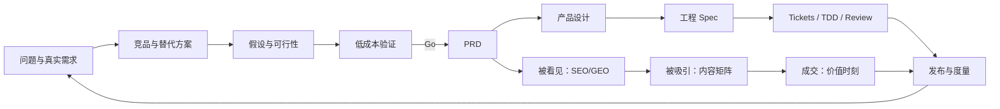

# 从想法到研发就绪：证据驱动的 AI 产品前置工作法

> 版本：v1.0  
> 日期：2026-08-01  
> 用途：适用于新产品、大功能和 AI 应用的研发前置工作，可在其他项目复用

## 引言：AI 降低了开发成本，却提高了选错方向的机会成本

AI Coding 让“把东西做出来”越来越容易，竞品也因此出现得更快。真正稀缺的能力从写功能，转向四件事：

1. 找到会长期存在、有人付出成本的真实需求；
2. 知道现有方案已经解决到哪里，差异是否成立；
3. 在重投入前证伪价值、可用性、商业和技术风险；
4. 把已经验证的决定转化为工程可以实施和验收的规格。

所以，研发前置流程不是为了“文档齐全”，而是为了逐步降低不确定性。竞品分析、可行性分析、PRD 和产品设计文档分别回答不同问题，不能用一份大而全的方案互相替代。

## 一、全貌：一条研发决策链，两个持续闭环



上方是**产品研发闭环**：证明做什么、为什么做、怎么验收。下方是**市场验证闭环**：目标用户能否发现、理解、尝试并付出成本。

两者不能串成瀑布。研究和验证应尽早开始；PRD、设计与工程实施可以逐渐细化，但每一阶段都必须允许回到前面修正假设。

## 二、开始前：先路由，不要机械套流程

不同规模的问题需要不同路线：

| 情况 | 推荐路线 |
| --- | --- |
| 没有代码库，只想澄清一个想法 | `/grill-me` |
| 已有代码库，决策可以在一次上下文内澄清 | `/grill-with-docs`，同步维护 `CONTEXT.md` 和 ADR |
| 巨大且迷雾很多的绿地项目 | `/wayfinder`，先解决决策票，再进入 Spec |
| 需要查官方能力、竞品事实或规范 | `/research` |
| 某个状态、交互或技术路径必须跑起来才知道 | `/prototype`，只保留答案，不保留原型债务 |
| 决策已经清楚，需要进入建设 | `/to-spec → /to-tickets → /implement` |

`ask-matt` 的作用就是先判断路线。不要因为手里有很多技能，就把所有技能都跑一遍。

### 本方法的技能组合

| 目标 | 技能/方法 |
| --- | --- |
| 研究一手资料 | `research` |
| 形成竞品格局 | `competitor-analysis` |
| 识别八类风险假设 | `identify-assumptions-new` |
| 排定验证顺序 | `prioritize-assumptions` |
| 设计最小行为实验 | `brainstorm-experiments-new` |
| 形成权威需求基线 | `create-prd` |
| 固化领域词汇与硬决策 | `domain-modeling` + ADR |
| 设计深模块和适配边界 | `codebase-design` |
| 转工程规格与拆票 | `to-spec` + `to-tickets` |
| 实现与质量门禁 | `implement` 内部驱动 `tdd`，最后 `code-review` |

产品交互设计不等于代码接口设计。只有在设计 Module API 或比较代码接口形状时，才使用 `design-an-interface`。

## 三、第一阶段：定义问题，不要从功能清单开始

### 3.1 一页问题框架

先写清楚：

- 谁在什么情境下遇到问题；
- 他们现在用什么替代方式；
- 哪一步最耗时间、金钱、注意力或承担风险；
- 问题出现频率和后果；
- 用户已经为解决它付出了什么；
- 如果一年不解决，会发生什么；
- 我们希望改变的行为是什么，而不是准备开发什么功能。

推荐使用 Job Story：

> 当【情境】发生时，我想要【动机/动作】，从而【可观察结果】。

“做一个 AI 知识库”不是问题；“每次写行业报告都要花数小时重新找原文和反例”才是。

### 3.2 找真需求的三条路径

结合课程材料，可把方向来源归纳为三类：

1. **自己的长期重复问题**：自己确实需要，而且未来仍会反复需要；
2. **别人已经付出成本的问题**：付费、上传资料、留下联系方式、切换工具或人工完成，都比口头点赞更可信；
3. **热点背后的长期趋势**：借助热点发现机会，但产品根基必须来自热点过后仍存在的抽象趋势，而不是一次事件。

### 3.3 需求证据阶梯

```text
关键词/搜索趋势
    < 社区讨论和求助
    < 用户主动留下联系方式
    < 用户上传真实资料/投入时间
    < 使用人工服务或替代工具
    < 支付订金/购买
    < 重复使用/续费/推荐
```

越靠右，用户付出的成本越高，需求证据越强。市场规模报告和竞品融资只能说明别人所在的市场，不能替代自己的用户行为数据。

### 3.4 第一阶段产物

- 一页 Problem Brief；
- 第一目标用户的 Job 和招募条件；
- 已知事实、推断和未知项列表；
- 最初 XYZ 假设：“至少 X% 的 Y 会完成 Z 行为”；
- 明确的停止条件。

可直接复用[研发前需求与商业验证问卷](../product-research/研发前需求与商业验证问卷.md)，先用问卷筛出有真实任务的人，再用访谈、数据导入、任务回放和订金验证高成本行为。

## 四、第二阶段：竞品分析要研究“替代行为”，不是堆功能表

### 4.1 竞品范围

至少包含四层：

1. **直接竞品**：同一目标用户、同一核心 Job；
2. **邻接产品**：解决其中一段流程；
3. **开源底座/平台**：可能成为依赖、替代技术路线或未来进入者；
4. **非产品替代**：人工服务、表格、文件夹、搜索引擎、通用 Chatbot 和“不做”。

### 4.2 证据规则

- 优先使用官网、官方文档、官方定价、官方 GitHub、Changelog 和公开 API；
- 给研究写明快照日期或 commit；
- “官网没写”只能记为“未发现”，不能写成“没有”；
- Star、融资和客户 Logo 是信号，不等于市场份额和留存；
- 对未验证的用户评价、活跃度和商业表现明确标注推断；
- 每个结论尽量靠近来源链接。

### 4.3 分析维度

| 维度 | 要回答的问题 |
| --- | --- |
| 定位 | 它承诺替谁完成什么 Job？ |
| First value | 用户多久看到第一次价值？ |
| Workflow | 它解决完整闭环，还是单个节点？ |
| Trust | 来源、时效、权限和引用如何处理？ |
| Differentiation | 真正难复制的是数据、工作流、生态还是品牌？ |
| Business | 按席位、用量、订阅、服务还是开源增值？ |
| GTM | 用户从哪里发现并开始使用？ |
| Switching | 数据能否导出，迁移和网络效应如何？ |
| Momentum | 最近更新、路线和生态在向哪里走？ |

### 4.4 竞品分析的正确结论

不要以“我们功能更多”收尾。应给出：

- 哪个用户细分被服务不足；
- 哪个关键 Job 仍断裂；
- 哪项差异已经被证据支持，哪项只是候选；
- 哪些竞品能力应该直接借鉴或复用；
- 未来 12-18 个月最可能被补齐的能力；
- 我们明确不竞争的战场。

### 4.5 产物模板

```markdown
# 竞品分析
## 市场与 Job 定义
## 直接/邻接/底座/替代方案
## 竞品事实表（逐项引用）
## 核心工作流对比
## 优势、缺口与威胁
## 候选差异化
## 定位建议与不进入领域
## 待验证问题
```

## 五、第三阶段：可行性不是“技术能做”，而是八类风险能否被证伪

### 5.1 八类风险

从产品经理、设计师和工程师三种视角，检查：

1. **价值**：用户会使用、复用并在意结果吗？
2. **易用性**：用户不经培训能完成任务并理解边界吗？
3. **商业**：付费与成本模型能成立吗？
4. **技术**：质量、规模、集成和恢复能达到门槛吗？
5. **伦理/合规**：即使能做，是否应该做？
6. **GTM**：目标用户在哪里，能否理解并尝试？
7. **战略**：为何现在做，差异是否会被快速复制？
8. **团队**：是否有角色、时间、资金和运维能力？

### 5.2 假设写法

坏假设：“用户喜欢知识图谱。”

好假设：“在 5 名每月写两次行业报告的用户中，至少 4 名能用结构化主题页 + 局部图，在 10 分钟内找到一条支持证据和一条反例，且正确解释两者关系。”

每条假设都要包含：对象、行为、情境、指标、门槛、时间窗口和失败后的动作。

### 5.3 优先级

先测**高影响、低信心**假设。可以使用 Impact × Risk 矩阵：

- 高影响、高风险：立即设计实验；
- 高影响、低风险：进入实现，但继续监控；
- 低影响、高风险：拒绝或延后；
- 低影响、低风险：不要抢占核心资源。

不要在没有数据时制造小数点后的 ICE/RICE 精度。定性排序加理由比伪精确分数更诚实。

### 5.4 最小验证实验

优先验证行为而非意见：

- **效果展示**：只展示用户结果，不强调用了什么模型或做了多久；
- **Concierge**：先人工交付，验证价值而不是自动化；
- **Wizard of Oz**：界面看似完整，后台暂由人工完成；
- **数据承诺**：要求上传真实资料、授权真实任务；
- **Landing page**：测预约和高成本行为，不只测浏览；
- **订金/预售**：验证支付和下一步承诺；
- **并行对照**：新旧方案同时回答，测采用、正确和耗时；
- **技术基准集**：用人工黄金答案反复回放，而不是挑几个漂亮 Demo。

### 5.5 可行性报告必须给决策

结论只能是：

- **Go**：关键证据达到门槛，进入下一投资阶段；
- **Conditional Go**：技术或价值可行，但必须先完成指定 Gate；
- **Hold**：等待外部条件或调整方案后复测；
- **Pivot**：问题成立，但目标用户、价值入口或方案错误；
- **Stop**：核心假设被证伪。

“存在风险，建议谨慎推进”不是决策。

## 六、第四阶段：PRD 负责“为何做、为谁做、做到什么”

PRD 是产品和研发共同认可的需求基线，不是功能愿望清单，也不应复制详细代码架构。

### 6.1 标准结构

1. Summary；
2. Contacts 与决策责任；
3. Background / Why now；
4. Objective、北极星行为、KR 和护栏；
5. Market Segment，以 Job 定义目标用户；
6. Value Proposition 与替代方式；
7. Solution：流程、关键能力、规则、假设和 Non-goals；
8. Release：相对阶段、Gate 和验收。

可增加数据、安全、国际化和运营要求，但每个章节都要回到目标用户和可观察结果。

### 6.2 指标分三层

- **价值指标**：用户是否完成真实任务，例如 Time to Evidence、证据采用率；
- **产品指标**：漏斗、复用、留存、付费和渠道行为；
- **质量/护栏**：错误、成本、延迟、越权、投诉和撤销。

导入量、Token、页面数和 DAU 不应在没有价值链的情况下成为北极星指标。

### 6.3 范围写法

每项需求写清：

- 用户触发；
- 系统行为；
- 权限和数据边界；
- 成功与失败状态；
- 可观察验收；
- 是否属于一期；
- 依赖和未验证假设。

### 6.4 PRD 完成 Gate

- 第一目标用户与第一核心任务唯一；
- 目标指标、护栏和停止条件明确；
- 核心流程没有依赖隐含人工操作；
- Non-goals 足以保护范围；
- 重大假设链接到实验；
- 与领域词汇和 ADR 无冲突；
- 产品、设计、研发、安全和运营都知道自己要决定什么。

## 七、第五阶段：产品设计文档负责“用户如何完成任务”

PRD 里的“支持分享”不是设计。产品设计要把它展开为入口、状态、权限、错误、恢复和反馈。

### 7.1 产品设计应包含

- 设计目标与原则；
- 信息架构和导航；
- 角色与权限；
- 首次使用和 First value；
- 核心用户旅程；
- 关键屏幕和交互；
- 对象/任务状态机；
- 空、错、慢、部分成功、离线、越权和超预算状态；
- 响应式、无障碍、i18n；
- 埋点与可用性测试任务；
- 进入视觉稿与前端实现前的待产物。

### 7.2 先画流程，再画页面

```text
触发 → 输入 → 系统处理 → 用户判断 → 成功结果
                    ↘ 部分成功
                    ↘ 可恢复失败
                    ↘ 权限拒绝
                    ↘ 用户取消/撤销
```

如果流程中的“系统处理”无法说清状态和恢复，就不应该直接进入高保真视觉稿。

### 7.3 设计可用性任务

让目标用户完成任务，不先解释产品术语。观察：

- 是否找到入口；
- 是否理解当前状态；
- 是否能预测动作后果；
- 是否正确理解权限和可信边界；
- 出错后是否能恢复；
- 完成后是否确认得到价值。

## 八、第六阶段：工程交接不是“把 PRD 扔给开发”

当产品方向、需求和交互已清楚，再进入工程主流程：

1. `/to-spec` 把已讨论决定压缩成可实施 Spec；
2. 识别最高层测试 Seam，尽量减少新增接口；
3. `/to-tickets` 拆成能独立交付价值的 tracer-bullet tickets；
4. 用 blocking edges 表达依赖，先做未被阻塞的最小闭环；
5. 每张票在新上下文执行 `/implement`；
6. `/implement` 用 TDD 完成一个个 red-green slice；
7. 最后用 `/code-review` 同时检查 Standards 和 Spec。

大型项目的正确拆法不是：数据库票、后端票、前端票、测试票。更好的票是：

> 用户导入一个 PDF，系统保存不可变版本，完成一次编译，并能从回答打开原文页码。

这是一条可验证的纵向能力；每完成一条，产品都更接近可用。

### 8.1 上下文卫生

从澄清到 Spec/拆票尽量保持一个连续上下文。接近模型推理质量下降的 smart zone 时，用 `/handoff` 写下当前决定并开新任务；不要在决策链中段丢掉原始理由。

## 九、市场验证闭环：被看见、被吸引、能成交

研发流程不能在“发布”结束。没有分发和成交信号，产品价值仍未被证明。

### 9.1 被看见：SEO 是基础，GEO 是 AI 引用层

课程材料可归纳为三层：

1. **技术可访问**：爬虫能访问、解析、索引；页面稳定、结构和元数据一致；
2. **内容可引用**：标题直接回答问题，结论前置，段落可摘录，提供第一手经验、日期和可靠来源；
3. **外部可信信号**：官网、社交账号、社区、媒体、播客和第三方评价中的品牌与事实一致。

GEO 不是堆关键词，也不是只生成 `llms.txt`。目标是让 AI 在回答目标用户问题时，能找到、理解并愿意引用真实、清晰、被外部印证的内容。

最小检查表：

- AI/搜索引擎能否读取核心页面？
- 页面是否围绕用户问题而不是产品口号？
- 关键主张是否有第一手证据、作者和更新时间？
- 站内是否形成主题内容集群和清晰内链？
- 外部平台是否有一致的实体信息和独立证据？
- 目标用户主要在哪个 AI/搜索平台提问？

### 9.2 被吸引：先有内容矩阵，再做 Skill 工作流

内容首先服务用户，其次才服务 AI。产品尚未形成品牌时，单纯夸功能通常没有吸引力；更有效的是把产品放进用户场景，并展示同行如何解决同类问题。

内容矩阵可以使用：

- 场景 × 用户角色；
- 行业 × 痛点；
- 任务 × 常见错误；
- 案例 × 产品能力；
- 新趋势 × 既有工作流。

只有矩阵足以持续产生至少约 30 个高质量题目时，才值得把创作流程固化成 Skills。推荐演化顺序：

1. 先与高能力 Agent 共同完成几篇样稿；
2. 记录真正影响质量的步骤、输入和人工判断；
3. 建立粗粒度主 Skill 和少量子 Skill；
4. 为每个节点固定输入/输出契约；
5. 逐节点人工评测，过大的拆分，表现差的改规则和样例；
6. 增加事实核验、GEO、风格和平台改写；
7. 持续用真实发布数据迭代。

可规模化的矩阵决定是否值得自动化，人的品味决定工作流的质量上限。

### 9.3 能成交：在价值被确认之后提出交换

用户付费前通常经历：第一次看见价值 → 再次确认不是偶然 → 为继续完成任务自然升级。

收费设计遵循三条：

1. 在深层价值事件后收费，不要在用户理解价值前筑墙；
2. 付费方式匹配使用方式：持续维护适合订阅，边界明确的任务适合按次，持续产生模型成本的能力可以配额度；
3. 优惠必须换回更强承诺，例如更长周期、更大使用量或再次完成真实任务。

漏斗至少观察：完成核心任务并看到付费入口的人数 → 付费人数 → 续费/退款/复用人数。

### 9.4 面向管理层或客户的表达

不要从模型、框架和功能讲起。用一页说明：

1. 当前业务问题和量级；
2. 哪些数据证明关键原因；
3. 建议做或不做什么，预计影响哪个业务指标；
4. 主要风险及控制方式；
5. 现在需要对方决定的资源、优先级或下一阶段。

Demo 应使用对方自己的问题和资料，并与现有方案做可量化对照。通用 Benchmark 很难替代客户场景中的真实胜出。

## 十、标准交付物与目录

推荐仓库结构：

```text
CONTEXT.md                         # 领域词汇
docs/
├── product/
│   ├── 竞品分析.md
│   ├── 可行性分析.md
│   ├── PRD-产品名-一期.md
│   └── 产品设计-产品名-一期.md
├── product-research/
│   └── 竞品事实底稿.md
├── methodology/
│   └── 从想法到研发就绪.md
├── adr/
│   └── 0001-*.md
└── specs/                         # 批准后生成
```

每个文档顶部包含版本、日期、状态、负责人和相关文档。历史材料保留，但明确当前基线，避免多个 PRD 同时有效。

## 十一、四份核心文档的边界

| 文档 | 核心问题 | 不应该变成 |
| --- | --- | --- |
| 竞品分析 | 别人和替代方式解决到哪里？ | 功能数量排行榜 |
| 可行性分析 | 哪些假设会推翻项目，如何最低成本验证？ | “技术可行，建议推进” |
| PRD | 为谁解决什么，目标、范围和验收是什么？ | 架构设计或愿望清单 |
| 产品设计 | 用户如何完成任务，状态、权限和异常如何处理？ | 只有几张理想路径界面图 |

技术方案回答系统如何实现；工程 Spec 回答这次改动要修改哪些 Module、Interface、数据契约和测试 Seam。它们都不能代替前面的产品决策。

## 十二、评审 Gate

### Gate A：问题值得继续研究

- 用户、情境、频率和现有替代明确；
- 至少有搜索/社交之外的一项高成本行为信号；
- 有可被证伪的 XYZ 假设；
- 知道什么结果会停止。

### Gate B：值得做验证，不是直接做平台

- 直接、邻接和非产品替代已研究；
- 候选差异不是“功能更多”；
- 八类风险已列出；
- 高影响低信心假设都有低成本实验。

### Gate C：进入产品研发

- 用户完成真实任务；
- 核心价值指标达到门槛；
- 关键技术基准通过；
- 付费或等价高成本承诺出现；
- PRD 的目标、Non-goals 和 Release Gate 获批。

### Gate D：进入前端实现

- 核心流程、状态、权限和异常已设计；
- 低保真原型完成目标用户可用性测试；
- 设计与领域词汇、ADR 一致；
- 埋点和验收可以观察用户结果。

### Gate E：进入发布

- Spec、Tickets、测试和回滚完成；
- 安全、隐私、成本和可观测门禁通过；
- 发布说明、支持、监控和事故响应准备好；
- 市场侧已准备可发现内容、目标用户触达和成交入口。

## 十三、常见反模式

1. **先写 PRD，再找用户**：把内部想法包装成需求；
2. **竞品没有写，所以它没有**：用信息缺失制造差异化；
3. **Star/融资等于需求**：把别人的信号当作自己的 YODA；
4. **技术 Demo 等于价值验证**：用户只看到框架，没完成任务；
5. **问愿不愿意付费**：没有真实支付和承诺；
6. **PRD 写满解决方案**：问题、指标和 Non-goals 反而不清；
7. **只设计 Happy Path**：长任务、越权、失败和撤销留给开发猜；
8. **用单一 AI 分数表达可信**：掩盖来源、时效、冲突和适用边界；
9. **按技术层拆票**：直到最后才发现闭环无法使用；
10. **发布后才想获客**：产品没有可索引内容、内容矩阵和成交时刻；
11. **过早自动化内容工作流**：矩阵不足，Skill 还没打磨素材就用完；
12. **文档永远是“最新版”**：没有状态、日期、决策人和历史基线。

## 十四、一次完整工作坊的操作清单

### 会前

- 收集现有方案、用户材料、竞品链接、数据和技术约束；
- 读取 `CONTEXT.md` 与相关 ADR；
- 选择 ask-matt 路线；
- 把事实研究交给 `research`，限定一手来源和输出文件。

### 第一场：问题与方向

- 写 Problem Brief；
- 识别三类真需求来源；
- 定义第一目标用户和真实任务；
- 建立需求证据阶梯与 XYZ 假设。

### 第二场：竞品与可行性

- 复核竞品事实底稿；
- 绘制工作流差异；
- 识别八类假设；
- 排定高影响、低信心问题；
- 设计实验、指标、门槛和停止条件。

### 第三场：PRD 与产品设计

- 固化目标、北极星行为、范围和 Non-goals；
- 画核心流程与状态机；
- 设计权限、异常、恢复和埋点；
- 列出仍需原型回答的问题。

### 会后

- 运行 R0 实验；
- 根据结果作 Go/Hold/Pivot/Stop；
- Go 后执行 `/to-spec → /to-tickets`；
- 每个 ticket 独立实现、测试、Review；
- 发布后把行为数据回写到假设和下一轮 PRD。

## 结语：方法的产物不是文档，而是更少的未知

一套成熟流程不会保证产品成功。它能做的是把“我们以为”逐步转化为“用户已经做过”“系统已经跑过”“指标已经达到”，并在事实不支持时尽早停止。

真正可复用的不是某个 PRD 模板，而是这条纪律：

> 用一手事实理解市场，用高成本行为确认需求，用最小实验攻击关键假设，用清晰文档固定已经做出的决定，再把决定拆成可以逐步验收的工程闭环。

## 参考输入

本文结合以下内部课程材料归纳并重新组织：

- 《17｜选方向：找到真需求的三种方法》；
- 《18｜被看见：AI 时代的流量逻辑 GEO》；
- 《19｜吸引 Ta：用 Skills 工作流创作用户喜爱的内容》；
- 《20｜卖出去：AI 产品的成单机会与面客表达》。

方法流程同时参考本仓库 `ask-matt` 所定义的 idea → ship 工程路径。
