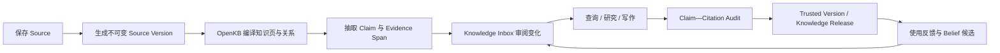

# PRD：FlyWiki 一期可信知识平台

> 版本：v1.0  
> 日期：2026-08-01  
> 状态：研发前评审稿  
> 产品名称：FlyWiki 暂作为开源底座名称，用户产品名称待定

相关文档：[竞品分析](竞品分析.md) · [可行性分析](可行性分析.md) · [产品设计](产品设计-FlyWiki-一期.md) · [一期产品与技术方案](../一期产品与技术方案.md) · [领域词汇表](../../CONTEXT.md) · [ADR](../adr/)

## 1. Summary

FlyWiki 是面向持续研究与输出者的可信知识平台。它把本地文件、网页、即时通信输入和持续追踪结果编译为结构化知识页与关系图，并在问答、研究和写作时明确区分证据、系统综合和用户已经确认的认知。

一期交付完整的个人知识工作闭环：采集、编译、追踪、审阅、可信问答、可信写作、分享与渠道使用；同时从数据模型上预留 Workspace 多租户、安全、监控和平台 API。

## 2. Contacts

| 角色 | 责任 | 当前安排 |
| --- | --- | --- |
| 产品负责人 | 范围、目标用户、指标和发布决策 | 项目发起人 |
| 技术负责人 | 架构、OpenKB 边界、质量和交付 | 待指定 |
| 产品设计 | 信息架构、交互、可用性和设计系统 | 待指定 |
| AI/评测负责人 | Claim—Evidence、编译质量和评测集 | 待指定 |
| 安全与隐私负责人 | Workspace、渠道、分享和数据治理 | 待指定 |
| 运营/GTM | 招募、验证、内容和用户成功 | 待指定 |

未指定角色不阻碍研发前文档评审，但进入 R1 前必须落实技术、设计、AI 评测和安全责任人。

## 3. Background

### 3.1 用户问题

目标用户并不缺少“保存资料”的工具。他们的问题发生在保存之后：

1. 历史文件和收藏分散，关系不可见；
2. 新资料持续进入，但没有时间逐条阅读和更新主题认知；
3. 普通搜索或 RAG 返回相似片段，却不说明哪些内容真的支持、反驳或限制当前判断；
4. 写报告、文章或方案时，需要重新寻找原文、确认时间和拼装引用；
5. 自动生成的知识页容易被误认为用户已经接受的认知；
6. 知识库难以安全分享给别人继续查询和写作。

### 3.2 为什么是现在

- OpenKB 已提供持续 Wiki 编译、关系链接、长文档处理和 Lint，可用作知识编译器；
- 大模型可以完成跨资料抽取和综合，但需要不可变证据、人工确认和确定性门禁约束；
- LiteLLM、DeepAgents、LangGraph、Celery 和 Langfuse 降低了多模型、语义流程和可观测成本；
- 浏览器插件、飞书机器人、PWA 和本地 Edge Device 可以覆盖高频入口；
- 市场已经证明“AI 知识库”有需求，但 Claim 级依据、个人认知分离和可信写作尚未成为默认能力。

### 3.3 产品立场

FlyWiki 不承诺替用户判断绝对真相，而是让每个可判断陈述尽量带着来源、适用边界、冲突和状态出现。系统知识可以更新，Belief 只能经用户确认；分享的是不可变 Knowledge Release，而不是正在变化的所有者知识库。

## 4. Objective

### 4.1 产品目标

> 让持续研究者更快地把分散资料转化为可追溯知识，并在输出时清楚知道：我已知什么、未知什么、外部出现了什么变化，以及每个事实依据何在。

### 4.2 北极星行为

**每周完成的可信知识任务数**：用户完成一次带有可复核依据的研究、问答或 Writing Artifact，并查看、采用或修正了至少一条 Evidence Span。

该指标同时要求系统产生结果、用户检查依据并用于真实任务，避免用“导入文件数”“聊天次数”替代价值。

### 4.3 一期 OKR

**O1：贯通从 Source 到可信输出的闭环。**

- KR1：一期验收语料中，Evidence Span locator 有效率 ≥98%；
- KR2：Trusted Version 中事实 Claim 的引用覆盖率为 100%；
- KR3：用户能从 Claim 一步打开对应原文上下文；
- KR4：同一 Knowledge Base 连续 10 轮增量编译后，黄金 Claim 和历史引用不丢失。

**O2：证明产品在真实输出任务中创造价值。**

- KR1：至少 5 名目标用户完成真实资料导入和真实输出回放；
- KR2：可信且强相关证据 Precision@5 ≥80%；
- KR3：Time to Evidence 中位数相对原流程下降 ≥50%；
- KR4：至少 30% 的验证用户做出订金、付费或下一次真实任务承诺。

**O3：建立可运营、可恢复的安全底座。**

- KR1：Workspace 越权、Share Link、API Key、MCP 和 Channel Binding 安全测试通过；
- KR2：关键异步任务可观察、可重试、可幂等，失败不会形成半发布状态；
- KR3：备份达到 RPO ≤15 分钟、RTO ≤4 小时；
- KR4：模型调用成本可按 Workspace、Knowledge Base 和任务归因。

### 4.4 护栏指标

- 无依据事实 Claim 比例；
- 错误 locator、错误关系和未解决冲突比例；
- 自动提案被拒绝或撤销的比例；
- 每个可信任务的模型成本、人工复核成本和 P95 延迟；
- 通知退订、静音、投诉和 Personal WeChat 异常率；
- 跨 Workspace、访客越权和敏感数据进入 Trace 的事件数。

不使用单一“知识可信分”或“健康总分”。

## 5. Market Segments

市场按需要完成的 Job 划分，而不是只按职业划分。

### 5.1 第一目标用户：高频证据型输出者

共同特征：

- 每月至少两次产出行业分析、产品方案、深度文章、咨询材料或研究报告；
- 已有 100 条以上历史资料，分散在文件夹、浏览器、微信、Notion/Obsidian 或稍后读工具；
- 输出前至少花 1 小时重新找资料、核对原文或寻找反例；
- 关心来源、时效、适用条件和引用，而不只需要流畅文案。

可从产品经理、行业分析师、研究型内容创作者、咨询顾问和独立研究者中招募。

### 5.2 第二目标用户：持续领域追踪者

他们关注一个或多个长期领域，需要系统发现新增、变化、冲突和过期内容，并用日报/周报降低阅读负担。

### 5.3 第三目标用户：知识发布者与访客

所有者希望发布一个可查询的知识版本；访客希望基于它查询、上传临时资料和写内容，但不需要或不应获得编辑所有者知识库的权限。

### 5.4 一期不优先服务

- 只需要临时聊天、没有长期资料的人；
- 只想要文件同步或传统笔记编辑的人；
- 需要多人实时协同编辑同一知识库的大型团队；
- 要求平台自动替其做高风险专业决策的人；
- 要求绕过封闭平台授权、全量同步个人聊天的人。

## 6. Value Propositions

| 用户 Job | 现有替代方式 | FlyWiki 收益 | 避免的痛苦 |
| --- | --- | --- | --- |
| 理解历史资料关系 | 文件夹、标签、全局搜索 | 自动主题结构、知识页和局部图谱 | 手工整理和全局蜘蛛网 |
| 持续追踪领域 | RSS、收藏、人工阅读 | Watch Rule、变化分析和分级推送 | 信息堆积与重复阅读 |
| 核对一个判断 | RAG/联网问答 | 支持、反驳、限制、替代和原文定位 | 把相似内容误作证据 |
| 形成可信输出 | 写作 Agent + 手工找引用 | Evidence Plan、认知对照和 Claim—Citation Audit | 写完后补引用、漏反例 |
| 维护个人认知 | 自动记忆或手工笔记 | Belief 与 Profile Document 经确认更新 | 系统推断冒充“我的观点” |
| 分享知识 | 共享文件夹或公开聊天 | 不可变 Release、访客隔离写作和投稿 | 访客误改、来源越权 |
| 随时使用 | 只能打开 Web | 微信/飞书/插件/PWA 统一入口 | 上下文切换和保存摩擦 |

### 6.1 候选差异化

1. **Evidence-first**：知识图谱可以下钻到 Claim 和不可变原文，不只展示语义关系；
2. **Belief separation**：系统综合与用户认知分离，自动化不会静默改变用户立场；
3. **Trusted Writing**：从证据计划到引用审计形成完整输出门禁；
4. **Knowledge Release**：分享对象原子、可回退，访客能用知识写作但不能编辑源库；
5. **Open foundation**：OpenKB 可升级底座、Python 平台、REST/MCP/Webhook 和全量导出。

这些是待验证的竞争优势，不应在没有用户行为和竞品证据时写成既成壁垒。

## 7. Solution

### 7.1 核心体验闭环

### 7.2 首次使用

1. 创建平台账号和默认 Workspace；
2. 创建 Knowledge Base，选择目标语言、主要用途和数据边界；
3. 通过文件上传、本地 Edge Device、URL 或插件导入首批 Source；
4. 显示解析、编译、证据抽取和 Lint 进度；
5. 生成第一张主题页、局部图和“新增/冲突/缺口”摘要；
6. 引导用户提出一个真实问题或导入一份历史输出；
7. 让用户打开第一条 Evidence Span，完成首次可信任务。

### 7.3 Knowledge Base 工作台

必须提供：

- 文件/来源树、OpenKB 知识页、局部图谱和证据抽屉联动；
- 单库与 Knowledge Collection 跨库查询；
- Claim 的 Evidence Status、Workspace Knowledge Status 和适用边界；
- 版本、来源、冲突、替代和变更历史；
- 结构、引用、来源、冲突、编译和发布七维健康问题。

默认是可阅读的结构化主题页，不以全局关系图作为首页。

### 7.4 Knowledge Inbox

统一处理新来源、Watch Rule 结果、冲突、过期、记忆候选、访客投稿、健康问题和失败任务。每项支持：查看原因和证据、接受、修改后接受、拒绝、稍后、批量处理和撤销。

### 7.5 Trusted Q&A、Research 与 Writing

提供三个显式模式：

- **问答**：快速回答，事实句带引用；证据不足时明确说不知道；
- **研究**：组合 Knowledge Base、Knowledge Release、联网资料和临时附件，展示已知/未知/冲突；
- **写作**：从 Evidence Plan、提纲、草稿到 Claim—Citation Audit，生成 Trusted Version。

事实、系统推论和创作表达必须在界面与导出中可区分。联网资料默认只属于 Research Session，未经接受不进入所有者 Knowledge Base。

### 7.6 追踪与推送

- Watch Rule 定义主题、来源、频率、过滤、预算和目标 Knowledge Base；
- 支持 RSS、公开网页、联网搜索与用户主动保存的封闭平台内容；
- 新信息按新增、强化、限制、冲突、替代、重复和低价值分类；
- 高优先级事件即时通知，普通变化进入日报或周报；
- 支持时区、免打扰、静音、去重、有限重试和反馈。

### 7.7 渠道与采集

**浏览器插件**：全文/智能正文/选区剪藏、图片、批注、目标 Knowledge Base、当前页问答和入库状态。

**飞书**：机器人单聊和群内 `@`；问答、写作请求、保存附件、任务进度和推送。默认不读取群内全部消息。

**个人微信**：通过用户自管 Edge Device 提供 allowlist 私聊入口；云端不保存登录凭证。若稳定性或合规 Gate 未通过，停止该连接器并触发范围复审；改用微信官方入口、飞书和 PWA 必须由产品负责人重新批准。

**本地文件**：Edge Device 显式绑定目录，预览变更，支持暂停、撤销、断点续传和系统密钥库。

### 7.8 分享与访客写作

- 所有者从当前知识构建不可变 Knowledge Release；
- Share Link 可撤销、不可猜测、默认不索引并有访问/模型预算；
- 访客可以查询、创建 Research Session、Writing Artifact，并上传临时附件、图片和链接；
- 访客不能编辑所有者 Knowledge Base、Belief 或 Release；
- 访客提交只进入 Knowledge Inbox，接受后才转为所有者 Source；
- 强制下架立即阻断相应原文和 Evidence Span 的分享访问。

### 7.9 Profile Document 与记忆

系统可以从用户明确行为和内容中生成身份、关注、记忆或认知候选，但只能写入 Change Proposal。用户可以查看差异、编辑、接受、拒绝、回滚和删除 Profile Document。

### 7.10 管理与平台接口

- Workspace、Owner/Admin/Editor/Viewer、配额、API Key 和审计；
- REST、MCP、Webhook；
- LiteLLM Proxy 多模型、BYOK、预算和降级；
- Langfuse/OTel 追踪、质量、成本和脱敏；
- Docker Compose 部署向导、官方镜像、备份恢复、导入导出和升级检查。

### 7.11 关键技术约束

- OpenKB 必须通过独立 Worker 和 `OpenKBAdapter` 使用；
- Source Version 与 Evidence Span 是真相源，知识页和图谱可重建；
- DeepAgents 只承担语义节点，不能直接发布、外发、删除或修改 Belief；
- 同一个 Knowledge Base 的 OpenKB 写入串行；
- Workspace 是唯一安全边界；
- 所有自动知识修改形成可预览、可审计、可回滚的 Knowledge Change Set；
- 中文优先并支持中英文 Source，Evidence Span 保留原文。

### 7.12 假设

本 PRD 依赖以下尚未证明的假设：

- 高频输出者愿意导入真实资料；
- 用户能理解系统知识与 Belief 的区别；
- 认知对照和 Claim 级依据明显优于普通 RAG；
- 用户愿意处理少量高价值 Inbox 项；
- OpenKB 多轮编译可以达到保真门槛；
- 个人微信 Edge Device 可以稳定运行；
- 分享写作能形成传播，而不只产生滥用成本；
- 订阅和用量收费能够覆盖模型与支持成本。

验证顺序与停止条件见[可行性分析](可行性分析.md)。

## 8. Release

### R0：证伪与架构跑道

- 历史输出回放、数据承诺和付费 Concierge；
- OpenKB Adapter/Worker、十轮增量回放；
- Claim—Evidence 与 locator 基准集；
- Workspace 最小垂直切片；
- 飞书 Spike、个人微信 Edge soak test；
- 通过 Go/Hold/Stop 评审后进入 R1。

### R1：可信知识核心

- 账号、Workspace、Knowledge Base；
- 文件/URL 摄取、Source Version、OpenKB 编译；
- Claim、Evidence Span、局部图、Knowledge Inbox；
- Trusted Q&A 与基础 Health；
- LiteLLM、Langfuse 和 Compose。

### R2：持续输入与输出闭环

- Watch Rule、联网研究、日报/周报；
- Trusted Writing Studio 与 Trusted Version；
- 浏览器插件、本地 Edge、飞书；
- Profile Document 和 Belief 确认；
- Knowledge Release、Visitor Session 和投稿。

### R3：平台化与发布就绪

- 个人微信受控入口，或经产品负责人重新批准的官方入口降级方案；
- REST/MCP/Webhook、配额、审计和管理视图；
- 全量导入导出、备份恢复、升级矩阵；
- 安全、容量、故障注入、无障碍和 13 项一期 DoD 验收。

每个 Release 必须形成可演示的纵向闭环，不允许把所有后端做完后才开始验证用户体验。

## 9. Non-goals

- 原生 iOS/Android App；
- 多人实时协同编辑同一 Knowledge Base；
- 访客修改所有者知识库；
- 自动改变 Belief、自动删除证据或自动公开发布；
- 云端保存个人微信凭证或全量同步聊天；
- 绕过封闭平台授权采集；
- 自研模型网关、向量数据库或通用 Agent Runtime；
- 一期拆微服务、强制 Kubernetes 或多活；
- 完整 SSO、计费、Marketplace 和企业管理后台；
- 用单一分数表达可信或知识健康。

## 10. 一期验收摘要

一期必须通过以下产品场景：

1. 导入本地目录，增量变化可追踪且旧版本不被覆盖；
2. 从主题页和局部图下钻到 Claim、Evidence Span 和原文；
3. 新来源产生支持、限制、冲突或替代候选，并在 Inbox 审阅；
4. Watch Rule 产生去重后的日报/周报；
5. 问答在证据不足时拒绝编造；
6. 写作经过 Claim—Citation Audit 形成 Trusted Version；
7. 用户编辑、确认和回滚 Profile Document/Belief；
8. 飞书和批准的微信入口完成问答、写作请求和推送；
9. 插件完成剪藏、批注和当前页问答；
10. 分享访客能查询、写作、上传和投稿，但不能编辑所有者知识；
11. Workspace、API、MCP、Share Link 和敏感信息隔离测试通过；
12. OpenKB 升级、失败恢复、Release 原子切换和强制下架通过；
13. 备份恢复、容量、成本归因和 Langfuse 脱敏验证通过。

详细验收规则以[一期产品与技术方案](../一期产品与技术方案.md)中的 Definition of Done 为准。
