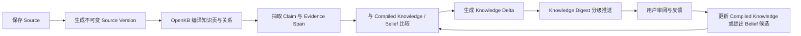

# PRD：FlyWiki 一期可信知识平台

> 版本：v1.3
> 日期：2026-08-03
> 状态：已由 [产品基线 v2.0](产品基线.md) 取代；仅保留为历史记录
> 产品名称：FlyWiki 暂作为开源底座名称，用户产品名称待定

相关文档：[竞品分析](竞品分析.md) · [可行性分析](可行性分析.md) · [产品设计](产品设计-FlyWiki-一期.md) · [一期产品与技术方案](一期产品与技术方案.md) · [领域词汇表](../../CONTEXT.md) · [ADR](../adr/)

> **历史说明**：本稿中的 R0 Gate、飞书优先与微信非产品化等范围决定已经失效。当前产品范围与实施顺序以 [产品基线](产品基线.md) 和 [首个里程碑](首个里程碑.md) 为准。

## 1. Summary

FlyWiki 是面向持续学习与领域追踪者的可信知识平台。它把本地文件、网页和持续进入的信息编译为结构化知识，比较新内容与已有知识及用户认知之间的关系，并把真正重要的变化连同依据推送给用户。

一期由个人开发者在 AI 辅助下交付，聚焦"整理已有资料 → 追踪新内容 → 识别 Knowledge Delta → 形成 Knowledge Digest → 用户确认认知变化"的闭环。知识使用出口只有两个：可信问答（Web + 飞书）和 MCP。数据模型上保留 Workspace 隔离，为二期平台化预留跑道，但一期不交付多角色、分享和对外 API。

## 2. Contacts

一期为单人项目：产品、技术、设计、AI 评测和安全决策均由项目发起人承担，AI 编程助手参与实现与评审。进入二期或引入规模化外部用户运营前，再评估补充协作者。

## 3. Background

### 3.1 用户问题

目标用户并不缺少"保存资料"的工具。他们的问题发生在保存之后：

1. 历史文件和收藏分散，关系不可见；
2. 新资料持续进入，但没有时间逐条阅读和更新主题认知；
3. 用户难以判断新内容是新增、冲突，还是已经知道的重复信息；
4. 即使发现变化，也不知道它是否影响自己已经确认的认知；
5. 普通摘要和推荐脱离已有知识，只会制造更多待阅读内容；
6. 自动生成的知识页容易被误认为用户已经接受的认知。

### 3.2 为什么是现在

- OpenKB 已提供持续 Wiki 编译、关系链接、长文档处理和 Lint，可用作知识编译器；
- 大模型可以完成跨资料抽取和综合，但需要不可变证据、人工确认和确定性门禁约束；
- LiteLLM、LangGraph、Celery 和 Langfuse 降低了多模型、语义流程和可观测成本；
- 浏览器插件和飞书机器人可以覆盖高频入口，完整控制面保持在响应式 Web；
- 市场已经证明"AI 知识库"有需求，但基于已有知识判断变化、区分世界知识与个人认知、并只推送高价值 Knowledge Delta 尚未成为默认能力。

### 3.3 产品立场

FlyWiki 不承诺替用户判断绝对真相，而是让每个可判断陈述尽量带着来源、适用边界、冲突和状态出现。系统知识可以更新，Belief 只能经用户确认。

## 4. Objective

### 4.1 产品目标

> 让持续学习者不必读完所有资料，也能知道：什么是新信息、什么与已有知识冲突、什么可能需要更新认知、什么只是强化已有认识，以及每项判断依据何在。

### 4.2 北极星行为

**每周完成的有效知识消化闭环数**：用户审阅一个带有可复核依据的 Knowledge Delta，并完成"已知、接受、反对、稍后或调整 Belief 候选"中的至少一个动作。

该指标同时要求系统发现变化、用户检查依据并作出处理，避免用"导入文件数""抓取条数"或"推送打开率"替代价值。

### 4.3 一期 OKR

**O1：贯通从 Source 到可解释 Knowledge Delta 的闭环。**

- KR1：一期验收语料中，Evidence Span locator 有效率 ≥98%（技术底线，不因单人规模下调）；
- KR2：新增、冲突、强化、忽略四分类的人工评审准确率 ≥80%；
- KR3：用户能从每条 Knowledge Delta 一步打开对应 Claim 与原文上下文；
- KR4：同一 Knowledge Base 连续 10 轮增量编译后，黄金 Claim 和历史引用不丢失。

**O2：证明产品能降低持续资料消化负担（按单人验证规模校准）。**

- KR1：开发者本人以真实资料和真实追踪主题连续使用两周（第一验证对象；自己不用即 Stop）；
- KR2：3-5 名外部目标用户完成真实资料导入，其中至少 2 人连续两周主动打开并给出反馈；
- KR3：每位持续使用者能指出至少一条"依靠原有流程会漏掉"的重要变化（定性证伪口径，替代 v1.2 的时间中位数下降 50% 统计指标）；
- KR4：至少 80% 的高优先级推送被用户判断为值得处理。

**O3：建立可运营、可恢复的安全底座（最简形态）。**

- KR1：Workspace 数据隔离与 MCP API Key 范围的安全测试通过；
- KR2：关键异步任务可观察、可重试、可幂等，失败不会形成半完成状态；
- KR3：备份达到 RPO ≤15 分钟、RTO ≤4 小时，并完成一次真实恢复演练；
- KR4：模型调用成本可按 Knowledge Base 和任务归因。

### 4.4 护栏指标

- 无依据事实 Claim 比例；
- 错误 locator、错误关系和未解决冲突比例；
- 自动提案被拒绝或撤销的比例；
- 每个 Knowledge Digest 的模型成本与 P95 延迟；
- 重复/低价值推送比例与关键冲突漏检率；
- 通知退订、静音与投诉。

不使用单一"知识可信分"或"健康总分"。

## 5. Market Segments

市场按需要完成的 Job 划分，而不是只按职业划分。

### 5.1 第一目标用户：资料过载的持续领域追踪者

共同特征：

- 已有 100 条以上历史资料，分散在文件夹、浏览器、微信、Notion/Obsidian 或稍后读工具；
- 每周持续接收或保存至少 10 条与一个长期主题相关的新资料，并经常形成未消化积压；
- 已经通过收藏、RSS、笔记、群聊或人工摘要尝试解决，但难以识别真正的新信息与认知影响；
- 关心来源、时效、适用条件和冲突，而不只需要更多摘要。

可从产品经理、行业分析师、投资研究者、研究型内容创作者、咨询顾问和独立研究者中招募。**开发者本人属于该画像，是一期第一验证对象。**

### 5.2 第二目标用户：高频证据型输出者

他们在写报告、方案或文章时需要快速核验原文和冲突。一期只以可信问答服务这类任务；基础内容生成和写作流程在二期评估。

### 5.3 知识发布者与访客（二期）

发布可查询知识版本、访客隔离使用与投稿的完整场景移至二期，待一期核心价值验证通过后再评估。

### 5.4 一期不优先服务

- 只需要临时聊天、没有长期资料的人；
- 只想要文件同步或传统笔记编辑的人；
- 需要多人实时协同编辑同一知识库的大型团队；
- 要求平台自动替其做高风险专业决策的人；
- 要求绕过封闭平台授权、全量同步个人聊天的人；
- 需要向外部访客发布知识库的人（二期）。

## 6. Value Propositions

| 用户 Job | 现有替代方式 | FlyWiki 收益 | 避免的痛苦 |
| --- | --- | --- | --- |
| 理解历史资料关系 | 文件夹、标签、全局搜索 | 自动主题结构、知识页和局部图谱 | 手工整理和全局蜘蛛网 |
| 持续追踪领域 | RSS、收藏、人工阅读 | Watch Rule、Knowledge Delta 和分级推送 | 信息堆积与重复阅读 |
| 判断认知影响 | 手工比较、凭记忆判断 | 区分新增、冲突、强化与可忽略 | 错过重要变化或被低价值信息淹没 |
| 定期消化信息 | 通用摘要、群消息、Newsletter | Knowledge Digest 只呈现重要变化、依据与建议动作 | 摘要越积越多，仍不知道该关注什么 |
| 核对一个判断 | RAG/联网问答 | 支持、反驳、限制、替代和原文定位 | 把相似内容误作证据 |
| 维护个人认知 | 自动记忆或手工笔记 | Belief 经确认更新，新证据冲突时提示 | 系统推断冒充"我的观点" |
| 随时使用 | 只能打开 Web | Web 主产品与飞书/插件轻入口，MCP 接入 AI 客户端 | 上下文切换和保存摩擦 |

### 6.1 候选差异化

1. **Evidence-first**：知识图谱可以下钻到 Claim 和不可变原文，不只展示语义关系；
2. **Belief separation**：系统综合与用户认知分离，自动化不会静默改变用户立场；
3. **Cognitive Delta**：新内容先与已有知识和 Belief 比较，只推送真正的新增、冲突或强化；
4. **Open foundation**：OpenKB 可升级底座、Python 平台、MCP 和全量导出。

（v1.2 中的 Knowledge Release 差异化移至二期。）这些是待验证的竞争优势，不应在没有用户行为和竞品证据时写成既成壁垒。

## 7. Solution

### 7.1 核心体验闭环

### 7.2 首次使用

1. 创建平台账号和默认 Workspace；
2. 创建 Knowledge Base，选择目标语言、主要用途和数据边界；
3. 通过文件上传、URL 或浏览器插件导入首批 Source；
4. 显示解析、编译、证据抽取和 Lint 进度；
5. 生成第一张主题页、局部图和已有知识基线；
6. 引导用户设置一个真实追踪主题，或导入最近一批尚未消化的资料；
7. 生成第一份 Knowledge Digest，让用户确认一条新增、强化或冲突结果并打开依据。

### 7.3 Knowledge Base 工作台

必须提供：

- 文件/来源树、OpenKB 知识页、局部图谱和证据抽屉联动；
- 单库与 Knowledge Collection 跨库查询；
- Claim 的 Evidence Status、Workspace Knowledge Status 和适用边界；
- 版本、来源、冲突、替代和变更历史；
- 结构、引用、来源、冲突、编译等维度的健康问题。

默认是可阅读的结构化主题页，不以全局关系图作为首页。

### 7.4 Knowledge Inbox

统一处理 Knowledge Delta、Watch Rule 结果、冲突、过期、健康问题和失败任务。默认按"必须处理、冲突、重要新增、强化、忽略（重复/低价值）"分组；每项支持查看原因和证据、标记已知、接受、反对、稍后、降低优先级和撤销。

### 7.5 可信问答

一期唯一的生成式知识出口是问答（Web + 飞书 + MCP 共用同一能力）：

- 快速回答，事实句逐条带引用，推论句显式标记为"系统推论"；
- 证据不足时明确说不知道，并提供联网检索、添加资料或创建 Watch Rule 的后续动作；
- 事实、系统推论必须在界面与导出中可区分。

基础内容生成（选定 Claim 生成摘要/短文并导出）移至二期；完整 Evidence Plan、长文工作流与 Claim—Citation Audit 同样延后。联网资料未经接受不进入所有者 Knowledge Base。

### 7.6 追踪与推送

- Watch Rule 定义主题、来源、频率、过滤、预算和目标 Knowledge Base；
- 支持 RSS、公开网页、联网搜索与用户主动保存的封闭平台内容；
- 每批新内容先与 Compiled Knowledge 和 Belief 比较，形成 Knowledge Delta。**产品界面与推送采用四分类：新增、冲突（含限制与替代，作为详情子标签展示）、强化、忽略（合并重复与低价值）**；数据模型保留七类枚举值以便二期细化，但一期的分类器、标注集与准确率指标只对四分类负责；
- 只有可能改变认知、关键冲突、来源撤回和重要新增可以即时通知，普通变化进入 Knowledge Digest，无实质变化不推送；
- 每条推送说明"为什么值得看、影响哪项已有知识、依据是什么、是否建议形成 Belief Change Proposal"；
- 支持时区、免打扰、静音、去重、有限重试，以及已知/接受/反对/稍后/降低优先级反馈。

### 7.7 渠道与采集

一期采集入口收敛为三个：**Web 上传文件、URL 抓取、浏览器插件剪藏**。

**浏览器插件（仅采集，弹窗形态）**：保存当前网址、手动添加网址、智能正文/选区剪藏（全文与图片剪藏视解析库顺手程度实现，不进验收）、Markdown 快速笔记、标签与备注、选择目标 Knowledge Base。插件内问答与侧边栏移至二期；插件不承载图谱、Watch Rule、Belief 或管理配置。

**飞书（唯一对外 IM）**：机器人单聊和群内 `@`；只做可信问答、Knowledge Digest 推送和认知反馈，**不做附件/链接采集入库**。默认不读取群内全部消息。

**个人微信（开发者自用实验通道，不进产品范围）**：开发者以 OpenClaw 式桥接接入自己的微信号（allowlist 仅本人），用于真实场景 dogfooding。不写入交付范围、不给用户承诺、不进验收。IM 接入层设计为通用接口（消息进 → 问答/推送出），飞书与微信桥共用。

所有插件与 IM 提交的新内容都先进入待处理状态。完成解析、去重、来源评估和认知对照前可以搜索和提问，但必须标记"尚未验证"，不能直接成为可信知识或影响 Belief/Knowledge Digest。

### 7.8 分享与访客（二期）

Knowledge Release、Share Link、Visitor Session、访客问答/上传/投稿整体移至二期。一期知识回滚能力由 Knowledge Change Set 的可回滚机制承担，不依赖 Release 快照。

### 7.9 Belief 与个人认知

Belief 采用最简形态：**用户在审阅 Knowledge Delta 或 Claim 时标记"接受"，该 Claim 即成为 Belief**（即 Workspace Knowledge Status 的 `accepted` 状态直接兼任 Belief，不设独立的 Belief 管理界面）。新证据与已接受 Claim 冲突时，系统生成 Belief Change Proposal 供用户审阅；系统不能自动改变 Belief。

Profile Document 与记忆候选移至二期。

### 7.10 管理与平台接口

- **Workspace 进入数据模型**（所有表带 `workspace_id`、对象键带 Workspace 前缀，ADR-0004 继续有效），但一期不做角色管理界面——每个用户是自己 Workspace 的唯一 Owner；
- **MCP 保留**：让知识库可被 Claude 等 AI 客户端读取与问答，API Key 只做 MCP 所需的最简形态（读取知识、问答，默认不能删除资料或修改 Belief）；
- 角色权限（Admin/Editor/Viewer）、配额管理、审计界面、Webhook、对外 REST API 移至二期；
- LiteLLM 以 Python SDK 内嵌方式提供多模型路由与降级（不独立部署 Proxy），预算控制用数据库计数实现；
- Langfuse 自托管，承担追踪、质量、成本和脱敏；
- Docker Compose 单机部署（自用 compose 文件即部署文档，不做部署向导产品化）。

### 7.11 关键技术约束

- OpenKB 必须通过独立 Worker 和 `OpenKBAdapter` 使用；
- Source Version 与 Evidence Span 是真相源，知识页和图谱可重建；
- 语义任务由 LangGraph 状态机 + 直接 LLM 调用承担（一期不引入 DeepAgents）；语义节点不能直接发布、外发、删除或修改 Belief；
- 同一个 Knowledge Base 的 OpenKB 写入串行；
- Workspace 是唯一安全边界（一期以应用层 `workspace_id` 过滤实现，PostgreSQL RLS 作为二期防御纵深）；
- 所有自动知识修改形成可预览、可审计、可回滚的 Knowledge Change Set；
- 中文优先并支持中英文 Source，Evidence Span 保留原文。

### 7.12 假设

本 PRD 依赖以下尚未证明的假设：

- 资料过载的持续追踪者愿意导入真实资料并设置追踪主题；
- 用户能理解系统知识与 Belief 的区别；
- Knowledge Delta 能比通用摘要更快暴露新增、冲突和认知影响；
- 用户愿意连续审阅少量高价值 Knowledge Digest 项；
- OpenKB 多轮编译可以达到保真门槛；
- 单人 + AI 辅助能在可接受的周期内交付并维护校准后的一期范围。

验证顺序与停止条件见[可行性分析](可行性分析.md)。

## 8. Release

### R0：证伪与架构跑道

- 开发者本人真实资料导入与两周 Knowledge Digest 自我验证准备；
- 3-5 名外部目标用户的资料与追踪主题承诺；
- OpenKB Adapter/Worker、十轮增量回放；
- Claim—Evidence 与 Knowledge Delta 四分类基准集（50 组人工标注）与 locator 基准（≥98%）；
- Workspace 数据模型最小垂直切片；
- 飞书 Spike；
- 通过 Go/Hold/Stop 评审后进入 R1。

### R1：已有资料整理与知识基线

- 账号（单用户 Owner）、Workspace 数据模型、Knowledge Base；
- 文件/URL 摄取、Source Version、OpenKB 编译；
- Claim、Evidence Span、局部图、Knowledge Inbox；
- Compiled Knowledge 基线、Knowledge Delta 比较与基础 Health；
- LiteLLM SDK、Langfuse 和 Compose。

### R2：追踪、认知对照与出口闭环

- Watch Rule、联网检索、Knowledge Digest 与分级推送（四分类）；
- 浏览器插件（采集，弹窗形态）、飞书（问答/推送/反馈）；
- Belief 确认（接受即 Belief）与 Belief Change Proposal；
- 可信问答（Web + 飞书）与 MCP；
- 备份恢复演练与一期验收。

（v1.2 的 R3 平台化内容——个人微信、分享、REST/Webhook、配额审计——移至二期。）

每个 Release 必须形成可演示的纵向闭环，不允许把所有后端做完后才开始验证用户体验。

## 9. Non-goals

一期明确不做（含 v1.3 校准移出项）：

- 个人微信产品化接入与 Edge Device（开发者自用实验通道除外，见 §7.7）；
- 本地文件夹同步；
- 分享与访客体系：Knowledge Release、Share Link、Visitor Session、访客问答/上传/投稿；
- 角色权限（Admin/Editor/Viewer）、配额管理、审计界面、Webhook、对外 REST API；
- Profile Document 与记忆候选；
- 基础内容生成、插件内问答与插件侧边栏；
- DeepAgents、独立部署的 LiteLLM Proxy、PostgreSQL RLS；
- 原生 iOS/Android App；
- 多人实时协同编辑同一 Knowledge Base；
- 自动改变 Belief、自动删除证据或自动公开发布；
- 云端保存个人微信凭证或全量同步聊天；
- 绕过封闭平台授权采集；
- 自研模型网关、向量数据库或通用 Agent Runtime；
- 一期拆微服务、强制 Kubernetes 或多活；
- 完整 SSO、计费、Marketplace 和企业管理后台；
- 完整 Trusted Writing Studio、长文 Evidence Plan 与自动成稿工作流；
- 用单一分数表达可信或知识健康。

## 10. 一期验收摘要

一期必须通过以下产品场景：

1. 从 Web 上传、URL 和插件导入资料，增量变化可追踪且旧版本不被覆盖；
2. 从主题页和局部图下钻到 Claim、Evidence Span 和原文；
3. 新来源形成新增、冲突、强化或忽略的 Knowledge Delta，并在 Inbox 审阅；
4. Watch Rule 连续两周产生去重的 Knowledge Digest，无实质变化不推送；
5. 问答在证据不足时拒绝编造；事实句带引用、推论句显式标记；
6. 用户接受 Claim 形成 Belief；新证据冲突已接受 Claim 时产生 Belief Change Proposal；接受动作可回滚；
7. 飞书完成问答、Knowledge Digest 推送和反馈；
8. 插件完成网址保存、正文/选区剪藏和快速笔记入库；
9. MCP 完成知识读取与问答，Workspace 数据隔离与 API Key 范围测试通过；
10. OpenKB 升级失败可恢复；备份恢复、成本归因和 Langfuse 脱敏验证通过。

详细验收规则以[一期产品与技术方案](一期产品与技术方案.md)中的 Definition of Done 为准。
