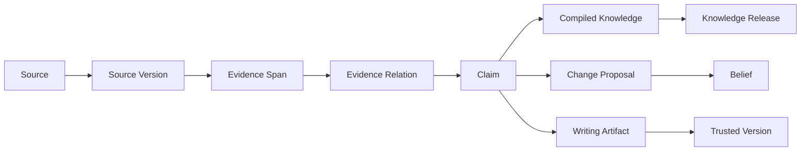
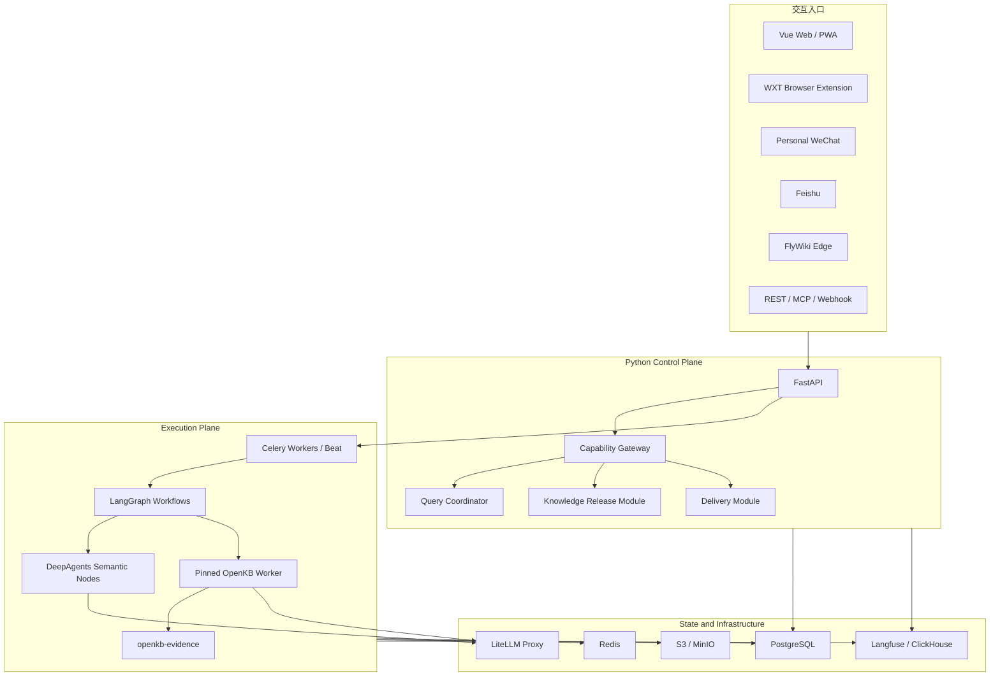

# FlyWiki 一期产品与技术方案

> 版本：v1.0  
> 日期：2026-08-01  
> 状态：范围与架构已确认；完整实施受研发前 R0 Gate 约束  
> 项目名称：FlyWiki 暂作为开源底座名称；用户产品另行命名

相关文档：[一期研发前置文档](product/) · [领域词汇表](../CONTEXT.md) · [图谱与 LLM Wiki 设计](图谱与LLM-Wiki设计.md) · [知识健康能力调研](开源知识库健康能力调研.md) · [ADR](adr/)

## 1. 文档地位

本文是 FlyWiki 一期当前有效的产品与技术基线，汇总了 2026-08-01 完成的产品评审和技术决策。它覆盖旧文档中与以下事项冲突的结论：

- 一期是可部署、可扩展的技术平台，不是只验证单一价值假设的人工 MVP；
- Knowledge Base 的图谱、编译和基础 Lint 必须使用 OpenKB；
- WeKnora 只作为 IM、分享、连接器、多租户、安全、监控和运维体验参考，不作为运行依赖；
- 业务后端统一使用 Python，不采用 OpenClaw，也不直接使用 OpenAI Agents SDK；OpenKB 上游当前包含的传递依赖被隔离在固定版本 Worker 内；
- DeepAgents 负责语义任务，确定性工作流由 Celery、LangGraph 和领域 Module 负责；
- 一期从数据结构上支持 Workspace 隔离，但产品体验可以先以单用户为主。

旧 PRD、可行性报告和开源选型分析保留为研究与决策演进记录；实现、测试和验收以本文、根目录 `CONTEXT.md` 和已接受 ADR 为准。

## 2. 产品定义

FlyWiki 是面向持续研究和输出者的可信知识平台。它将本地文件、网页、即时通信入口和持续追踪结果编译成可浏览的知识页与关系图，并在用户问答、研究和写作时提供可核验依据、冲突、未知项和个人认知对照。

一句话价值：

> 让用户知道自己已经知道什么、还不知道什么、外部世界出现了什么新知识，以及每个事实结论依据何在。

一期必须完成五个闭环：

1. **采集闭环**：资料从文件、网页、插件、IM 或追踪进入不可变来源库；
2. **知识闭环**：OpenKB 将来源编译成知识页与图谱，Evidence 扩展保留 Claim 级依据；
3. **追踪闭环**：Watch Rule 发现变化，经 Knowledge Inbox 审阅后更新系统知识；
4. **输出闭环**：问答和写作按事实、推论与创作分层，并完成引用审计；
5. **交付闭环**：知识可通过微信、飞书、Share Link、REST、MCP 和 Webhook 安全使用。

## 3. 产品原则

### 3.1 证据优先

- 所有事实 Claim 必须能够追溯到不可变 Source Version 中的 Evidence Span；
- “主题相关”不等于“能够作为证据”；
- Evidence Span 必须保留原文和可复核定位，翻译只能作为派生内容；
- 没有足够证据时，可信问答必须明确回答不知道、证据不足或来源冲突。

### 3.2 系统知识与个人认知分离

- Compiled Knowledge 可以根据来源自动更新；
- Belief 只能由用户明确表达、接受或修改后接受；
- 系统推断的用户身份、兴趣和认知只能形成 Change Proposal；
- 用户可以查看、编辑和回滚 Profile Document。

### 3.3 自净化必须可逆

- 自动去重候选、别名候选、过期标记、状态重算和隔离允许自动运行；
- 删除、合并、证据解绑、Belief 修改和发布必须经过授权；
- 用户可主动删除自己有权管理的 Source、派生知识和 Profile Document；执行前必须展示影响范围，撤销相关分享访问，并形成可审计的 Knowledge Change Set；
- 所有知识修改形成 Knowledge Change Set，记录修改前后、触发原因、依据、执行者和回滚信息；
- 原始来源不得被模型生成内容覆盖。

### 3.4 默认私有、最小授权

- 新建 Workspace、Knowledge Base、Source 和 Visitor Session 默认私有；
- 微信、飞书、Edge Device、REST Key、MCP 和 Share Link 都只获得完成任务所需的最小能力；
- 分享默认不展示或下载原始资料；
- 云端不保存个人微信登录凭证和封闭平台 Cookie。

### 3.5 不用一个数字掩盖问题

产品不得使用单一“可信度”“健康分”代替解释。应分别显示引用覆盖、引用有效、来源新鲜、冲突待审、结构健康、编译健康和发布健康。

## 4. 一期用户与核心任务

一期面向已有大量历史资料、持续研究并需要产出报告、文章、决策材料或分析的个人专业用户。典型任务包括：

- 把本地文件夹和长期收藏恢复为可理解的主题结构；
- 追踪一个明确领域，知道哪些新内容真正改变已有知识；
- 通过微信或飞书随时查询、写作和接收报告；
- 在写作前获得支持、反对、限制、过期信息和原文定位；
- 分享一个只读知识库，让他人查询并基于它写内容；
- 维护自己的身份、兴趣、记忆和已确认认知。

## 5. 一期能力范围

| 能力域 | 一期交付 |
| --- | --- |
| Knowledge Base | 本地文件和文件夹导入、OpenKB 编译、知识页、图谱、跨库联合查询 |
| Evidence | Source Version、Evidence Span、Claim、类型化关系、冲突与替代状态 |
| Tracking | Watch Rule、定时搜索、RSS/公开来源、封闭平台用户主动采集、Knowledge Inbox |
| Push | 日报/周报、关键事件即时通知、免打扰、幂等、反馈闭环 |
| Trusted Q&A | 原文检索、可信问答、研究与写作三种模式 |
| Trusted Writing | Evidence Plan、认知对照、提纲、草稿、Claim—Citation Audit、可信版本 |
| IM | 个人微信私聊入口、飞书私聊和群内 `@`、问答、写作请求和推送 |
| Browser Extension | 全文/智能/选区剪藏、批注、当前页问答、多 Knowledge Base、侧边栏 |
| Sharing | 不可变 Knowledge Release、可撤销匿名链接、访客查询/写作/上传、投稿审核 |
| Memory | 用户可编辑 Profile Document、自动候选、版本、差异和回滚 |
| Health | 引用、来源、冲突、结构、编译、发布七维健康检查与可逆修复 |
| Platform | Workspace、角色、REST、MCP、Webhook、配额、审计和恢复 |
| Observability | Langfuse 全链路追踪、成本、质量指标和生产数据脱敏 |

## 6. 主要产品界面

### 6.1 Knowledge Base 工作台

- 文件树、OpenKB 知识页和局部图谱联动；
- 图谱默认围绕当前主题或问题呈现，不展示无边界的全局蜘蛛网；
- 节点可下钻到 Claim、Evidence Span 和 Source Version；
- 支持单库浏览和通过 Query Coordinator 进行跨库联合查询；
- 一个 FlyWiki Knowledge Base 对应一个 OpenKB Workspace 和一条 Knowledge Release 流。

### 6.2 Knowledge Inbox

统一处理：

- 新来源和追踪结果；
- 与 Compiled Knowledge 或 Belief 冲突的新证据；
- Profile Document 更新候选；
- 访客投稿；
- 自动去重、过期和结构修复建议；
- 抓取、编译、引用和投递异常。

每个条目支持接受、拒绝、稍后、批量处理、查看依据和撤销。未经接受的候选不得进入 Belief；明确授权为自动摄取的可信来源可以进入 Compiled Knowledge。

### 6.3 Knowledge Health Center

健康中心按七个维度展示问题数量、严重程度、受影响对象和建议动作：

1. 引用覆盖；
2. 引用有效；
3. 来源新鲜；
4. 冲突待审；
5. 结构健康；
6. 编译健康；
7. 发布健康。

OpenKB 原生 Lint 负责断链、孤立页、缺 Wiki 条目、索引同步、Frontmatter 和语义候选问题。`openkb-evidence` 负责 Claim 覆盖、Evidence Span 定位、Source Version 新鲜度、冲突/替代和可信发布门禁。

### 6.4 Trusted Writing Studio

标准流程：

```text
写作目标
→ 选择 Knowledge Base / Knowledge Collection 与读者
→ Evidence Plan
→ 已知 / 未知 / 冲突 / 外部新知识
→ 提纲
→ 分段写作
→ Claim—Citation Audit
→ 用户确认
→ Trusted Version
→ Markdown / DOCX / PDF / Share Link
```

只有通过引用审计的版本可以标记为 Trusted Version。该标记只表示引用门禁通过，不构成对所有事实的绝对担保。

### 6.5 Sharing 与 Visitor Session

- 分享对象是不可变 Knowledge Release，不是正在写入的 OpenKB Workspace；
- Share Link 默认不可猜测、可撤销、不被搜索引擎索引并带配额；
- 匿名访客可以浏览、查询和创建自己的 Research Session 或 Writing Artifact；
- 访客不能编辑所有者 Knowledge Base；
- 访客附件、图片和链接默认只属于 Visitor Session，并设置有效期；
- “提交给所有者”只进入 Knowledge Inbox，不直接入库；
- 原始资料默认不可见、不可下载，所有者可以逐 Source 明确开放。

## 7. 回答与写作模式

| 模式 | 行为 | 门禁 |
| --- | --- | --- |
| 原文检索 | 返回 Evidence Span、上下文和定位 | 不生成超出原文的事实 |
| 可信问答 | 对事实 Claim 建立逐项引用，显示冲突与未知 | 无依据事实不能进入最终答案 |
| 研究与写作 | 调用 DeepAgents 完成比较、规划和综合 | 明确标记事实、推论和创作内容 |

分享页、定期报告和默认问答使用可信问答模式。Research Session 可以组合 Knowledge Release、联网资料和附件，但输出必须标记 `[知识库]`、`[联网]`、`[附件]` 和 `[推论]`。

## 8. 领域模型与状态

领域术语以根目录 [CONTEXT.md](../CONTEXT.md) 为准。核心追溯链为：



### 8.1 Evidence Status

- `unsupported`：没有可用 Evidence Span；
- `single_source`：只有一个来源支持；
- `corroborated`：多个独立来源相互印证；
- `contested`：存在有效反驳或适用范围冲突；
- `superseded`：已被更新证据或更新 Claim 替代。

### 8.2 Workspace Knowledge Status

- `unknown`：用户尚未形成或确认判断；
- `seen`：用户已看到但未接受；
- `accepted`：用户确认接受；
- `rejected`：用户明确拒绝；
- `superseded`：用户确认由新的 Belief 替代。

两个状态维度必须独立。证据充分不代表用户接受，用户接受也不代表证据充分。

### 8.3 Profile Document

- `USER.md`：全局身份、角色、目标和长期偏好；
- `INTERESTS.md`：Workspace 范围内的关注主题；
- `MEMORY.md`：可复用经历、背景和上下文；
- `BELIEFS.md`：用户确认的 Belief 摘要。

文档支持用户编辑、版本、Diff 和回滚。系统从明确用户表达中可以直接形成保存建议；敏感身份和推断认知只能作为候选。文档不得包含密钥，也不得进入 Share Link 或完整 Langfuse Trace。

## 9. 系统架构

一期采用模块化单体仓库、多个独立进程和共享领域模型。不是微服务，但进程可以按负载独立扩容。



## 10. 深 Module 与接缝

每个 Module 通过一个小 Interface 隐藏领域规则、幂等、权限和错误恢复。Interface 同时是调用面和测试面；实现细节不得泄漏给调用者。

| Module | Interface 负责承诺 | 主要实现 | Adapter / 接缝 |
| --- | --- | --- | --- |
| Workspace & Identity | 解析 Principal、授权能力、管理成员和绑定 | Workspace、角色、RLS、Channel Binding | Web、IM、API Key、Share Principal Adapter |
| Source Registry | 捕获 Source、创建不可变版本、撤回访问 | 去重、版本、对象存储、许可与敏感标记 | File、Web、Edge、Visitor Upload Adapter |
| Knowledge Compilation | 编译、查询、重建和执行原生 Lint | 固定版本 OpenKB Worker | `OpenKBAdapter` 与测试 Fake Adapter |
| Evidence Graph | 从来源建立 Claim、Evidence Span 和关系并重算状态 | `openkb-evidence`、PostgreSQL | OpenKB hook Adapter、解析器 Adapter |
| Research & Tracking | 执行 Watch Rule 并产生候选来源或报告 | Celery、搜索、抓取、去重、预算 | Search Provider、Feed、Closed-platform Adapter |
| Query Coordinator | 跨 Knowledge Base 召回并组装可信上下文 | 联合检索、权限过滤、证据排序 | OpenKB Query、Evidence Graph Adapter |
| Knowledge Governance | 产生、审阅和执行可逆知识修改 | Change Proposal、Knowledge Change Set | Inbox、Health Finding Adapter |
| Writing | 规划、起草、审计并生成 Trusted Version | LangGraph、DeepAgents、Claim—Citation Audit | Export Adapter |
| Knowledge Release | 构建、校验、原子发布、回退和强制下架 | 不可变 Release、latest pointer | Share Web、Embed Adapter |
| Delivery | 发送、重试、去重和记录通知 | Notification Policy、Delivery Grant | WeChat、Feishu、Email Adapter |
| Capability Gateway | 统一执行工具授权和输入安全策略 | Workspace 上下文、SSRF、配额、审计 | REST、MCP、Agent Tool Adapter |
| Knowledge Health | 汇总并解释七维健康问题 | OpenKB Lint、Evidence Check、运行状态 | Health Check Adapter |

禁止建立只把请求转发到下一个 Module 的浅层。跨进程调用仍由拥有领域规则的 Module 定义 Interface，HTTP、队列和本地 Fake 只是 Adapter。

## 11. OpenKB 集成与扩展

### 11.1 映射关系

- 一个 FlyWiki Knowledge Base 对应一个 OpenKB Workspace；
- 一个 Workspace 可以拥有多个 Knowledge Base；
- 相同 Source Version 可以复用对象存储，但在不同 Knowledge Base 中独立编译；
- 跨库查询由 Query Coordinator 联合完成，不合并 OpenKB 目录；
- 一期分享一个 Knowledge Release，后续可用 Knowledge Collection 组合多个发布版本。

### 11.2 `openkb-evidence`

`openkb-evidence` 是独立 Python Package，拥有：

- Evidence Span 和精确 locator；
- Claim 与适用条件；
- `SUPPORTS`、`CONTRADICTS`、`LIMITS`、`UPDATES` 等类型化关系；
- Evidence Status 与 Workspace Knowledge Status 计算；
- 冲突候选、引用完整性和健康检查；
- OpenKB 图谱贡献器；
- SQLite 开发 Adapter 和 PostgreSQL 生产 Adapter。

OpenKB Core 只增加通用扩展钩子，并优先向上游提交。FlyWiki 的 Workspace、追踪、IM、分享、调度和权限不得进入 OpenKB 扩展包。

### 11.3 升级纪律

- OpenKB Worker 固定镜像版本、Commit 和依赖锁；
- 只有 `OpenKBAdapter` 与 `openkb-evidence` 可以触碰 OpenKB 内部接口；
- FlyWiki 业务 Module 不导入或调用 OpenAI Agents SDK；若 OpenKB 上游继续依赖它，仅允许存在于隔离 Worker 的传递依赖树中；
- CI 运行固定版本阻断测试、最新稳定版兼容测试和主分支预警测试；
- 升级前从 Source Version 重建代表性 Knowledge Base，对比页面、图谱、Claim、引用和 Release；
- 失败时切回上一个 Worker 镜像，不迁移或覆盖 Source Version。

## 12. 工作流与 Agent 运行时

### 12.1 职责分工

| 层 | 职责 |
| --- | --- |
| Celery Beat / API / Webhook | 触发定时、用户和外部事件 |
| Celery Worker | 可靠异步、并发、重试、超时、幂等和资源队列 |
| LangGraph | 表达显式状态流、检查点和人工确认节点 |
| DeepAgents | 研究、冲突判断、写作规划等语义任务 |
| 领域 Module | 权限、持久化、发布、通知和确定性规则 |

DeepAgents 默认只能读取 Workspace 范围数据并提交提案，不拥有数据库、任意 Shell 或任意文件系统权限。所有变更和外发通过 Capability Gateway 与确定性 Module。

### 12.2 追踪流程

```text
Watch Rule 到期
→ 发现 URL / Feed Item
→ FlyWiki 抓取原始内容
→ 创建 Source Version
→ 去重与权限检查
→ review 或显式 auto_ingest
→ OpenKB 编译
→ Evidence Graph 更新
→ Knowledge Change Set
→ Knowledge Inbox / Digest
```

搜索结果只用于发现 URL；FlyWiki 必须自行抓取原始内容并创建 Source Version。默认 Search Provider 为 Brave Search API，同时保留 Tavily、Exa 和 SearXNG Adapter。平台额度和 Workspace BYOK 均可使用。

可信固定 RSS、作者、频道或页面可以显式开启 `auto_ingest`。主题关键词、未知来源、搜索结果和封闭平台内容默认进入 Review。

### 12.3 报告结构

日报和周报按变化量生成：

1. 必须处理：来源撤回、关键冲突和证据失效；
2. 世界新知识：相对现有 Compiled Knowledge 的真实新增；
3. 值得阅读：高相关但尚不能形成知识更新的内容；
4. 自动整理：去重、过期和结构变化摘要。

没有实质变化时不推送。报告保存 Release Diff 和引用，支持“已知、接受、反对、稍后、降低优先级”反馈。

## 13. 输入与连接器

### 13.1 FlyWiki Edge

Edge Device 是受限 Python 本地守护进程，统一承担：

- 本地文件夹只读同步；
- 个人微信连接器；
- 封闭平台用户主动采集；
- 本地凭证和密钥保管；
- 向云端建立出站安全连接。

Edge Device 不是 OpenClaw，也不运行通用 Agent。它保存目录层级、文件哈希和移动/重命名信息，不修改或删除用户本地文件，并通过周期性对账修复漏事件。

### 13.2 个人微信

- 一期只支持 allowlist 私聊；
- 支持问答、可信写作请求、报告推送和反馈；
- 不同步全部聊天或收藏；
- Channel Principal 通过配对绑定平台账号；
- 推送需要独立 Delivery Grant；
- 微信失效或 Edge Device 损坏不影响 Workspace 所有权。

### 13.3 飞书

- 支持私聊和群内 `@`；
- 群聊只能访问明确授权的 Knowledge Release；
- 文件、图片和链接按会话权限进入 Source Registry 或 Visitor Session；
- 高风险操作跳转 Web 完成，不在群消息中直接执行。

### 13.4 浏览器插件

技术栈为 WXT + Vue 3 + Manifest V3，参考 WeKnora Chrome Extension 和 Obsidian Web Clipper 的产品行为：

- 全文、智能正文和选区剪藏；
- 高亮、批注和 Markdown 快速笔记；
- 选择目标 Knowledge Base；
- 当前页面可信问答；
- Side Panel 管理抓取范围和引用预览；
- 默认保存清洗正文与 locator，原始 HTML 快照默认关闭、用户可选开启；
- 插件不上传浏览器 Cookie。

### 13.5 移动端

一期不开发原生 iOS/Android App。移动能力由微信、飞书和响应式 Vue Web/PWA 覆盖，包括报告阅读、收件箱处理、分享查询、附件上传和深链跳转。

## 14. 身份、权限与多租户准备

### 14.1 根身份与恢复

- 平台账号是根身份；Channel Principal 和 Edge Device 只是绑定；
- 一期提供邮箱验证和恢复码，预留手机号、Passkey 和企业 SSO；
- 新设备登录后扫码配对，可远程撤销；
- 换机、渠道重绑和恢复操作需要二次验证和审计。

### 14.2 Workspace 权限

- 角色：Owner、Admin、Editor、Viewer；
- PostgreSQL RLS 与应用层同时约束 Workspace 数据；
- 关键关联使用包含 `workspace_id` 的组合外键；
- 对象存储 Key 带 Workspace 前缀；
- Celery 使用签名执行上下文，Worker 必须重新验证资源归属；
- Share Link 使用 Release 范围的匿名 Principal。

### 14.3 REST、MCP 与 Webhook

- 版本化 REST 是 Web、插件、Edge Device 和 IM 的统一入口；
- MCP 是 REST 能力的受限 Adapter，不拥有单独权限体系；
- Workspace API Key 按读取知识、提交来源、研究、创建草稿和提交审核授权；
- MCP 和 API Key 默认不能删除资料、修改 Belief 或发布 Knowledge Release；
- Key 支持过期、撤销、配额、IP 限制和审计；
- Webhook 覆盖摄取完成、健康问题、Release 发布和任务失败。

## 15. 内容权利、隐私与安全

### 15.1 内容权利

- Source 记录作者、URL、采集时间、许可和分享策略；
- 许可未知的内容默认只用于私人研究；
- 分享只展示必要综合结果和引用片段；
- 所有者可以逐 Source 设置禁止分享、允许引用或允许下载；
- 强制下架立即阻断所有 Release 中相应原文和引用片段访问，不等待重新编译。

### 15.2 敏感信息

- 发布前扫描密钥、身份证号、联系方式和其他敏感信息；
- 命中后阻止自动发布并进入 Knowledge Inbox；
- 调用外部模型前按 Workspace 策略脱敏，并展示模型供应商；
- Visitor Session 附件默认私有并按 TTL 删除；
- Langfuse 不保存完整私密文档、Cookie、密钥或个人微信原始聊天。

### 15.3 不可信输入

浏览器内容、网页、附件、IM 消息和访客输入一律视为不可信：

- Capability Gateway 执行 SSRF 防护、URL 规范化、文件类型检查、病毒扫描、大小限制和内容隔离；
- Prompt Injection 检测只作为信号，不能替代工具权限；
- Agent 不得从输入内容获得新的能力；
- 访客内容不能跨 Visitor Session 或 Workspace 被检索。

## 16. 前后端技术栈

### 16.1 后端

- Python 模块化单体；
- FastAPI 控制面；
- Celery Worker 与 Celery Beat；
- LangGraph 状态工作流；
- DeepAgents 语义 Agent Harness；
- OpenKB 独立 Worker；
- PostgreSQL 领域数据和任务真相源；
- Redis 队列、缓存、锁和临时状态；
- S3/MinIO 原始资料、附件和 Release；
- LiteLLM Proxy 模型网关；
- Langfuse + OpenTelemetry + ClickHouse 可观测性。

### 16.2 前端

- Vue 3 + Vite + Pinia + Vue Router + TDesign；
- 浏览器插件：WXT + Vue 3 + Manifest V3；
- 共享 TypeScript Package：UI、API Client、Clipper Core、Graph UI；
- 一期 Share Link 默认不被索引，因此不引入 Nuxt/SSR；
- UI 简体中文优先，从第一天使用 i18n。

### 16.3 多语言

- 中文和英文资料均可摄取、检索、建图和比较冲突；
- Evidence Span 保存原文，翻译是明确标记的派生内容；
- 输出语言默认跟随用户设置；
- 跨语言查询结合原始查询、受控翻译和实体别名；
- OCR、分词、网页抽取和 locator 必须进入中英文混合评测集。

## 17. 模型网关与可观测性

### 17.1 LiteLLM Proxy

一期直接采用 LiteLLM Proxy，不自研 Model Gateway：

- OpenKB 保留原生 LiteLLM 调用方式，通过兼容 Endpoint 和虚拟 Key 接入 Proxy；
- DeepAgents、OCR/VLM、抽取、冲突分析和写作统一接入 Proxy；
- 支持平台额度与 Workspace BYOK；
- 按任务路由模型，记录 token、费用、延迟和错误；
- 支持日/月预算、并发、联网搜索配额和超限策略；
- 降级不得放松引用审计和权限门禁。

### 17.2 Langfuse

一期必须集成自托管 Langfuse，并通过 OpenTelemetry 串联：

- FastAPI 请求；
- Celery Task；
- LangGraph Run；
- DeepAgents Run 与工具调用；
- OpenKB 编译；
- Knowledge Release；
- IM 与通知投递。

生产默认脱敏。运营可查看完整运行诊断，Workspace 用户只查看已清洗的质量和成本摘要。核心质量指标包括引用覆盖、locator 有效率、无依据 Claim 比例、冲突召回、工具拒绝、成本和延迟。

## 18. 通知策略

- 高优先级：来源撤回、关键 Belief 冲突、引用失效和任务失败可以即时通知；
- 普通新增：进入日报或周报；
- 支持 Workspace 时区、免打扰、工作日和渠道频率；
- 支持按 Knowledge Base、Watch Rule 和主题静音；
- 微信和飞书只展示必要摘要，敏感证据登录 Web 查看；
- 所有投递包含幂等键、送达状态、有限重试和发送记录；
- 用户反馈影响后续排序和频率，但不能改变证据状态。

## 19. 部署与基础设施

### 19.1 Docker Compose

一期提供 Docker Compose，直接使用上游官方镜像：

- PostgreSQL 官方镜像；
- Redis 官方 Alpine 镜像并启用 AOF；
- MinIO 官方 Release 镜像；
- LiteLLM、Langfuse、ClickHouse 等各自官方镜像。

所有镜像固定补丁版本和 digest，不使用 `latest`。FlyWiki 不为 PostgreSQL、Redis 和 MinIO 维护自定义基础镜像。

### 19.2 逻辑隔离与生产替换

- FlyWiki 与 Langfuse 可以复用 PostgreSQL、Redis 和 MinIO 实例，但使用独立 Database、ACL/前缀和 Bucket；
- 数据库、Redis、MinIO、OpenKB Worker 和 ClickHouse 默认不暴露公网端口；
- 开发和单机使用 Compose；
- 生产可通过环境变量切换到托管 PostgreSQL、Redis 和 S3，无需修改领域代码；
- 一期不强制 Kubernetes，但进程、健康检查、配置和持久卷设计必须可迁移。

## 20. 数据导出、备份与恢复

### 20.1 完整导出包

导出包含：

- 原始文件和 Source Version；
- Markdown 知识页；
- Claim、Evidence Span 和类型化关系；
- 图谱数据；
- Profile Document；
- Watch Rule、来源配置和 Knowledge Change Set；
- 机器可读 Manifest。

密钥、微信凭证、API Key 和完整运行日志不进入普通导出包。导出包支持重新导入并尽量恢复引用和关系。

### 20.2 灾难恢复目标

- PostgreSQL 支持时间点恢复，目标 `RPO ≤ 15 分钟`、`RTO ≤ 4 小时`；
- S3/MinIO 开启对象版本和生命周期；
- OpenKB Workspace 是可重建派生数据，不作为唯一备份；
- Redis 不作为知识真相源；
- 恢复后用幂等键避免重复摄取、发布和推送；
- 备份加密并定期执行真实恢复演练；
- 一期不建设异地双活。

## 21. 首次使用与运维体验

### 21.1 管理员部署预检

检查 PostgreSQL、Redis、S3/MinIO、LiteLLM、Langfuse、OpenKB Worker、邮件服务、密钥强度、版本和存储权限，并生成诊断报告。

### 21.2 用户引导

引导创建 Workspace 和 Knowledge Base、导入首个文件夹、安装 Edge Device、绑定微信/飞书、安装浏览器插件和创建 Watch Rule。提供演示 Knowledge Base；所有步骤可以跳过并稍后继续。

首次导入完成后生成初检报告，说明结构、引用、冲突候选、未处理来源和下一步建议。

## 22. 容量与性能基线

一期必须通过以下参考数据集：

- 单 Knowledge Base 1,000 份中英文混合资料；
- 原始文件合计 20 GB；
- 单文件默认上限 200 MB；
- 每个 Workspace 默认最多 10 个 Knowledge Base，可由管理员调整；
- 同一个 Knowledge Base 的编译写入串行，不同 Knowledge Base 可并行；
- 浏览、查询和分享读取不能被后台编译整体阻塞；
- 抓取、OCR、OpenKB 编译和健康检查具有独立并发、预算和资源队列；
- 所有耗时任务支持进度、取消、重试和失败恢复。

这些数字是一期压测包络，不是永久硬限制，也不构成万级并发或数万文档单库承诺。

## 23. 一期明确不做

- 原生 iOS/Android App 和离线移动知识库；
- 多人实时协同编辑；
- 访客直接修改所有者 Knowledge Base；
- 自动改变用户确认过的 Belief；
- 自动删除原始资料、证据或知识页；
- 云端集中保存个人微信凭证；
- 批量同步个人微信聊天和收藏；
- 绕过平台授权抓取封闭平台；
- 未经审阅自动公开发布或自动对外发消息；
- 自研模型网关、向量数据库或通用 Agent 框架；
- 异地多活、微服务拆分和 Kubernetes 强依赖；
- 企业 SSO、计费订阅、插件市场和完整多租户运营后台；
- 用单一可信分或健康分代替可解释维度。

以上能力可以预留数据结构或 Adapter，但不进入一期验收。

## 24. Definition of Done

以下端到端场景全部通过，一期才算完成：

1. 使用固定版本官方基础设施镜像完成 Compose 部署，预检和 Langfuse 链路正常；
2. 从本地文件夹、浏览器插件、网页链接和附件导入资料并形成不可变 Source Version；
3. OpenKB 生成 Wiki 与图谱，`openkb-evidence` 建立 Claim、Evidence Span 和关系；
4. 可信问答中的事实 Claim 全部通过引用审计，证据不足时明确回答不知道；
5. Trusted Writing Studio 完成 Evidence Plan、冲突展示、草稿和 Claim—Citation Audit；
6. Watch Rule 完成追踪、Knowledge Inbox 审阅、无变化不推送和日报/周报；
7. 微信和飞书完成绑定、问答、写作请求、报告推送、撤销和送达审计；
8. 浏览器插件完成剪藏、选区、批注、当前页问答并提交到目标 Knowledge Base；
9. Knowledge Release 原子发布和回退，访客可查询、写作和上传但不能修改所有者知识；
10. Knowledge Health Center 发现七维问题并通过可回滚 Knowledge Change Set 处理；
11. Workspace 隔离、角色、API Key、MCP、敏感信息和强制下架测试全部通过；
12. 完整导出/恢复、PostgreSQL 时间点恢复、对象版本恢复和消息幂等演练通过；
13. 参考数据集达到 1,000 份资料、20 GB 单库基线，读取不被后台编译整体阻塞。

## 25. 建议实施顺序

### R0：证伪与架构跑道

- 真实历史输出回放、数据承诺和付费行为验证；
- OpenKB Worker/Adapter、十轮增量编译和升级回退 PoC；
- Claim—Evidence 与 locator 人工基准集；
- Workspace 最小垂直切片、飞书 Spike 和个人微信 Edge soak test；
- 按[一期可行性分析](product/可行性分析.md)执行 Go/Hold/Pivot/Stop 评审。

R0 不改变一期最终范围，也不是用人工 MVP 替代平台交付；它只负责在全面投入前证伪会推翻项目的高风险假设。

### R1：可信知识内核

- Workspace 与身份骨架；
- Source Registry、Source Version、Evidence Span；
- 固定版本 OpenKB Worker 与 Adapter；
- `openkb-evidence`；
- 可信问答与基础 Knowledge Base 工作台；
- PostgreSQL、Redis、S3/MinIO、LiteLLM 和 Langfuse。

### R2：追踪、自净化与写作

- Watch Rule、Search Provider、抓取和 Knowledge Inbox；
- Knowledge Health Center 与 Knowledge Change Set；
- Trusted Writing Studio；
- Profile Document；
- 日报、周报和通知策略。

### R3：多入口与分享

- FlyWiki Edge 与个人微信；
- 飞书；
- 浏览器插件；
- Knowledge Release、Share Link 和 Visitor Session；
- REST、MCP、Webhook；
- 完整导出、恢复和容量验收。

三个阶段都必须保持 Source Version、Workspace 隔离、Capability Gateway、Langfuse 脱敏和 OpenKB 升级测试，不能把安全与可追溯性推迟到最后补做。

## 26. 当前保留事项

- 用户产品正式名称暂不决定；
- LiteLLM、PostgreSQL、Redis、MinIO、Langfuse 和 ClickHouse 的具体补丁版本与 digest 在实现前通过兼容性测试锁定；
- 微信连接器的具体协议和账号风险在实现前再次核验，只允许用户授权的本地部署方式；
- Source 许可和强制下架流程在公开发布前完成法律审查；
- 正式推荐容量以一期基准压测结果为准。
