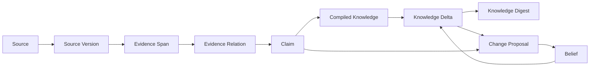
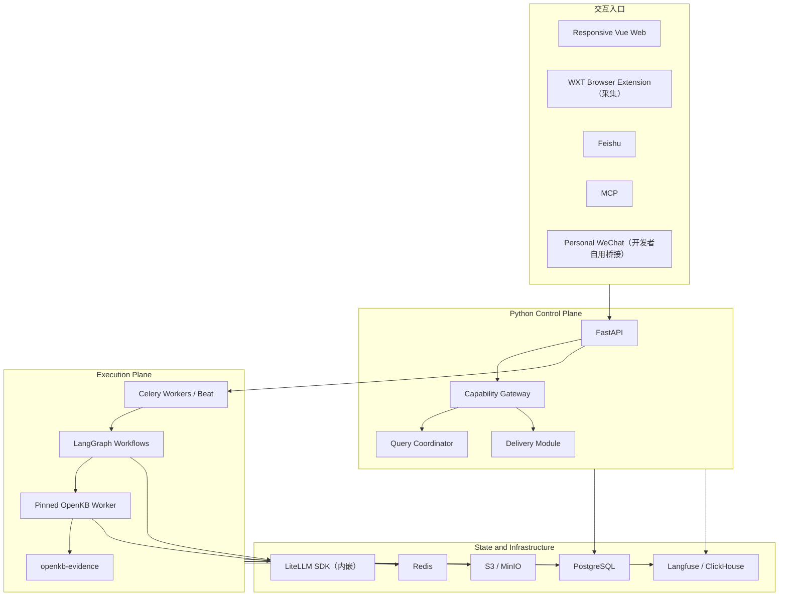

# FlyWiki 一期产品与技术方案

> 版本：v1.3
> 日期：2026-08-03
> 状态：范围与架构已确认（已按单人开发规模校准）；完整实施受研发前 R0 Gate 约束  
> 项目名称：FlyWiki 暂作为开源底座名称；用户产品另行命名

相关文档：[一期研发前置文档](README.md) · [领域词汇表](../../CONTEXT.md) · [图谱与 LLM Wiki 设计](../图谱与LLM-Wiki设计.md) · [知识健康能力调研](../开源知识库健康能力调研.md) · [ADR](../adr/)

> **v1.3 范围校准说明**：执行者为个人开发者 + AI 辅助。相较 v1.2 移出一期：个人微信产品化接入与 FlyWiki Edge、本地文件同步、分享与访客体系、基础内容生成、DeepAgents、独立部署的 LiteLLM Proxy、多角色权限、对外 REST/Webhook、Profile Document 与 PostgreSQL RLS。Knowledge Delta 产品面收敛为新增/冲突/强化/忽略四分类（数据模型保留七类枚举）。四篇 ADR 在新范围下继续有效。被移出能力保留数据结构或 Adapter 边界，但不进入一期验收。

## 1. 文档地位

本文是 FlyWiki 一期当前有效的产品与技术基线，汇总了截至 2026-08-03 完成的产品评审和技术决策。它覆盖旧文档中与以下事项冲突的结论：

- 一期由个人开发者 + AI 辅助交付，聚焦价值闭环，严格纵向分批，不横向铺开入口；
- Knowledge Base 的图谱、编译和基础 Lint 必须使用 OpenKB；
- WeKnora 只作为 IM、连接器、租户模型、安全、监控和运维体验参考，不作为运行依赖；
- 业务后端统一使用 Python，不采用 OpenClaw，也不直接使用 OpenAI Agents SDK；OpenKB 上游当前包含的传递依赖被隔离在固定版本 Worker 内；
- 语义任务由 LangGraph + 直接 LLM 调用承担，一期不引入 DeepAgents；确定性工作流由 Celery、LangGraph 和领域 Module 负责；
- 一期从数据结构上支持 Workspace 隔离（应用层 `workspace_id` 过滤；RLS 为二期），产品体验以单用户单 Workspace 为主；
- 一期只交付响应式 Web 主产品；浏览器插件（仅采集）和飞书（仅问答/推送/反馈）是受限入口，不复制完整控制面；个人微信仅为开发者自用实验通道；
- 一期不接支付，计费订阅仅预留演进边界。

旧 PRD、可行性报告和开源选型分析保留为研究与决策演进记录；实现、测试和验收以本文、根目录 `CONTEXT.md` 和已接受 ADR 为准。

## 2. 产品定义

FlyWiki 是面向资料过载与持续领域追踪者的可信知识平台。它将历史资料编译成知识基线，把持续进入的新内容与已有知识和用户认知比较，并将真正重要的新增、强化、限制、冲突与替代连同依据推送给用户。

一句话价值：

> 不要求用户读完所有资料，也能知道什么是新信息、什么与已有知识冲突、什么需要认知审阅、什么只是强化，以及每项判断依据何在。

一期必须完成四个闭环：

1. **采集闭环**：资料从文件、网页、插件或追踪进入不可变来源库；
2. **知识闭环**：OpenKB 将来源编译成知识页与图谱，Evidence 扩展保留 Claim 级依据；
3. **变化闭环**：新 Evidence 与 Compiled Knowledge/Belief 比较，形成可解释 Knowledge Delta（四分类）；
4. **消化与出口闭环**：Knowledge Digest 按认知影响分级推送，用户反馈进入下一轮排序和 Change Proposal；知识通过可信问答（Web/飞书）和 MCP 使用。

## 3. 产品原则

### 3.1 证据优先

- 所有事实 Claim 必须能够追溯到不可变 Source Version 中的 Evidence Span；
- “主题相关”不等于“能够作为证据”；
- Evidence Span 必须保留原文和可复核定位，翻译只能作为派生内容；
- 没有足够证据时，可信问答必须明确回答不知道、证据不足或来源冲突。

### 3.2 系统知识与个人认知分离

- Compiled Knowledge 可以根据来源自动更新；
- Belief 只能由用户明确表达、接受或修改后接受；用户对 Claim 标记“接受”即形成 Belief；
- 系统推断只能形成 Change Proposal，不能静默改变 Belief。

（Profile Document 与自动记忆候选移至二期。）

### 3.3 自净化必须可逆

- 自动去重候选、别名候选、过期标记、状态重算和隔离允许自动运行；
- 删除、合并、证据解绑和 Belief 修改必须经过授权；
- 用户可主动删除自己有权管理的 Source 和派生知识；执行前必须展示影响范围，并形成可审计的 Knowledge Change Set；
- 所有知识修改形成 Knowledge Change Set，记录修改前后、触发原因、依据、执行者和回滚信息；
- 原始来源不得被模型生成内容覆盖。

### 3.4 默认私有、最小授权

- 新建 Workspace、Knowledge Base 和 Source 默认私有；
- 飞书、MCP API Key 都只获得完成任务所需的最小能力；
- 云端不保存个人微信登录凭证和封闭平台 Cookie（微信仅为开发者本地自用通道）。

### 3.5 不用一个数字掩盖问题

产品不得使用单一“可信度”“健康分”代替解释。应分别显示引用覆盖、引用有效、来源新鲜、冲突待审、结构健康和编译健康。

## 4. 一期用户与核心任务

一期面向已有大量历史资料、持续关注一个或多个领域，却没有时间消化所有新增内容的个人专业用户；开发者本人属于该画像，是第一验证对象。典型任务包括：

- 把历史文件和长期收藏恢复为可理解的主题结构；
- 追踪一个明确领域，识别新增、冲突、强化与忽略；
- 判断新证据是否可能影响自己已经确认的认知；
- 通过飞书接收低噪声 Knowledge Digest 并反馈；
- 在需要时获得带原文依据的问答；
- 通过 MCP 让 AI 客户端读取和问答自己的知识库；
- 维护自己已确认的认知（Belief）。

## 5. 一期能力范围

| 能力域 | 一期交付 |
| --- | --- |
| Knowledge Base | Web 上传、URL 导入、OpenKB 编译、知识页、图谱、跨库联合查询 |
| Evidence | Source Version、Evidence Span、Claim、Evidence Relation 与 Knowledge Delta（四分类） |
| Tracking | Watch Rule、定时搜索、RSS/公开来源、封闭平台用户主动采集、Knowledge Inbox |
| Push | Knowledge Digest、关键认知影响即时通知、免打扰、幂等和反馈闭环 |
| Trusted Q&A | 原文检索、可信问答、联网补充（事实带引用、推论显式标记） |
| IM | 飞书私聊和群内 `@`：问答、Knowledge Digest 和反馈；复杂操作回 Web。个人微信为开发者自用实验通道 |
| Browser Extension | 采集（弹窗）：网址、智能正文/选区剪藏、笔记、选目标 Knowledge Base |
| Belief | 接受 Claim 即 Belief；新证据冲突时生成 Belief Change Proposal |
| Health | 引用、来源、冲突、结构、编译六维健康检查与可逆修复 |
| Platform | Workspace 数据模型隔离、MCP 与最简 API Key |
| Observability | Langfuse 全链路追踪、成本、质量指标和生产数据脱敏 |

**移至二期**：分享/访客体系、基础内容生成、Profile Document、多角色权限、REST/Webhook、配额审计后台、个人微信产品化、本地文件同步、FlyWiki Edge。

## 6. 主要产品界面

Web 是一期唯一完整控制面。日常工作台参考 Cubox 的三栏阅读结构：左栏为 Knowledge Base、待处理、追踪、Knowledge Digest 和标签；中栏为 Source/Knowledge Delta/Inbox 卡片列表；右栏为原文、Evidence Span、摘要、可信问答和认知对照。Knowledge Graph 作为独立局部探索视图，不占据默认首页。

### 6.1 Knowledge Base 工作台

- 文件树、OpenKB 知识页和局部图谱联动；
- 图谱默认围绕当前主题或问题呈现，不展示无边界的全局蜘蛛网；
- 节点可下钻到 Claim、Evidence Span 和 Source Version；
- 支持单库浏览和通过 Query Coordinator 进行跨库联合查询；
- 一个 FlyWiki Knowledge Base 对应一个 OpenKB Workspace。

### 6.2 Knowledge Inbox

统一处理：

- 新来源和追踪结果；
- 新增、冲突、强化和忽略 Knowledge Delta（冲突含限制、替代子标签）；
- 可能影响 Belief 的 Change Proposal；
- 自动去重、过期和结构修复建议；
- 抓取、编译、引用和投递异常。

每个条目支持接受、拒绝、稍后、批量处理、查看依据和撤销。所有新内容先完成解析、去重、来源评估和认知对照；处理完成前可搜索和问答，但必须标记“尚未验证”。未经接受的候选不得进入 Belief；满足治理规则并明确授权的来源可以由系统晋级 Compiled Knowledge，但采集动作本身不能直接建立可信知识。

### 6.3 Knowledge Health Center

健康中心按六个维度展示问题数量、严重程度、受影响对象和建议动作：

1. 引用覆盖；
2. 引用有效；
3. 来源新鲜；
4. 冲突待审；
5. 结构健康；
6. 编译健康。

（发布健康随分享移至二期。）OpenKB 原生 Lint 负责断链、孤立页、缺 Wiki 条目、索引同步、Frontmatter 和语义候选问题。`openkb-evidence` 负责 Claim 覆盖、Evidence Span 定位、Source Version 新鲜度和冲突/替代。

### 6.4 Knowledge Digest

Knowledge Digest 以 Knowledge Delta 为最小条目，按“必须处理、冲突、新增、强化、忽略”四分类组织。每条必须说明对比对象、变化理由、Evidence Span 和建议动作。

（基础内容生成移至二期；完整 Writing Studio、Evidence Plan 和长文 Claim—Citation Audit 同样延后。）

### 6.5 Sharing 与 Visitor Session（二期）

分享（不可变 Knowledge Release、Share Link、访客隔离会话、访客问答/上传/投稿审核）整体移至二期，待一期核心价值验证通过后再设计。一期知识回滚由 Knowledge Change Set 承担，不依赖 Release 快照。

## 7. 知识使用模式

| 模式 | 行为 | 门禁 |
| --- | --- | --- |
| 原文检索 | 返回 Evidence Span、上下文和定位 | 不生成超出原文的事实 |
| 可信问答 | 对事实 Claim 建立逐项引用，显示冲突与未知 | 无依据事实不能进入最终答案 |

Knowledge Digest 和默认问答使用可信问答模式。临时任务可以组合联网资料和附件，但输出必须标记 `[知识库]`、`[联网]`、`[附件]` 和 `[推论]`。（基础内容生成模式移至二期。）

## 8. 领域模型与状态

领域术语以根目录 [CONTEXT.md](../../CONTEXT.md) 为准。核心追溯链为：



（Knowledge Release、Writing Artifact、Trusted Version 属于二期，不在一期追溯链中。）

### 8.1 Evidence Status

- `unsupported`：没有可用 Evidence Span；
- `single_source`：只有一个来源支持；
- `corroborated`：多个独立来源相互印证；
- `contested`：存在有效反驳或适用范围冲突；
- `superseded`：已被更新证据或更新 Claim 替代。

### 8.2 Workspace Knowledge Status

- `unknown`：用户尚未形成或确认判断；
- `seen`：用户已看到但未接受；
- `accepted`：用户确认接受；
- `rejected`：用户明确拒绝；
- `superseded`：用户确认由新的 Belief 替代。

两个状态维度必须独立。证据充分不代表用户接受，用户接受也不代表证据充分。

### 8.3 Belief（一期最简形态）

一期不设独立的 Profile Document 体系。Belief 由 Workspace Knowledge Status 的 `accepted` 状态直接承担：用户对某个 Claim 标记“接受”，该 Claim 即成为其 Belief。新证据与已接受 Claim 冲突时，系统生成 Belief Change Proposal 供审阅，不能自动改写。

（`USER.md`/`INTERESTS.md`/`MEMORY.md`/`BELIEFS.md` 形态的可编辑、可版本化 Profile Document 与自动记忆候选移至二期。）

## 9. 系统架构

一期采用模块化单体仓库、多个独立进程和共享领域模型。不是微服务，但进程可以按负载独立扩容。



（Knowledge Release Module 与 DeepAgents 节点移至二期，故不在一期架构图中。）

## 10. 深 Module 与接缝

每个 Module 通过一个小 Interface 隐藏领域规则、幂等、权限和错误恢复。Interface 同时是调用面和测试面；实现细节不得泄漏给调用者。

| Module | Interface 负责承诺 | 主要实现 | Adapter / 接缝 |
| --- | --- | --- | --- |
| Workspace & Identity | 解析 Principal、授权能力 | Workspace（单用户 Owner）、`workspace_id` 过滤、Channel Binding | Web、IM、API Key Adapter |
| Source Registry | 捕获 Source、创建不可变版本 | 去重、版本、对象存储、许可与敏感标记 | File、Web Upload Adapter |
| Knowledge Compilation | 编译、查询、重建和执行原生 Lint | 固定版本 OpenKB Worker | `OpenKBAdapter` 与测试 Fake Adapter |
| Evidence Graph | 从来源建立 Claim、Evidence Span 和关系并重算状态 | `openkb-evidence`、PostgreSQL | OpenKB hook Adapter、解析器 Adapter |
| Tracking & Delta | 执行 Watch Rule，将新证据与已有知识和 Belief 比较（四分类） | Celery、搜索、抓取、Knowledge Delta、预算 | Search Provider、Feed、Closed-platform Adapter |
| Query Coordinator | 跨 Knowledge Base 召回并组装可信上下文 | 联合检索、权限过滤、证据排序 | OpenKB Query、Evidence Graph Adapter |
| Knowledge Governance | 产生、审阅和执行可逆知识修改 | Change Proposal、Knowledge Change Set | Inbox、Health Finding Adapter |
| Trusted Content | 生成带依据的可信问答回答 | LangGraph、引用检查 | — |
| Delivery | 发送、重试、去重和记录通知 | Notification Policy、Delivery Grant | Feishu、Email Adapter |
| Capability Gateway | 统一执行工具授权和输入安全策略 | Workspace 上下文、SSRF、配额、审计 | MCP、Agent Tool Adapter |
| Knowledge Health | 汇总并解释六维健康问题 | OpenKB Lint、Evidence Check、运行状态 | Health Check Adapter |

二期恢复的 Module（Knowledge Release、访客上传、多角色、REST/Webhook Adapter、DeepAgents 语义节点、WeChat 产品化 Delivery）保留接缝但不在一期实现。禁止建立只把请求转发到下一个 Module 的浅层。

## 11. OpenKB 集成与扩展

### 11.1 映射关系

- 一个 FlyWiki Knowledge Base 对应一个 OpenKB Workspace；
- 一个 Workspace 可以拥有多个 Knowledge Base；
- 相同 Source Version 可以复用对象存储，但在不同 Knowledge Base 中独立编译；
- 跨库查询由 Query Coordinator 联合完成，不合并 OpenKB 目录（二期用 Knowledge Collection 组合多个发布版本）。

### 11.2 `openkb-evidence`

`openkb-evidence` 是独立 Python Package，拥有：

- Evidence Span 和精确 locator；
- Claim 与适用条件；
- `SUPPORTS`、`CONTRADICTS`、`LIMITS`、`UPDATES` 等类型化关系；
- Evidence Status 与 Workspace Knowledge Status 计算；
- 冲突候选、引用完整性和健康检查；
- OpenKB 图谱贡献器；
- SQLite 开发 Adapter 和 PostgreSQL 生产 Adapter。

OpenKB Core 只增加通用扩展钩子，并优先向上游提交。FlyWiki 的 Workspace、追踪、IM、分享、调度和权限不得进入 OpenKB 扩展包。

### 11.3 升级纪律

- OpenKB Worker 固定镜像版本、Commit 和依赖锁；
- 只有 `OpenKBAdapter` 与 `openkb-evidence` 可以触碰 OpenKB 内部接口；
- FlyWiki 业务 Module 不导入或调用 OpenAI Agents SDK；若 OpenKB 上游继续依赖它，仅允许存在于隔离 Worker 的传递依赖树中；
- CI 运行固定版本阻断测试、最新稳定版兼容测试和主分支预警测试；
- 升级前从 Source Version 重建代表性 Knowledge Base，对比页面、图谱、Claim、引用和 Release；
- 失败时切回上一个 Worker 镜像，不迁移或覆盖 Source Version。

## 12. 工作流与 Agent 运行时

### 12.1 职责分工

| 层 | 职责 |
| --- | --- |
| Celery Beat / API | 触发定时、用户和外部事件 |
| Celery Worker | 可靠异步、并发、重试、超时、幂等和资源队列 |
| LangGraph | 表达显式状态流、检查点、人工确认节点，以及新旧知识比较、冲突判断、变化归类和摘要等语义任务 |
| 领域 Module | 权限、持久化、通知和确定性规则 |

一期用 LangGraph 节点内嵌 LiteLLM SDK 直接完成语义任务，不引入 DeepAgents Agent Harness（移至二期）。语义节点默认只能读取 Workspace 范围数据并提交提案，不拥有数据库、任意 Shell 或任意文件系统权限。所有变更和外发通过 Capability Gateway 与确定性 Module。

### 12.2 追踪流程

```text
Watch Rule 到期
→ 发现 URL / Feed Item
→ FlyWiki 抓取原始内容
→ 创建 Source Version
→ 去重与权限检查
→ Review 或满足治理规则后自动晋级
→ OpenKB 编译
→ Evidence Graph 更新
→ 与 Compiled Knowledge / Belief 比较
→ Knowledge Delta
→ Knowledge Inbox / Knowledge Digest
```

搜索结果只用于发现 URL；FlyWiki 必须自行抓取原始内容并创建 Source Version。默认 Search Provider 为 Brave Search API，同时保留 Tavily、Exa 和 SearXNG Adapter。平台额度和 Workspace BYOK 均可使用。

可信固定 RSS、作者、频道或页面可以显式开启“处理完成后自动晋级”；主题关键词、未知来源、搜索结果和封闭平台内容默认进入 Review。任何入口都必须先创建 Source Version 并经过处理状态，不能从采集直接跳到可信知识。

### 12.3 Knowledge Digest 结构

Knowledge Digest 按认知影响而不是抓取数量生成：

1. 必须处理：来源撤回、关键冲突和证据失效；
2. 世界新知识：相对现有 Compiled Knowledge 的真实新增；
3. 可能需要认知更新：限制、反驳或替代已确认 Belief 的候选；
4. 强化：新的独立证据支持已有 Claim 或 Belief；
5. 值得阅读：高相关但尚不能形成知识更新的内容；
6. 自动整理：去重、过期和结构变化摘要。

没有实质变化时不推送。默认每周一份，用户可改为每日或关闭；只有高置信度重大冲突、来源撤回、关键引用失效和追踪主题的重要变化即时通知。报告保存 Release Diff 和引用，支持“已知、接受、反对、稍后、降低优先级”反馈。

## 13. 输入与连接器

一期入口聚焦三条：本地文件/网页上传、飞书、浏览器插件采集，外加一条开发者自用的微信桥接。FlyWiki Edge 守护进程、本地文件夹同步、封闭平台主动采集移至二期。

### 13.1 本地文件与网页上传

- 通过 Web 或浏览器插件上传本地文件、粘贴网页链接；
- 每次上传创建不可变 Source/Source Version 并做去重；
- 一期不做常驻本地守护进程与本地文件夹增量同步；
- Web 端标签、摘要、Compiled Knowledge 和 Belief 不写回本地。

### 13.2 微信（开发者自用桥接）

微信在一期不是对外产品能力，而是开发者自用的实验通道，用于验证“通过 IM 与知识库对话”的形态：

- 通过一个通用 IM 接口对接（参考 OpenClaw 连接微信的方式），不产品化、不承诺稳定性；
- 只支持开发者本人 allowlist 私聊问答；
- 不同步聊天或收藏，不在云端集中保存微信凭证；
- 微信通道失效不影响 Workspace 所有权与任何知识数据。

### 13.3 飞书

- 支持私聊和群内 `@` 问答；
- 一期只做问答与 Knowledge Digest 推送，不做飞书附件/链接入库（移至二期）；
- 高风险操作跳转 Web 完成，不在群消息中直接执行。

### 13.4 浏览器插件

技术栈为 WXT + Vue 3 + Manifest V3，参考 WeKnora Chrome Extension 和 Obsidian Web Clipper 的产品行为。一期插件定位为“采集器”：

- 当前网址、手动输入新网址、全文、智能正文、选区和图片剪藏；
- 高亮、批注和 Markdown 快速笔记；
- 选择目标 Knowledge Base；
- 默认保存清洗正文与 locator，原始 HTML 快照默认关闭、用户可选开启；
- 插件不上传浏览器 Cookie；
- 插件内问答（当前页 + 知识库）与 Side Panel 内嵌问答移至二期，一期用 popup 完成采集，问答统一回到 Web。

插件不管理 Knowledge Graph、Watch Rule、Belief、批量审核和系统设置；这些能力通过深链回到 Web。

### 13.5 移动端

一期不开发原生 iOS/Android App，也不承诺独立 PWA 安装体验。移动能力由飞书和响应式 Vue Web 覆盖，包括报告阅读、收件箱处理、附件上传和深链跳转。

## 14. 身份、权限与多租户准备

### 14.1 根身份与恢复

- 平台账号是根身份；Channel Binding 只是绑定；
- 一期提供邮箱验证和恢复码，预留手机号、Passkey 和企业 SSO；
- 换机、渠道重绑和恢复操作需要二次验证和审计。

### 14.2 Workspace 权限

- 一期为单人项目，只有一个 Owner，不实现多角色（Admin/Editor/Viewer 移至二期）；
- 所有查询按 `workspace_id` 过滤，关键关联使用包含 `workspace_id` 的组合外键，为后续多租户与 RLS 预留；
- 对象存储 Key 带 Workspace 前缀；
- Celery 使用签名执行上下文，Worker 必须重新验证资源归属。

### 14.3 MCP 与 API Key

- 一期对外可编程入口只有 MCP，配套 Workspace API Key；REST、Webhook 与匿名 Share Principal 移至二期；
- Workspace API Key 按读取知识、提交来源、研究、创建草稿和提交审核授权；
- MCP 和 API Key 默认不能删除资料、修改 Belief；
- Key 支持过期、撤销、配额、IP 限制和审计。

## 15. 内容权利、隐私与安全

### 15.1 内容权利

- Source 记录作者、URL、采集时间和许可；
- 许可未知的内容默认只用于私人研究；
- 一期不做对外分享，因此不涉及 Release 分享策略与强制下架（随分享一起移至二期），但数据结构预留逐 Source 的禁止分享、允许引用、允许下载标记。

### 15.2 敏感信息

- 入库与生成前扫描密钥、身份证号、联系方式和其他敏感信息；
- 命中后阻止自动晋级并进入 Knowledge Inbox；
- 调用外部模型前按 Workspace 策略脱敏，并展示模型供应商；
- Langfuse 不保存完整私密文档、Cookie、密钥或微信原始聊天。

### 15.3 不可信输入

浏览器内容、网页、附件和 IM 消息一律视为不可信：

- Capability Gateway 执行 SSRF 防护、URL 规范化、文件类型检查、病毒扫描、大小限制和内容隔离；
- Prompt Injection 检测只作为信号，不能替代工具权限；
- Agent 不得从输入内容获得新的能力。

## 16. 前后端技术栈

### 16.1 后端

- Python 模块化单体；
- FastAPI 控制面；
- Celery Worker 与 Celery Beat；
- LangGraph 状态工作流（语义任务在节点内嵌 LiteLLM SDK 完成，不引入 DeepAgents）；
- OpenKB 独立 Worker；
- PostgreSQL 领域数据和任务真相源；
- Redis 队列、缓存、锁和临时状态；
- S3/MinIO 原始资料和附件；
- LiteLLM 以 SDK 内嵌方式作模型网关（不部署独立 Proxy）；
- Langfuse + OpenTelemetry + ClickHouse 可观测性。

### 16.2 前端

- Vue 3 + Vite + Pinia + Vue Router + TDesign；
- 浏览器插件：WXT + Vue 3 + Manifest V3；
- 共享 TypeScript Package：UI、API Client、Clipper Core、Graph UI；
- 一期不做对外分享，不引入 Nuxt/SSR；
- UI 简体中文优先，从第一天使用 i18n。

### 16.3 多语言

- 中文和英文资料均可摄取、检索、建图和比较冲突；
- Evidence Span 保存原文，翻译是明确标记的派生内容；
- 输出语言默认跟随用户设置；
- 跨语言查询结合原始查询、受控翻译和实体别名；
- OCR、分词、网页抽取和 locator 必须进入中英文混合评测集。

## 17. 模型网关与可观测性

### 17.1 LiteLLM（SDK 内嵌）

一期用 LiteLLM 以 SDK 方式内嵌作模型网关，不部署独立 LiteLLM Proxy，也不自研 Model Gateway：

- OpenKB 保留原生 LiteLLM 调用方式；
- LangGraph 语义节点、OCR/VLM、抽取、Knowledge Delta 分析统一走 LiteLLM SDK；
- 支持平台额度与 Workspace BYOK；
- 按任务路由模型，记录 token、费用、延迟和错误；
- 支持日/月预算、并发、联网搜索配额和超限策略；
- 降级不得放松引用审计和权限门禁。

### 17.2 Langfuse

一期必须集成自托管 Langfuse，并通过 OpenTelemetry 串联：

- FastAPI 请求；
- Celery Task；
- LangGraph Run 与工具调用；
- OpenKB 编译；
- IM 与通知投递。

生产默认脱敏。运营可查看完整运行诊断，Workspace 用户只查看已清洗的质量和成本摘要。核心质量指标包括引用覆盖、locator 有效率、Knowledge Delta 分类准确率、高价值处理率、关键冲突漏检、工具拒绝、成本和延迟。

## 18. 通知策略

- 高优先级：来源撤回、关键 Belief 冲突、引用失效和任务失败可以即时通知；
- 普通新增与强化：默认进入每周 Knowledge Digest，用户可改为每日或关闭；
- 支持 Workspace 时区、免打扰、工作日和渠道频率；
- 支持按 Knowledge Base、Watch Rule 和主题静音；
- 飞书只展示必要摘要，敏感证据登录 Web 查看；
- 所有投递包含幂等键、送达状态、有限重试和发送记录；
- 用户反馈影响后续排序和频率，但不能改变证据状态。

## 19. 部署与基础设施

### 19.1 Docker Compose

一期提供 Docker Compose，直接使用上游官方镜像：

- PostgreSQL 官方镜像；
- Redis 官方 Alpine 镜像并启用 AOF；
- MinIO 官方 Release 镜像；
- Langfuse、ClickHouse 各自官方镜像（LiteLLM 以 SDK 内嵌，不单独起 Proxy 容器）。

所有镜像固定补丁版本和 digest，不使用 `latest`。FlyWiki 不为 PostgreSQL、Redis 和 MinIO 维护自定义基础镜像。

### 19.2 逻辑隔离与生产替换

- FlyWiki 与 Langfuse 可以复用 PostgreSQL、Redis 和 MinIO 实例，但使用独立 Database、ACL/前缀和 Bucket；
- 数据库、Redis、MinIO、OpenKB Worker 和 ClickHouse 默认不暴露公网端口；
- 开发和单机使用 Compose；
- 生产可通过环境变量切换到托管 PostgreSQL、Redis 和 S3，无需修改领域代码；
- 一期不强制 Kubernetes，但进程、健康检查、配置和持久卷设计必须可迁移。

## 20. 数据导出、备份与恢复

### 20.1 完整导出包

导出包含：

- 原始文件和 Source Version；
- Markdown 知识页；
- Claim、Evidence Span 和类型化关系；
- 图谱数据；
- Belief；
- Watch Rule、来源配置和 Knowledge Change Set；
- 机器可读 Manifest。

密钥、微信凭证、API Key 和完整运行日志不进入普通导出包。导出包支持重新导入并尽量恢复引用和关系。

### 20.2 灾难恢复目标

- PostgreSQL 支持时间点恢复，目标 `RPO ≤ 15 分钟`、`RTO ≤ 4 小时`；
- S3/MinIO 开启对象版本和生命周期；
- OpenKB Workspace 是可重建派生数据，不作为唯一备份；
- Redis 不作为知识真相源；
- 恢复后用幂等键避免重复摄取、发布和推送；
- 备份加密并定期执行真实恢复演练；
- 一期不建设异地双活。

## 21. 首次使用与运维体验

### 21.1 管理员部署预检

检查 PostgreSQL、Redis、S3/MinIO、Langfuse、OpenKB Worker、邮件服务、模型供应商密钥、密钥强度、版本和存储权限，并生成诊断报告。

### 21.2 用户引导

引导创建 Workspace 和 Knowledge Base、上传首个文件/网页、安装浏览器插件、绑定飞书和创建 Watch Rule。提供演示 Knowledge Base；所有步骤可以跳过并稍后继续。

首次导入完成后生成初检报告，说明结构、引用、冲突候选、未处理来源和下一步建议。

## 22. 容量与性能基线

一期必须通过以下参考数据集：

- 单 Knowledge Base 1,000 份中英文混合资料；
- 原始文件合计 20 GB；
- 单文件默认上限 200 MB；
- 每个 Workspace 默认最多 10 个 Knowledge Base，可由管理员调整；
- 同一个 Knowledge Base 的编译写入串行，不同 Knowledge Base 可并行；
- 浏览、查询读取不能被后台编译整体阻塞；
- 抓取、OCR、OpenKB 编译和健康检查具有独立并发、预算和资源队列；
- 所有耗时任务支持进度、取消、重试和失败恢复。

这些数字是一期压测包络，不是永久硬限制，也不构成万级并发或数万文档单库承诺。

## 23. 一期明确不做

- 原生 iOS/Android App 和离线移动知识库；
- 多人实时协同编辑与多角色权限（Admin/Editor/Viewer）；
- 完整 Trusted Writing Studio、长文 Evidence Plan 和自动成稿工作流；
- 对外分享：Knowledge Release、Share Link、Visitor Session 与访客上传/写作；
- FlyWiki Edge 守护进程、本地文件夹增量同步与封闭平台主动采集；
- 微信产品化能力（一期仅开发者自用桥接，不承诺稳定性、不批量同步聊天/收藏、不在云端集中保存微信凭证）；
- 飞书附件/链接入库；
- 插件内问答与 Side Panel 内嵌问答；
- REST、Webhook 对外接口（一期对外可编程入口仅 MCP）；
- 自动改变用户确认过的 Belief；
- 自动删除原始资料、证据或知识页；
- 未经审阅自动公开发布或自动对外发消息；
- 自研模型网关、独立 LiteLLM Proxy、向量数据库或通用 Agent 框架（含 DeepAgents）；
- 异地多活、微服务拆分和 Kubernetes 强依赖；
- 企业 SSO、计费订阅、插件市场和完整多租户运营后台；
- 用单一可信分或健康分代替可解释维度。

以上能力可以预留数据结构或 Adapter，但不进入一期验收。

## 24. Definition of Done

以下端到端场景全部通过，一期才算完成：

1. 使用固定版本官方基础设施镜像完成 Compose 部署，预检和 Langfuse 链路正常；
2. 从本地文件、浏览器插件和网页链接导入资料并形成不可变 Source Version；
3. OpenKB 生成 Wiki 与图谱，`openkb-evidence` 建立 Claim、Evidence Span 和关系；
4. 可信问答中的事实 Claim 全部通过引用审计，证据不足时明确回答不知道；
5. 新来源相对 Compiled Knowledge 与 Belief 形成可解释 Knowledge Delta（四分类：世界新知识、可能需要认知更新、强化、值得阅读）；
6. Watch Rule 连续两周生成 Knowledge Digest，完成分级、去重、无变化不推送和用户反馈；
7. 飞书完成绑定、问答、Knowledge Digest 推送、认知反馈、撤销和送达审计；开发者微信桥接可完成自用问答；
8. 浏览器插件完成新内容/网址添加、剪藏、选区、图片、批注（采集器形态，问答回到 Web）；
9. Knowledge Health Center 发现六维问题并通过可回滚 Knowledge Change Set 处理；
10. Workspace（单 Owner）隔离、API Key、MCP 和敏感信息测试全部通过；
11. 完整导出/恢复、PostgreSQL 时间点恢复、对象版本恢复和消息幂等演练通过；
12. 参考数据集达到 1,000 份资料、20 GB 单库基线，读取不被后台编译整体阻塞。

## 25. 建议实施顺序

### R0：证伪与架构跑道

- 开发者本人先行 dogfood、100 条资料导入、两周 Knowledge Digest 回放和持续使用验证；
- OpenKB Worker/Adapter、十轮增量编译和升级回退 PoC；
- Claim—Evidence 与 locator 人工基准集；
- Workspace 最小垂直切片、飞书 Spike；
- 按[一期可行性分析](可行性分析.md)执行 Go/Hold/Pivot/Stop 评审。

R0 不改变一期最终范围，也不是用人工 MVP 替代平台交付；它只负责在全面投入前证伪会推翻项目的高风险假设。

### R1：已有资料整理与知识基线

- Workspace 与身份骨架；
- Source Registry、Source Version、Evidence Span；
- 固定版本 OpenKB Worker 与 Adapter；
- `openkb-evidence`；
- Compiled Knowledge 基线、Knowledge Delta 和基础 Knowledge Base 工作台；
- PostgreSQL、Redis、S3/MinIO、LiteLLM SDK 和 Langfuse。

### R2：追踪、认知对照与推送

- Watch Rule、Search Provider、抓取和 Knowledge Inbox；
- Knowledge Health Center 与 Knowledge Change Set；
- Belief（一期最简形态：接受态）；
- Knowledge Digest、可信问答和通知策略。

### R3：多入口与集成

- 飞书问答与 Knowledge Digest 推送；
- 浏览器插件（采集器）；
- 开发者微信自用桥接；
- MCP 与 Workspace API Key；
- 完整导出、恢复和容量验收。

三个阶段都必须保持 Source Version、Workspace 隔离、Capability Gateway、Langfuse 脱敏和 OpenKB 升级测试，不能把安全与可追溯性推迟到最后补做。

## 26. 当前保留事项

- 用户产品正式名称暂不决定；
- LiteLLM、PostgreSQL、Redis、MinIO、Langfuse 和 ClickHouse 的具体补丁版本与 digest 在实现前通过兼容性测试锁定；
- 开发者自用微信桥接的具体接入方式和账号风险在实现前再次核验，只允许开发者本人授权的本地部署方式；
- Source 许可流程随二期分享能力上线前完成法律审查；
- 正式推荐容量以一期基准压测结果为准。
