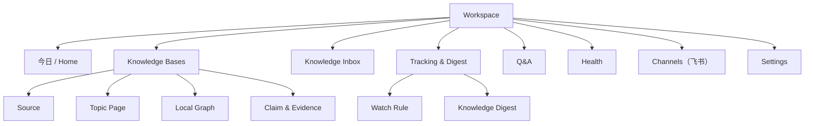
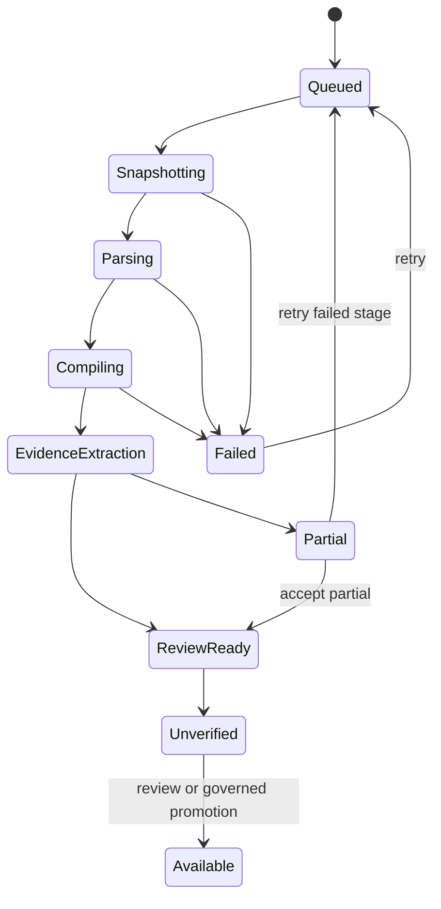

# 产品设计文档：FlyWiki 一期

> 版本：v1.3
> 日期：2026-08-03
> 状态：产品设计基线，视觉稿和可用性测试待完成

相关文档：[一期 PRD](PRD-FlyWiki-一期.md) · [可行性分析](可行性分析.md) · [一期产品与技术方案](一期产品与技术方案.md) · [领域词汇表](../../CONTEXT.md)

> **v1.3 范围校准说明**：依据 2026-08-03 审核结论，本版移除个人微信/Edge Device、本地文件同步、分享与访客界面、基础内容生成、插件侧边栏（含插件内问答）、Profile Document 界面和多角色权限体验；Knowledge Delta 产品面收敛为新增/冲突/强化/忽略四分类。被移除章节保留标题并标注"二期"。

## 1. 设计目标

一期产品设计需要同时做到：

1. 让没有知识图谱背景的用户完成导入、追踪、变化审阅和认知反馈；
2. 让每个事实结论可下钻到原文，不用相信黑箱分数；
3. 把自动化产生的变化集中到少量、可处理的决策点；
4. 默认展示结构化知识，只在探索关系时使用局部图；
5. 在 Web、插件和飞书之间保持同一任务和权限语义；
6. Web 是唯一完整控制面，插件只承担采集入口，飞书只承担问答、推送与反馈。

## 2. 设计原则

### 2.1 先结论，再依据，再系统过程

用户先看到当前回答或主题结构，再按需展开 Claim、Evidence Span、Source Version 和编译日志。系统不能把 Agent 思考过程当作主要界面。

### 2.2 事实、变化、认知和创作必须可辨

| 类型 | 默认视觉语义 | 必须提供 |
| --- | --- | --- |
| 事实 Claim | 实线、来源标记 | Evidence Span、时间、适用条件 |
| Knowledge Delta | “新增/冲突/强化/忽略”标记（限制、替代作为“冲突”详情子标签） | 对比对象、变化理由与依据 |
| 系统推论 | 虚线/“系统综合” | 推理依据与不确定项 |
| Belief | “你已确认”标记 | 确认时间、版本和回滚 |
| 创作表达 | “草稿/表达”标记 | 不伪装成来源事实 |

不能只靠颜色区分；同时使用文字、图标和可访问标签。

### 2.3 关系图是放大镜，不是地图墙

默认只显示围绕当前主题、Claim 或问题的一至两跳局部图。用户主动扩展节点；全局图放在高级探索入口，不承担首页导航。

### 2.4 自动化以 Proposal 结束

系统可以自动采集、分类、重算和生成 Change Proposal，但涉及 Belief、删除、合并、证据解绑、公开发布和外发时，界面必须显示影响范围并请求授权。

### 2.5 失败必须可理解、可恢复

每个长任务显示当前阶段、已完成结果、失败原因、体验额度消耗、下一步和重试范围。失败不能只显示“处理出错”。

## 3. 信息架构



### 3.1 全局导航

桌面端左侧主导航：

1. 今日；
2. Knowledge Bases；
3. Inbox（带按严重度分组的未处理数量）；
4. 追踪与推送；
5. 可信问答；
6. 健康；
7. 渠道（飞书绑定与推送设置）；
8. 设置。

顶部区域提供全局提问/命令、任务中心、通知和账号入口。一期每个用户是自己单一 Workspace 的 Owner，不提供 Workspace 切换器；数据模型层的 Workspace 隔离对用户透明。分享导航移至二期。

### 3.2 Web 主工作台

日常资料整理参考 Cubox 的低学习成本三栏结构，但不复制其阅读管理定位：

- 左栏负责 Knowledge Base、未读、待处理、追踪、Knowledge Digest、标签和设置导航；
- 中栏显示 Source、Knowledge Delta、Knowledge Inbox 条目或搜索结果卡片；
- 右栏用于原文阅读、Evidence Span 定位、摘要、可信问答和“新增/冲突/强化/忽略/待验证”分析；
- 顶部保留全局搜索、快速添加和任务状态；
- Knowledge Graph 是 Knowledge Base 下的独立视图，默认展示局部图，不挤入日常阅读主界面。

## 4. 首页与首次使用

### 4.1 新用户首页

```text
┌─────────────────────────────────────────────────────────────┐
│ 建立你的第一个可信知识库                                   │
│                                                             │
│ ① 创建 Knowledge Base                                      │
│ ② 导入一组真实资料                                          │
│ ③ 选择一个持续关注的主题，查看第一批重要变化                │
│                                                             │
│ [上传文件] [保存网页] [先看示例库]                          │
│                                                             │
│ 数据默认私有 · 原文不会被模型生成内容覆盖 · 可完整导出       │
└─────────────────────────────────────────────────────────────┘
```

首次使用不要求用户理解 Claim 或 Belief。术语在用户第一次需要做相应决策时渐进解释。

### 4.2 回访首页

按“需要用户决定”而不是“系统产生了多少内容”排序：

- 需要确认的重大冲突；
- 可能需要更新认知的 Knowledge Delta；
- Watch Rule 的重要新增与强化；
- 本期待处理的 Knowledge Digest；
- 引用失效和编译异常；
- 本周知识变化摘要；
- 最近使用的 Knowledge Base。

## 5. 导入与编译体验

### 5.1 创建 Knowledge Base

向导只询问会改变系统行为的信息：

- 名称和用途；
- 主要语言；
- 默认私有级别；
- 首批导入方式；
- 新来源默认审阅策略，以及满足完整治理规则后是否允许自动晋级；
- 模型预算档位。

不在向导中要求配置图谱 Schema、Embedding、Chunk 参数或 OpenKB 内部选项。

### 5.2 摄取状态



进度卡显示 Source 数量和阶段，不显示虚假的精确百分比。用户可以离开页面；任务中心持续更新。

`Unverified` 状态的内容可以搜索和提问，但结果必须标记“尚未验证”；采集动作本身永远不能把内容直接写成可信知识。

### 5.3 失败与部分成功

- 原始文件已保存但解析失败：允许下载/删除 Source Version，提供解析日志摘要；
- Wiki 编译失败：Source 仍可检索，已有知识基线不受影响；
- Evidence 抽取失败：知识页标记“依据整理未完成”，不得进入 Belief 或可信问答的引用；
- 单个 Source 失败不阻断整批中已完成的 Source；
- 重试只重跑失败阶段，明确预计模型成本。

## 6. Knowledge Base 工作台

### 6.1 桌面布局

```text
┌──────────────┬──────────────────────────┬────────────────────────┐
│ 全局/知识导航 │ Source / Delta 卡片列表   │ 阅读、证据与认知对照     │
│              │                          │                        │
│ Knowledge DB │ 待处理 / 未读 / 追踪结果  │ 原文 / Evidence Span    │
│ Inbox/Digest │ 筛选、标签、排序          │ 摘要 / 问答 / 差异分析   │
│ Share/Tags   │                          │ 打开局部图 / 采取动作     │
└──────────────┴──────────────────────────┴────────────────────────┘
```

左栏可收起，中间栏是对象列表，右栏是日常消化主工作区；用户选择 Source、Knowledge Delta、Claim 或搜索结果后在右栏查看原文与分析。局部图从右栏动作进入独立视图。页面刷新和分享链接应保留当前对象 ID，而不是只保留视觉位置。

### 6.2 主题页

固定信息顺序：

1. 一句话当前结论和更新时间；
2. 适用对象、时间与边界；
3. 关键 Claim；
4. 共识、冲突、限制和已替代内容；
5. 我的 Belief 对照；
6. 证据缺口和下一步研究问题；
7. 来源、变更和编译历史。

### 6.3 Claim 卡片

每张卡必须显示：

- 可判断陈述；
- Evidence Status；
- 生效时间/适用条件；
- 支持、反驳、限制、补充和替代数量；
- 与 Belief 的关系；
- “打开依据”“查看变化”“加入追踪”“报告问题”动作。

“3 个来源”不等于“3 个独立来源”。同源转载需要合并展示。

### 6.4 证据抽屉

Evidence Span 原文优先，翻译和摘要折叠显示。必须包含：

- Source 标题、作者/机构、发布日期和抓取时间；
- 页码、段落、时间码或图片区域；
- 上下文前后文；
- 原文打开方式和权限提示；
- 该证据与 Claim 的关系及理由；
- Source Version 与当前最新版差异。

### 6.5 局部图

节点默认类型：Topic、Claim、Source；Evidence Span 只在展开 Claim 时出现。边必须有动词语义，如“支持”“限制”“替代”，禁止只显示“相关”。

图交互：单击预览、双击固定中心、滚轮缩放、键盘导航、按关系/时间/来源过滤、展开一跳。超过阈值后提示收窄范围，不无限加载。

## 7. Knowledge Inbox

### 7.1 分组

- 必须处理：来源撤回、关键 Belief 冲突、引用失效；
- 可能改变认知：影响已确认 Belief 的冲突（含限制、替代）；
- 值得知道：重要新增、强化和证据缺口；
- 可折叠：忽略（已知、重复和低价值）；
- 其他决定：删除/合并；
- 可自动处理：确定性断链、重复抓取、状态重算；
- 系统异常：抓取、编译、定位、投递和预算失败。

（访客投稿与 Profile Document 候选分组移至二期。）

### 7.2 条目结构

```text
[重大冲突] 新证据限制了你已确认的判断

你已确认：……
新证据指出：……
差异来源：适用对象不同 / 2026 年规则更新

[查看原文] [保持原判断] [修改后接受] [接受系统建议] [稍后]
```

接受动作必须说明会修改 Compiled Knowledge、Belief 还是仅清除提醒。用户对 Claim 标记“接受”即形成 Belief。批量处理只用于同类、同影响级别条目。

### 7.3 撤销

完成后显示可撤销通知，并在 Change Set 历史提供长期回滚。

## 8. 可信问答

### 8.1 使用方式

输入框提供“提问”入口（Web、飞书和 MCP 共用同一问答能力）。默认使用当前 Knowledge Base；用户可以临时加入联网资料或附件，但系统必须显著标记其来源边界。

### 8.2 问答结果

答案由以下块组成：

1. 直接回答；
2. 关键依据；
3. 冲突/限制；
4. 未知与缺口；
5. “查看依据和比较过程”折叠区。

引用编号绑定 Claim 与 Evidence Span，而不是只链接 Source 首页。事实句逐条带引用，推论句显式标记为“系统推论”。无证据时展示“当前知识库没有足够依据”，并提供联网检索、添加资料或创建 Watch Rule。

### 8.3 基础内容生成（二期）

选定 Claim/Evidence Span/Knowledge Delta 生成摘要、说明、邮件或短文并导出的能力移至二期。一期"区分事实与推论"的要求由问答结果结构（事实带引用、推论显式标记）承担；完整 Writing Studio、Evidence Plan 和 Trusted Version 工作流同样延后。

## 9. Tracking 与推送

### 9.1 Watch Rule 向导

用自然语言描述主题后，系统生成可编辑结构：关键词/实体、包含和排除条件、来源、频率、预算、目标 Knowledge Base 和通知级别。

首次保存前必须预览最近一段时间会命中的样例，避免建立过宽规则。

### 9.2 Knowledge Digest 设计

Knowledge Digest 不按来源顺序罗列，而按用户决策价值组织（四分类）：

1. 必须处理：来源撤回、证据失效和关键冲突；
2. 冲突：可能限制、反驳或替代 Belief 的变化（限制、替代作为详情子标签）；
3. 新增：当前 Compiled Knowledge 中没有的重要 Claim；
4. 强化：新的独立证据支持已有 Claim 或 Belief；
5. 忽略（默认折叠）：重复或低价值。

每项提供“为什么推给我”“影响哪项已有知识”“查看证据”“已知”“接受”“反对”“稍后”“降低此类优先级”和“调整 Watch Rule”。涉及 Belief 的结果只能创建 Change Proposal，不提供自动更新按钮。

默认每周生成一份 Knowledge Digest，用户可改为每日或关闭。只有高置信度重大冲突、来源撤回、关键引用失效和追踪主题的重要变化即时通知；飞书只展示摘要，完整审阅回到 Web。

## 10. 浏览器插件

插件一期只承担采集，只做弹窗形态。

### 10.1 弹窗

- 自动识别标题、作者、日期和正文状态；
- 保存方式：当前网址、手动输入新网址、智能正文、选区（全文与图片视解析库顺手程度实现）；
- 可直接新建 Markdown 文字笔记；
- 目标 Knowledge Base；
- 标签/批注；
- 是否立即分析；
- 保存状态、待处理/尚未验证标识和失败恢复。

对于需要登录或动态内容的站点，插件明确显示保存的是用户当前可见快照。不得承诺后续仍可自动访问。

插件不提供 Knowledge Graph 管理、Watch Rule 编辑、Belief 修改、批量审核、系统管理和插件内问答；这些能力通过深链回到 Web。

### 10.2 侧边栏与插件内问答（二期）

侧边栏（当前页与知识库对照、“当前网页 + 选定 Knowledge Base”的分来源问答）移至二期。一期问答统一在 Web 与飞书完成。

## 11. 飞书与响应式 Web

飞书只提供高频动作，不复制完整 Web 管理界面。

支持命令/意图：

- 提问当前或指定 Knowledge Base；
- 查看本期 Knowledge Digest；
- 查看任务进度；
- 接收重要新增、强化、认知变化候选和重大冲突；
- 用深链打开 Web 查看敏感证据与完成审批。

飞书群内只有 `@` 机器人或明确命令进入系统。涉及删除、Belief 修改、密钥的动作必须跳转 Web 二次确认。飞书不做附件/链接采集入库。

个人微信为开发者自用实验通道（不进产品范围）：开发者以自管桥接接入自己的账号做 dogfooding，与飞书共用同一 IM 接入层（消息进 → 问答/推送出）。

## 12. 分享与 Visitor Session（二期）

Knowledge Release 发布、Share Link、访客界面、访客问答/上传/投稿整体移至二期，待一期核心价值验证通过后再设计。

## 13. Health Center

六个维度分别展示问题数和趋势，不汇总成一个分数：引用覆盖、引用有效、来源新鲜、冲突待审、结构健康、编译健康。（发布健康随分享移至二期。）

每个 Finding 包含：受影响对象、为什么重要、检测方式、建议动作、是否自动修复、影响范围和历史。安全修复可以批量执行；语义和破坏性修复必须确认。

## 14. 权限体验

一期每个用户是自己单一 Workspace 的唯一 Owner，不提供多角色管理界面。Workspace 隔离在数据模型层实现（所有对象带 `workspace_id`），对用户透明。MCP API Key 是唯一的能力授予形态：

| 能力 | Owner（用户本人） | MCP API Key |
| --- | :---: | :---: |
| 查看 Knowledge Base | ✓ | ✓（授权范围内） |
| 可信问答 | ✓ | ✓（授权范围内） |
| 导入/编辑 Compiled Knowledge | ✓ | 默认 — |
| 修改 Belief、删除资料 | ✓ | — |
| 管理密钥与渠道 | ✓ | — |

多角色（Admin/Editor/Viewer）、访客权限和 Knowledge Release 权限移至二期。所有禁用动作显示原因，不通过隐藏按钮制造权限猜测。

## 15. 通用状态与反馈

每个主要页面都需要设计：

- 首次空状态：告诉用户为什么、第一步是什么；
- 搜索无结果：区分无匹配、无权限、尚未编译；
- Loading：显示当前阶段，可离开；
- Partial：显示可用与不可用部分；
- Error：可恢复动作、任务 ID、是否消耗体验额度；
- Stale：页面或 Release 的数据截止时间；
- Offline：插件本地队列和稍后同步；
- Budget exceeded：解释限制并允许调整或换低成本模式。

破坏性操作需要对象名确认、影响预览和恢复说明；不使用笼统“确定吗”。

## 16. 响应式、无障碍与国际化

- 中文为首发界面语言，所有文案进入 i18n 资源；
- Evidence Span 保留原文，翻译明确标记；
- 响应式 Web 支持手机查看报告、问答、证据和 Inbox 审批，复杂图谱与批量管理提示使用桌面浏览器；一期不承诺独立 PWA 安装体验；
- 键盘可完成导航、搜索、证据打开和 Inbox 决策；
- 焦点、对比度、屏幕阅读标签和 Reduced Motion 达到 WCAG 2.2 AA 目标；
- 表格在窄屏变为卡片，图谱必须有等价列表视图；
- 时间显示用户时区，并可查看 Source 原始时区。

## 17. 埋点与可用性验证

### 17.1 核心事件

- `source_import_started/completed/failed`；
- `first_topic_opened`、`evidence_span_opened`；
- `claim_relation_corrected`；
- `inbox_item_accepted/edited/rejected/deferred/undone`；
- `knowledge_delta_created/reclassified`；
- `knowledge_digest_delivered/opened/completed`；
- `knowledge_delta_known/accepted/rejected/later/downranked`；
- `trusted_answer_completed`；
- `channel_binding_created/revoked`（飞书）。

事件不记录 Evidence Span 原文、完整提问或敏感数据；必要内容只记录分类、长度、哈希或用户授权的评测样本。

### 17.2 研发前可用性任务

至少用 3-5 名目标用户（含开发者本人）测试：

1. 导入资料并解释当前处理状态；
2. 从一个主题找到支持和反对证据；
3. 判断系统知识是否等于自己的认知；
4. 在 Knowledge Digest 中区分新增、强化、冲突和忽略；
5. 接受一条 Claim 使其成为 Belief，并处理一条 Belief Change Proposal，解释为何系统不能自动修改；
6. 在插件或飞书保存/提问一条内容并回到 Web 查看。

通过标准：无需解释内部术语即可完成；关键权限和可信边界理解正确；严重错误可以自行恢复。

## 18. 视觉与交互待产物

进入前端实现前仍需完成：

- 低保真原型：首次导入、工作台、Knowledge Digest、Inbox 四条主流程；
- 三种信息密度方案的可用性比较；
- Claim/Evidence/Belief 的非颜色视觉语法；
- 桌面 Web、移动 Web 和插件弹窗响应式稿；
- 空、错、慢、部分成功和越权状态组件；
- Design tokens、组件清单和文案术语表；
- 交互原型测试报告及修改记录。

这些是 R1 前的设计 Gate；本文定义产品行为，不替代视觉稿。
