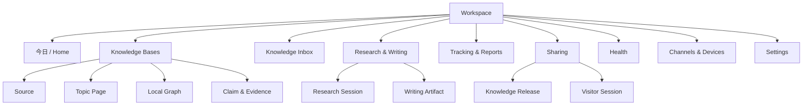
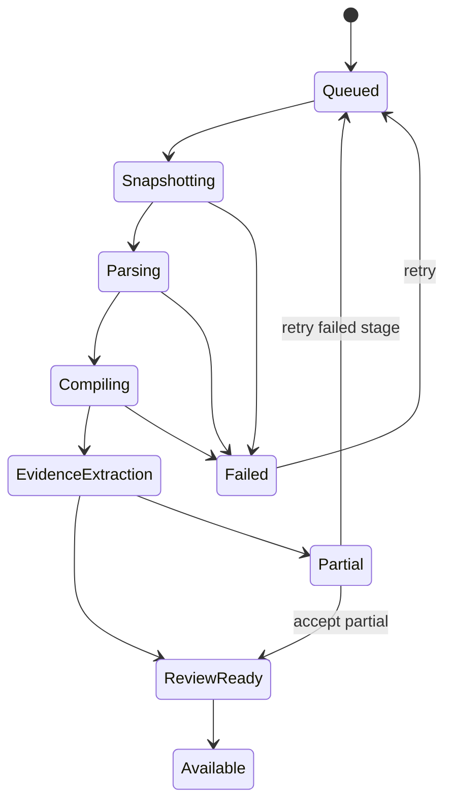
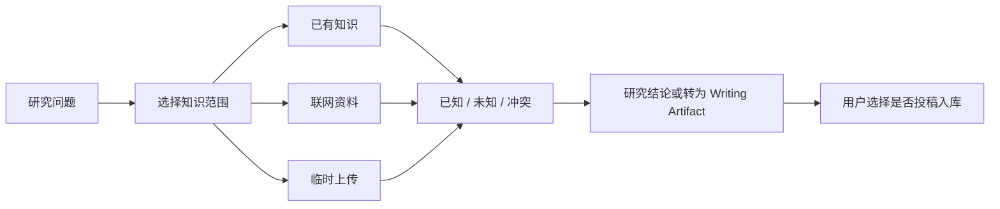
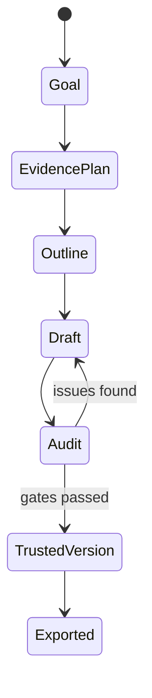

# 产品设计文档：FlyWiki 一期

> 版本：v1.0  
> 日期：2026-08-01  
> 状态：产品设计基线，视觉稿和可用性测试待完成

相关文档：[一期 PRD](PRD-FlyWiki-一期.md) · [可行性分析](可行性分析.md) · [一期产品与技术方案](../一期产品与技术方案.md) · [领域词汇表](../../CONTEXT.md)

## 1. 设计目标

一期产品设计需要同时做到：

1. 让没有知识图谱背景的用户完成导入、查询、审阅和写作；
2. 让每个事实结论可下钻到原文，不用相信黑箱分数；
3. 把自动化产生的变化集中到少量、可处理的决策点；
4. 默认展示结构化知识，只在探索关系时使用局部图；
5. 在 Web、插件、微信和飞书之间保持同一任务和权限语义；
6. 让分享访客“可以用知识完成任务”，但不能编辑所有者知识。

## 2. 设计原则

### 2.1 先结论，再依据，再系统过程

用户先看到当前回答或主题结构，再按需展开 Claim、Evidence Span、Source Version 和编译日志。系统不能把 Agent 思考过程当作主要界面。

### 2.2 事实、推论、认知和创作必须可辨

| 类型 | 默认视觉语义 | 必须提供 |
| --- | --- | --- |
| 事实 Claim | 实线、来源标记 | Evidence Span、时间、适用条件 |
| 系统推论 | 虚线/“系统综合” | 推理依据与不确定项 |
| Belief | “你已确认”标记 | 确认时间、版本和回滚 |
| 创作表达 | “草稿/表达”标记 | 不伪装成来源事实 |

不能只靠颜色区分；同时使用文字、图标和可访问标签。

### 2.3 关系图是放大镜，不是地图墙

默认只显示围绕当前主题、Claim 或问题的一至两跳局部图。用户主动扩展节点；全局图放在高级探索入口，不承担首页导航。

### 2.4 自动化以 Proposal 结束

系统可以自动采集、分类、重算和生成 Change Proposal，但涉及 Belief、删除、合并、证据解绑、公开发布和外发时，界面必须显示影响范围并请求授权。

### 2.5 失败必须可理解、可恢复

每个长任务显示当前阶段、已完成结果、失败原因、是否计费、下一步和重试范围。失败不能只显示“处理出错”。

## 3. 信息架构



### 3.1 全局导航

桌面端左侧主导航：

1. 今日；
2. Knowledge Bases；
3. Inbox（带按严重度分组的未处理数量）；
4. 研究与写作；
5. 追踪与报告；
6. 分享；
7. 健康；
8. 渠道与设备；
9. 设置。

顶部区域提供 Workspace 切换、全局提问/命令、任务中心、通知和账号入口。切换 Workspace 后所有内容和任务上下文同时切换，不保留上一个 Workspace 的搜索结果。

## 4. 首页与首次使用

### 4.1 新用户首页

```text
┌─────────────────────────────────────────────────────────────┐
│ 建立你的第一个可信知识库                                   │
│                                                             │
│ ① 创建 Knowledge Base                                      │
│ ② 导入一组真实资料                                          │
│ ③ 用你正在研究的问题检查结果                                │
│                                                             │
│ [导入本地文件夹] [上传文件] [保存网页] [先看示例库]          │
│                                                             │
│ 数据默认私有 · 原文不会被模型生成内容覆盖 · 可完整导出       │
└─────────────────────────────────────────────────────────────┘
```

首次使用不要求用户理解 Claim 或 Belief。术语在用户第一次需要做相应决策时渐进解释。

### 4.2 回访首页

按“需要用户决定”而不是“系统产生了多少内容”排序：

- 需要确认的重大冲突；
- 进行中的真实写作/研究任务；
- Watch Rule 的重要变化；
- 引用失效和发布异常；
- 本周知识变化摘要；
- 最近使用的 Knowledge Base。

## 5. 导入与编译体验

### 5.1 创建 Knowledge Base

向导只询问会改变系统行为的信息：

- 名称和用途；
- 主要语言；
- 默认私有级别；
- 首批导入方式；
- 是否允许可信来源自动进入 Compiled Knowledge；
- 模型预算档位。

不在向导中要求配置图谱 Schema、Embedding、Chunk 参数或 OpenKB 内部选项。

### 5.2 摄取状态



进度卡显示 Source 数量和阶段，不显示虚假的精确百分比。用户可以离开页面；任务中心持续更新。

### 5.3 失败与部分成功

- 原始文件已保存但解析失败：允许下载/删除 Source Version，提供解析日志摘要；
- Wiki 编译失败：Source 仍可检索，旧 Knowledge Release 不受影响；
- Evidence 抽取失败：知识页标记“依据整理未完成”，不得用于 Trusted Version；
- 单个 Source 失败不阻断整批中已完成的 Source；
- 重试只重跑失败阶段，明确预计模型成本。

## 6. Knowledge Base 工作台

### 6.1 桌面布局

```text
┌──────────────┬──────────────────────────────────┬───────────────┐
│ 来源/主题导航 │ 主题页 / 查询结果 / Writing      │ 证据与关系抽屉 │
│              │                                  │               │
│ Sources      │ 当前结论                         │ Evidence      │
│ Topics       │ 共识 / 争议 / 已替代 / 缺口      │ Source Version│
│ Saved views  │                                  │ Claim history │
│              │ [局部图] [时间线] [开始写作]      │               │
└──────────────┴──────────────────────────────────┴───────────────┘
```

左栏可收起，中间栏是主工作区，右栏只在选择 Claim、引用或图节点时出现。页面刷新和分享链接应保留当前对象 ID，而不是只保留视觉位置。

### 6.2 主题页

固定信息顺序：

1. 一句话当前结论和更新时间；
2. 适用对象、时间与边界；
3. 关键 Claim；
4. 共识、冲突、限制和已替代内容；
5. 我的 Belief 对照；
6. 证据缺口和下一步研究问题；
7. 来源、变更和编译历史。

### 6.3 Claim 卡片

每张卡必须显示：

- 可判断陈述；
- Evidence Status；
- 生效时间/适用条件；
- 支持、反驳、限制、补充和替代数量；
- 与 Belief 的关系；
- “打开依据”“加入写作”“报告问题”动作。

“3 个来源”不等于“3 个独立来源”。同源转载需要合并展示。

### 6.4 证据抽屉

Evidence Span 原文优先，翻译和摘要折叠显示。必须包含：

- Source 标题、作者/机构、发布日期和抓取时间；
- 页码、段落、时间码或图片区域；
- 上下文前后文；
- 原文打开方式和权限提示；
- 该证据与 Claim 的关系及理由；
- Source Version 与当前最新版差异。

### 6.5 局部图

节点默认类型：Topic、Claim、Source；Evidence Span 只在展开 Claim 时出现。边必须有动词语义，如“支持”“限制”“替代”，禁止只显示“相关”。

图交互：单击预览、双击固定中心、滚轮缩放、键盘导航、按关系/时间/来源过滤、展开一跳。超过阈值后提示收窄范围，不无限加载。

## 7. Knowledge Inbox

### 7.1 分组

- 需要决定：Belief 冲突、删除/合并、发布、访客投稿；
- 建议审阅：新 Claim、Profile Document 候选、语义健康问题；
- 可自动处理：确定性断链、重复抓取、状态重算；
- 系统异常：抓取、编译、定位、投递和预算失败。

### 7.2 条目结构

```text
[重大冲突] 新证据限制了你已确认的判断

你已确认：……
新证据指出：……
差异来源：适用对象不同 / 2026 年规则更新

[查看原文] [保持原判断] [修改后接受] [接受系统建议] [稍后]
```

接受动作必须说明会修改 Compiled Knowledge、Belief、Profile Document 还是仅清除提醒。批量处理只用于同类、同影响级别条目。

### 7.3 撤销

完成后显示可撤销通知，并在 Change Set 历史提供长期回滚。若回滚会影响已发布 Release，系统先提示创建新 Release 或强制下架，不静默改历史快照。

## 8. 查询、研究与可信写作

### 8.1 模式切换

输入框上方明确显示当前模式：问答、研究、写作。切换模式保留问题文本，但提示上下文、成本和输出差异。

### 8.2 问答结果

答案由以下块组成：

1. 直接回答；
2. 关键依据；
3. 冲突/限制；
4. 未知与缺口；
5. “查看研究过程”折叠区。

引用编号绑定 Claim 与 Evidence Span，而不是只链接 Source 首页。无证据时展示“当前知识库没有足够依据”，并提供联网研究、添加资料或创建 Watch Rule。

### 8.3 Research Session



临时内容用显著边界标识；离开前询问保留周期或提交，不默认污染 Knowledge Base。

### 8.4 Writing Studio

布局包括目标与读者、Evidence Plan、大纲/正文、证据篮和审计面板。

写作状态：



审计问题按严重度：

- 阻断：事实 Claim 无引用、引用不可访问、越权 Source；
- 必须确认：来源冲突、时间过期、只由单一来源支持；
- 建议：二手来源、样本限制、表达超出证据范围；
- 编辑建议：结构、语气和重复，不影响 Trusted 标记。

### 8.5 导出

支持 Markdown、DOCX、PDF 和 Share Link。导出选择包括引用样式、是否附证据清单、是否包含系统推论标记。不能导出当前用户无权再分发的原文全文。

## 9. Tracking 与推送

### 9.1 Watch Rule 向导

用自然语言描述主题后，系统生成可编辑结构：关键词/实体、包含和排除条件、来源、频率、预算、目标 Knowledge Base 和通知级别。

首次保存前必须预览最近一段时间会命中的样例，避免建立过宽规则。

### 9.2 报告设计

日报/周报按用户决策价值组织：

1. 改变已有结论；
2. 与 Belief 冲突；
3. 填补证据缺口；
4. 新增但尚未改变知识；
5. 重复或低价值（折叠）。

每项提供“为什么推给我”“查看证据”“静音此类”“调整 Watch Rule”。

## 10. 浏览器插件

### 10.1 弹窗

- 自动识别标题、作者、日期和正文状态；
- 保存方式：全文、智能正文、选区；
- 目标 Knowledge Base；
- 标签/批注；
- 是否立即分析；
- 保存状态和失败恢复。

### 10.2 侧边栏

- 当前页摘要和关键 Claim；
- 与已有知识的新增、冲突和重复；
- 当前页问答；
- 高亮与批注；
- 打开 Web 工作台。

对于需要登录或动态内容的站点，插件明确显示保存的是用户当前可见快照。不得承诺后续仍可自动访问。

## 11. 微信、飞书与 PWA

渠道只提供高频动作，不复制完整 Web 管理界面。

支持命令/意图：

- 提问当前或指定 Knowledge Base；
- 保存链接、文件、图片和一段文字；
- 发起研究或写作任务；
- 查看任务进度；
- 接收报告和重大冲突；
- 用深链打开 Web 查看敏感证据与完成审批。

飞书群内只有 `@` 机器人或明确命令进入系统。个人微信仅处理 allowlist 私聊。涉及删除、发布、Belief 修改、密钥和成员权限的动作必须跳转 Web 二次确认。

## 12. 分享与 Visitor Session

### 12.1 所有者发布

发布向导显示：Release 内容摘要、健康门禁、可见范围、是否允许访客问答/写作/上传、预算、有效期、原文权限和搜索引擎索引设置。

发布失败不改变 latest pointer；成功后生成不可猜测 Share Link。撤销链接与强制下架是不同动作。

### 12.2 访客界面

访客顶部始终显示：知识库所有者、Release 时间、资料截止时间和“这是只读发布版本”。

访客可以：浏览、查询、创建自己的 Research Session/Writing Artifact、上传临时资料、导出自己的内容、提交给所有者。

访客不能：编辑页面、改变图谱、查看所有者私有 Source、修改 Belief、查看其他 Visitor Session、直接把附件写入所有者知识库。

## 13. Health Center

七个维度分别展示问题数和趋势，不汇总成一个分数：引用覆盖、引用有效、来源新鲜、冲突待审、结构健康、编译健康、发布健康。

每个 Finding 包含：受影响对象、为什么重要、检测方式、建议动作、是否自动修复、影响范围和历史。安全修复可以批量执行；语义和破坏性修复必须确认。

## 14. 权限体验

| 能力 | Owner | Admin | Editor | Viewer | 匿名访客 |
| --- | :---: | :---: | :---: | :---: | :---: |
| 查看 Workspace Knowledge Base | ✓ | ✓ | ✓ | ✓ | — |
| 导入/编辑 Compiled Knowledge | ✓ | ✓ | ✓ | — | — |
| 管理成员、密钥和渠道 | ✓ | ✓ | — | — | — |
| 删除 Workspace | ✓ | — | — | — | — |
| 创建 Knowledge Release | ✓ | ✓ | ✓ | — | — |
| 查询指定 Release | ✓ | ✓ | ✓ | ✓ | 按 Share Link |
| 在 Visitor Session 写作/上传 | ✓ | ✓ | ✓ | ✓ | 按 Share Link |
| 修改所有者 Knowledge Base/Belief | 按自身权限 | 按自身权限 | 按自身权限 | — | — |

所有禁用动作显示原因和需要的角色，不通过隐藏按钮制造权限猜测。

## 15. 通用状态与反馈

每个主要页面都需要设计：

- 首次空状态：告诉用户为什么、第一步是什么；
- 搜索无结果：区分无匹配、无权限、尚未编译；
- Loading：显示当前阶段，可离开；
- Partial：显示可用与不可用部分；
- Error：可恢复动作、任务 ID、是否扣费；
- Stale：页面或 Release 的数据截止时间；
- Offline：插件/Edge 本地队列和稍后同步；
- Budget exceeded：解释限制并允许调整或换低成本模式。

破坏性操作需要对象名确认、影响预览和恢复说明；不使用笼统“确定吗”。

## 16. 响应式、无障碍与国际化

- 中文为首发界面语言，所有文案进入 i18n 资源；
- Evidence Span 保留原文，翻译明确标记；
- PWA 支持手机查看报告、问答、证据和 Inbox 审批，复杂图谱与批量管理提示使用桌面；
- 键盘可完成导航、搜索、证据打开和 Inbox 决策；
- 焦点、对比度、屏幕阅读标签和 Reduced Motion 达到 WCAG 2.2 AA 目标；
- 表格在窄屏变为卡片，图谱必须有等价列表视图；
- 时间显示用户时区，并可查看 Source 原始时区。

## 17. 埋点与可用性验证

### 17.1 核心事件

- `source_import_started/completed/failed`；
- `first_topic_opened`、`evidence_span_opened`；
- `claim_relation_corrected`；
- `inbox_item_accepted/edited/rejected/deferred/undone`；
- `research_session_completed`；
- `writing_audit_started/passed/blocked`；
- `trusted_version_exported`；
- `watch_report_item_opened/muted`；
- `release_published/revoked/takedown`；
- `visitor_query/writing/submission`；
- `channel_binding_created/revoked`。

事件不记录 Evidence Span 原文、完整提问或敏感 Profile Document；必要内容只记录分类、长度、哈希或用户授权的评测样本。

### 17.2 研发前可用性任务

至少用 5 名目标用户测试：

1. 导入资料并解释当前处理状态；
2. 从一个主题找到支持和反对证据；
3. 判断系统知识是否等于自己的认知；
4. 处理一条 Belief 冲突；
5. 创建带引用的短文并通过审计；
6. 发布 Share Link，并说明访客能做什么；
7. 在插件或飞书保存一条内容并回到 Web 查看。

通过标准：无需解释内部术语即可完成；关键权限和可信边界理解正确；严重错误可以自行恢复。

## 18. 视觉与交互待产物

进入前端实现前仍需完成：

- 低保真原型：首次导入、工作台、Inbox、Writing、分享五条主流程；
- 三种信息密度方案的可用性比较；
- Claim/Evidence/Belief 的非颜色视觉语法；
- 桌面、PWA 和插件响应式稿；
- 空、错、慢、部分成功和越权状态组件；
- Design tokens、组件清单和文案术语表；
- 交互原型测试报告及修改记录。

这些是 R1 前的设计 Gate；本文定义产品行为，不替代视觉稿。
