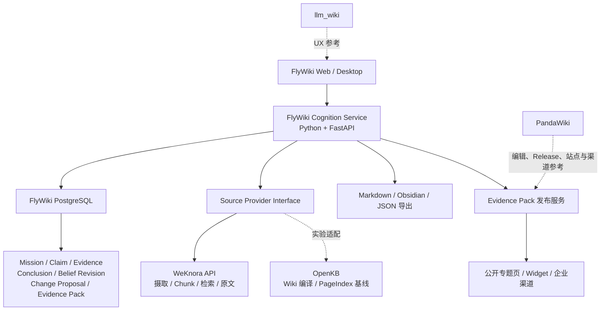
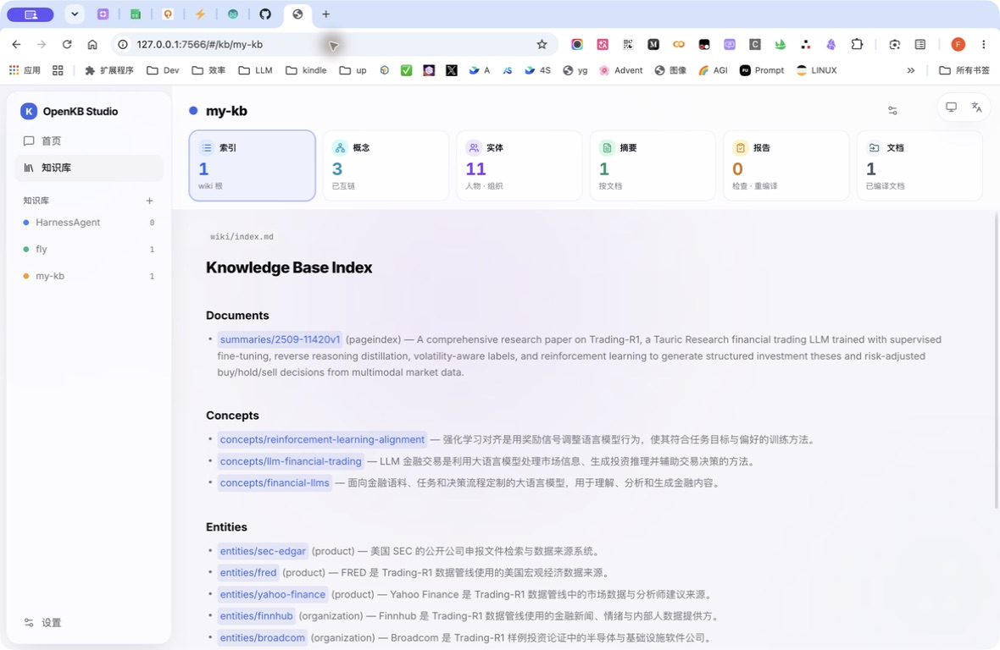

# 开源基座选型分析：OpenKB vs llm_wiki vs WeKnora vs PandaWiki

> 版本：v1.2 · 日期：2026-07-27 · 状态：Phase 0 技术选型（源码核验版）

> [!IMPORTANT]
> 本文保留为选型演进记录。当前决策已改为“OpenKB 是可升级知识编译底座，WeKnora 仅作实现参考”，详见[一期产品与技术方案](一期产品与技术方案.md)和 [ADR-0001](adr/0001-openkb-as-upgradeable-knowledge-compiler.md)。

相关文档：[垂直认知顾问 PRD](PRD-FlyWiki-垂直认知顾问.md) · [MVP 与验证方案](MVP与验证方案.md) · [图谱与 LLM Wiki 设计](图谱与LLM-Wiki设计.md) · [产品可行性报告](产品可行性报告.md)

---

## 一、决策摘要

FlyWiki 不应直接选择四个项目中的任何一个作为完整产品基座，也不建议采用“OpenKB 做核心、参考 WeKnora/PandaWiki 补 SaaS”的路线。

**推荐决策：**

1. **自研独立的 FlyWiki Cognition Core**：使用 Python/FastAPI 和关系数据库，独立保存 Mission、Claim、Evidence、Conclusion、Belief Revision、Change Proposal、Evidence Pack 和用户采用反馈。
2. **P0 以 WeKnora 作为上游知识服务**：通过 API 复用现有文档摄取、解析、Chunk、检索和原文定位能力，不复制或重写其 Go 管线。
3. **OpenKB 作为 Wiki 编译与 PageIndex 实验基线**：借鉴持续编译、Markdown 导出和长文档检索思路，但不把其 Markdown 页面作为 FlyWiki 的核心数据库。
4. **llm_wiki 作为 UX 参考**：借鉴 Review、Lint、知识图谱、本地工作流和人工确认交互，不直接复用其 GPLv3 代码。
5. **PandaWiki 作为内容生产、发布和渠道交付参考**：重点借鉴草稿—发布分离、AI 辅助编辑、公开文档站、问答挂件、多渠道 App、用户反馈和运营统计，不把它的 Node/RAG 模型作为认知核心。
6. **企业化后再评估 WeKnora 平台能力**：付费和产品闭环验证通过后，再决定是否长期复用其 Tenant、RBAC、任务队列、连接器与部署体系。

一句话结论：

> **WeKnora 负责“资料可靠进入并能找回原文”，FlyWiki 负责“什么信息应该改变用户认知以及为什么”；OpenKB、llm_wiki 和 PandaWiki 分别提供编译算法、审核交互与内容发布参考，但不拥有 FlyWiki 的核心数据模型。**

这一结论替代 v1.0 中“Phase 0 基于 OpenKB fork 改造”的建议。

---

## 二、选型依据与源码快照

本次判断不仅依据 README 和功能清单，还核验了四套项目的领域对象、更新流程、API、认证、任务机制和许可证。

| 项目 | 本地源码快照 | 主要技术栈 | 许可证 |
|---|---|---|---|
| OpenKB | `ff54396`，2026-07-22 | Python、FastAPI、Markdown、PageIndex | Apache-2.0 |
| llm_wiki | `e8bdec6`，2026-07-20 | Tauri、Rust、React、TypeScript | GPLv3 |
| WeKnora | `25ef7b6c`，2026-07-20 | Go、Vue、关系数据库、多检索后端 | MIT，第三方组件需单独审计 |
| PandaWiki | `cd9de0b`，2026-07-23 | Go、React/Vite、Next.js、PostgreSQL、RAGLite | AGPL-3.0，Pro 后端为独立子模块 |

本地源码路径：

- OpenKB：`/Users/fly/code/OpenKB`
- llm_wiki：`/Users/fly/code/llm_wiki`
- WeKnora：`/Users/fly/code/WeKnora`
- PandaWiki：本次使用临时浅克隆核验 `chaitin/PandaWiki@cd9de0b`

需要特别注意：开源项目迭代较快，本结论对应以上源码快照。进入正式开发前，应重新核验 API、数据库迁移和许可证变化。

---

## 三、先明确 FlyWiki 真正需要验证什么

FlyWiki 最新定位不是“生成一个更自动的 Wiki”，而是：

> 面向持续研究和输出的个人专业用户，围绕一个明确知识任务，把新资料压缩为少量认知变化，并在写作或决策时生成可核验、可引用、包含反方证据的证据包。

产品核心对象不是页面，而是：

| 对象 | FlyWiki 中的作用 |
|---|---|
| Mission / Recurring Question | 约束系统长期关注的问题，防止生成大量与任务无关的内容 |
| Source / Fragment | 保存不可变原文和可精确定位的上下文 |
| Claim | 可以被支持、反驳、限制或替代的最小主张 |
| Evidence | 对 Claim 产生作用的原文、数据、表格或图像 |
| Conclusion | 围绕持续问题形成的当前回答 |
| Belief Revision | 用户明确确认过的判断及其历史版本 |
| Change Proposal | 新证据相对当前结论造成的新增、强化、削弱、冲突或替代建议 |
| Evidence Pack | 围绕真实输出观点组织的支持、反驳、限制、背景和原文引用 |

必须满足的核心不变量包括：

1. 原始来源不可被模型生成内容覆盖；
2. Wiki 陈述必须能追踪到 Claim；
3. 有依据的 Claim 必须能追踪到 Evidence 和 Source；
4. 冲突不能通过摘要或整页重写自动消失；
5. 用户 Belief 必须经过明确确认；
6. 被替代内容保留历史，但不默认参与当前结论；
7. 相关性高不能自动等同于直接证据；
8. Evidence 必须记录能证明什么、不能证明什么及适用边界。

因此，选型的核心问题不是“谁生成 Wiki 更快”，而是：

> 哪个项目可以复用为可靠的 Source/Fragment 底座，同时不妨碍 FlyWiki 独立建立 Claim—Evidence—Belief 认知模型。

---

## 四、OpenKB 源码分析

### 4.1 实际具备的能力

OpenKB 是三者中最接近 Karpathy LLM Wiki 思路的实现：

- 原始文档进入 `sources/`；
- 每份文档生成 Summary；
- 跨文档生成或更新 Concept、Entity；
- Markdown 页面通过 Wikilink 互联；
- 长文档可以使用 PageIndex；
- 支持 Query、Chat、Lint、删除和重编译；
- 当前版本已经具备 FastAPI、Web Workbench、多知识库选择和同知识库异步变更锁；
- Markdown 和 Obsidian 兼容，Apache-2.0 对商业使用友好；
- Python 技术栈适合快速做 LLM 管线实验。

因此，v1.0 文档中“OpenKB 无并发、无管理台”的描述已经部分过时。当前源码中：

- `openkb/api.py` 已有 FastAPI 和按 KB 的异步变更锁；
- `openkb/api_kbs.py` 已有 Web UI 使用的多知识库发现和切换；
- `openkb/add_coordinator.py` 已有本地摄取日志、失败恢复和回滚协调；
- `openkb/locks.py` 已有本地文件锁和原子写入。

这些能力足以支持本地单机工作台，但还不等于 SaaS 多租户平台。

### 4.2 与 FlyWiki 的关键差距

#### 领域模型仍然以页面为中心

`openkb/schema.py` 中的核心类型是 Summary、Concept、Entity、Exploration 和 Index。源码中没有 Claim、Evidence、Conclusion、Belief Revision 等一等对象。

Concept 页只在 frontmatter 中保存文档级 `sources`。它无法直接表达：

- 某一句话由哪个原文片段支持；
- 哪些 Evidence 支持、反驳或限制某个 Claim；
- Claim 的适用时间、范围和当前状态；
- 用户是否确认了这条结论；
- 某次更新修改了哪些 Claim。

#### 更新方式是 LLM 整页重写

`openkb/agent/compiler.py` 的更新 Prompt 明确要求模型把新信息自然整合进已有页面，并“重写完整页面”。写入阶段也使用模型返回正文替换旧正文，而不是保存结构化 Diff。

实际语义是：

```text
已有页面 + 新资料
→ LLM 整页重写
→ 替换旧正文
```

而 FlyWiki 需要：

```text
新 Claim
→ 与当前 Claim 比较
→ 重复 / 支持 / 细化 / 冲突 / 替代 / 无法判断
→ 生成结构化 Change Proposal
→ 用户确认
→ 形成新的 Conclusion / Belief Revision
```

整页重写可能把少数观点、冲突和适用边界压缩掉，也无法稳定回答“这次为什么改变”。

#### “矛盾检测”不是结构化证据关系

OpenKB 的 contradiction 能力位于 `openkb/agent/linter.py`：模型检查页面矛盾、缺口、过期和冗余，最后输出一份 Markdown 报告。

它没有持久保存：

- `claim_a conflicts_with claim_b`；
- 冲突由哪些 Evidence 触发；
- 哪个来源支持或反驳哪部分主张；
- 用户如何处理该冲突；
- 冲突对 Conclusion 或 Belief 造成了什么影响。

因此它适合作为“知识库体检”，不能直接作为 FlyWiki 的 Claim—Evidence 图。

#### API 和知识库切换不等于 SaaS

OpenKB 的多知识库本质是本地目录扫描和配置注册；认证是可选的全局 Bearer Token。当前源码中没有：

- Tenant / User / Membership；
- 行级数据隔离；
- 角色和资源权限；
- 跨实例任务队列与分布式锁；
- 配额、计费和完整审计；
- 云端对象存储生命周期。

### 4.3 对 FlyWiki 的正确用法

OpenKB 适合作为：

- 持续 Wiki 编译算法参考；
- PageIndex 与向量检索的对照实验；
- Markdown/Obsidian 导出参考；
- 全页编译质量和十轮更新失真的评测基线；
- Python Prompt、模型适配和本地实验参考。

不建议：

- 直接 fork 后把 Markdown 页面升级成 FlyWiki 主数据库；
- 把 Lint 报告当作结构化冲突模型；
- 先深改 OpenKB，后续再迁移到 WeKnora SaaS；
- 让模型整页重写用户已确认的结论。

---

## 五、llm_wiki 源码分析

### 5.1 实际具备的能力

llm_wiki 是最完整的 LLM Wiki 桌面产品参考：

- Tauri + React 跨平台桌面形态；
- 知识树、聊天、页面预览三栏布局；
- Sources、Search、Graph、Lint、Review、Deep Research；
- 本地资料和文件监控；
- 向量搜索和图谱浏览；
- 本地 HTTP API；
- Review 项目的稳定 ID、处理状态和批量处理；
- 本地隐私和 Obsidian 工作流。

其中最值得 FlyWiki 借鉴的是 Review 交互。`src/stores/review-store.ts` 中的 Review 类型包括：

- contradiction；
- duplicate；
- missing-page；
- confirm；
- suggestion。

这可以转化为 FlyWiki 的认知变化卡、Evidence 不足提醒、冲突审核、接受、修改和忽略。

### 5.2 与 FlyWiki 的关键差距

- 核心组织单位仍是本地项目、文件和 Wiki 页面；
- contradiction 是 Review 项目，不是 Claim—Evidence 关系；
- resolved 状态主要服务本地 UI，不是 SaaS 审计或用户认知版本；
- 业务逻辑大量位于前端 TypeScript 和桌面运行时；
- HTTP API 使用本地端口和单 Token，定位是桌面自动化接口而非公网 SaaS API；
- 没有 Tenant、团队权限、配额和云端任务治理。

### 5.3 商业许可证风险

llm_wiki 使用 GPLv3。商业闭源产品如果修改、链接或分发其代码，可能触发 Copyleft 义务。具体边界需要法律顾问确认。

推荐做法：

- 可以研究其公开产品行为、信息架构和交互模式；
- 可以重新设计 Review/Lint/Graph 体验；
- 不直接复制实现代码；
- 不把其 Tauri/Rust/TypeScript 工程作为 FlyWiki SaaS 起点。

---

## 六、WeKnora 源码分析

### 6.1 最适合复用的 Source/Fragment 底座

WeKnora 的 `internal/types/chunk.go` 已把 Chunk 建模为结构化数据库对象，包含：

- Tenant ID；
- Knowledge ID / Knowledge Base ID；
- Chunk 内容和顺序；
- `StartAt` / `EndAt`；
- 前后 Chunk；
- Chunk 类型和父子关系；
- Metadata；
- Content Hash；
- 创建、更新和软删除状态。

客户端 `client/chunk.go` 已提供按文档分页读取 Chunk 的 API。

这与 FlyWiki Fragment 的需求高度接近，可以形成：

```text
WeKnora Knowledge / Chunk
→ FlyWiki Source Reference / Fragment Snapshot
→ Evidence
→ Claim
→ Conclusion / Belief Revision
```

相比从 OpenKB Markdown 页面反向解析来源，直接基于结构化 Chunk 建立 Evidence 更稳定。

### 6.2 Wiki 引用能力强于 OpenKB，但仍不等于 Evidence

WeKnora 的 `WikiPage` 已保存：

- `SourceRefs`：文档级来源；
- `ChunkRefs`：页面编译使用的具体 Chunk；
- `Version`：用户可见内容变化时递增的版本号；
- Tenant 和 Knowledge Base；
- 页面状态、目录和链接关系。

这可以回答“这个 Wiki 页面参考了哪些 Chunk”，但不能完整回答：

- 页面中某个具体 Claim 由哪个 Chunk 支持；
- 哪些 Chunk 是反驳、限制或背景；
- Evidence 能证明 Claim 的哪一部分；
- Evidence 明确不能证明什么；
- 用户是否接受了这一结论。

`WikiPage.Version` 也只是当前记录上的递增整数，更新仍会覆盖当前正文；源码中没有完整的历史 Revision 对象。因此，WeKnora Wiki 不能直接替代 FlyWiki 的 Conclusion / Belief Revision。

### 6.3 SaaS 与企业基础能力明显领先

WeKnora 已具备：

- Tenant 和四级成员角色；
- RBAC 中间件和资源归属校验；
- 细粒度 API Key；
- 关系数据库；
- 多种向量和检索后端；
- 持久任务队列、并发 Claim、重试和 DLQ；
- Worker Pool 治理；
- Wiki、Agent 和混合检索；
- 企业连接器与部署体系。

这些能力不是 FlyWiki 的差异化，但未来企业部署很难绕过。直接复用或通过 API 对接的成本远低于重新开发。

### 6.4 Go 技术栈的正确处理方式

Go 不友好不等于必须重写 WeKnora。

推荐把 WeKnora 当作独立 Docker 服务，通过 REST API 使用。Python 团队只维护一个 `SourceProvider` 适配层，不进入其 Go 内核。对团队而言，这与使用 Elasticsearch、Milvus 或其他外部基础设施类似。

这样可以：

- 立即复用现有 FLY 知识库；
- 避免重写解析、切片、索引、检索和任务队列；
- 让 FlyWiki 核心保持 Python；
- 通过接口隔离保留未来替换 WeKnora 的能力；
- 避免持续追赶上游 Go 项目更新。

需要额外验证：

- PDF 页码、段落和 OCR 坐标是否能稳定返回；
- Chunk 重新切分后 ID 是否变化；
- `StartAt` / `EndAt` 对不同文档格式的准确性；
- Chunk Metadata 是否包含足够的章节与页面信息；
- 文档删除和重新索引时如何通知 FlyWiki；
- FlyWiki 是否需要额外保存引用快照、上下文和 Content Hash。

---

## 七、PandaWiki 源码分析

### 7.1 它的本质是“AI 内容生产与发布平台”

PandaWiki 的产品重心与 OpenKB、WeKnora 不同。它围绕一套可编辑的文档树，同时提供：

- React/Vite 管理端；
- Next.js 公开知识站；
- AI 润色、续写、摘要、问答和搜索；
- 草稿、发布快照和历史发布记录；
- Web、Widget、飞书、钉钉、企业微信、公众号、Discord 等交付形态；
- 评论、用户贡献、问答反馈、对话回放和用量统计；
- 自定义域名、SSL、主题、SEO、Sitemap 和移动端页面。

其核心知识对象是 `Node`，节点分为目录和文档，正文可以使用 Markdown 或 HTML，并具有：

- `unreleased`、`draft`、`published` 三种状态；
- 内容、摘要、父子关系、创建者和编辑者；
- `visible`、`visitable`、`answerable` 三种访问语义；
- 发布后的 `NodeRelease` 快照；
- 知识库级 `KBRelease` 和发布标签。

这套设计最擅长解决的是：

> 如何把已经整理好的知识，经过编辑、审核和发布，变成对外可访问、可问答、可运营的内容产品。

它并不直接解决 FlyWiki 更核心的问题：

> 新资料具体改变了哪条判断、依据是什么、用户是否接受、旧判断为何被替代。

因此，PandaWiki 对 FlyWiki 的主要价值位于**编辑、发布、分发和运营层**，而不是认知与证据层。

### 7.2 最值得借鉴的开源能力

| PandaWiki 能力 | 源码中的实现线索 | 对 FlyWiki 的借鉴方式 |
|---|---|---|
| 草稿与发布分离 | `NodeStatus`、`NodeRelease`、`KBRelease`；发布时创建节点快照并异步更新检索库 | 将机器生成的 Change Proposal 与用户确认后的 Conclusion / Evidence Pack 分离；只有已确认版本进入公开检索和交付 |
| 管理端与公开站分离 | `web/admin` 使用 React/Vite，`app` 使用 Next.js | 内部做证据审核工作台，外部做可分享、可引用的证据包与专题页 |
| 一个知识核心，多种 App | `AppType` 覆盖 Web、Widget、飞书、钉钉、企微、公众号、Discord、OpenAI API、MCP 等类型 | 在 FlyWiki 内把“知识与结论”同“交付渠道配置”解耦，避免为每个渠道复制数据 |
| AI 辅助编辑 | `CreationUsecase` 提供润色和行内续写，节点流程支持摘要生成 | 用于辅助修改结论、补足限定条件、压缩 Evidence Pack；最终采纳仍需明确的人类确认 |
| 多来源导入编排 | URL、文件、RSS、Sitemap、Notion、Confluence、飞书、钉钉、语雀、思源、Epub、Wiki.js、MiniDoc 等适配器 | 借鉴统一 Connector 接口、任务状态、预览选择和异步导入流程，不直接假定主仓库包含全部解析器 |
| 问答反馈与内容共建 | 对话、答案评分、反馈类型、评论、用户贡献、审核状态 | 将普通“赞/踩”升级为对 Claim、Evidence、Change Proposal 的接受、拒绝、修改和理由 |
| 内容运营能力 | SEO、Sitemap、主题、推荐问题、推荐内容、免责声明、移动端、嵌入式 Widget | 用于把 Evidence Pack 从内部结果升级为可传播的研究产物 |
| 三类节点权限语义 | `visible`、`visitable`、`answerable` | 可进一步演化为“能否被检索、能否被用户看到、能否被模型引用”三个独立控制面 |

其中最值得直接吸收的不是某个页面组件，而是两条产品原则。

第一条是**候选内容不应自动进入公开答案**：

```text
新资料进入
→ 生成 Change Proposal
→ 人工审核和修订
→ 创建不可变发布快照
→ 更新公开检索与交付渠道
```

PandaWiki 的发布流程会为本次发布选择的文档创建 `NodeRelease`，再异步更新向量库并记录知识库级发布版本。这一机制很适合改造成 FlyWiki 的“候选认知—确认认知—公开证据包”门禁。

第二条是**知识内容与交付渠道分离**：

```text
Conclusion / Evidence Pack
             │
             ├── Web 专题页
             ├── 嵌入式问答
             ├── 飞书 / 钉钉 / 企业微信
             ├── API
             └── MCP
```

这可以让 FlyWiki 的商业价值从“整理资料”扩展为“在用户真实工作流中持续交付经过核验的结论”。

### 7.3 RAG 与引用能力的边界

PandaWiki 主仓库没有实现一个完整的自有 RAG 引擎，而是通过 `RAGService` 接口调用外部 RAG 服务；当前适配器使用 `raglite-go-sdk`。类似地，网页和第三方内容解析通过独立的 `panda-wiki-crawler` 服务调用。

这意味着可以借鉴其服务边界，但不能把主仓库理解为已经开源了所有解析、切片和检索内部实现。

更关键的是，PandaWiki 当前的引用仍偏文档级：

- RAG SDK 原始检索结果可以携带位置和相似度信息；
- 后端映射为 `NodeContentChunk` 时，主要保留 Chunk ID、内容和文档 ID；
- Prompt 把检索片段按文档标题和 URL 组织给模型；
- 最终 `ConversationReference` 只保存 Node ID、名称和 URL。

因此它可以告诉用户“答案参考了哪些文档”，但不能稳定表达：

- 某个 Claim 对应哪一页、哪一段或哪组坐标；
- 某条 Evidence 是支持、反驳、限制还是背景；
- 引用能证明 Claim 的哪一部分；
- 哪些表达是原文事实，哪些是模型推断；
- 新证据是否足以触发 Belief Revision。

FlyWiki 不能直接沿用这一引用模型。应在导入时保存 Source Version、Fragment Snapshot、位置、上下文和 Content Hash，并在自己的数据库中建立 Claim—Evidence 关系。

### 7.4 不应直接继承的部分

1. **不要把 `Node` 当作认知真相模型。**  
   PandaWiki 的节点是可编辑和可发布的内容页，不是不可变 Source、Claim、Evidence、Conclusion 与 Belief 的组合。

2. **不要把 Prompt 引用当作证据链。**  
   “要求模型输出引用链接”是展示约束，不是可审计的数据关系。

3. **不要直接深度 fork 作为闭源 SaaS 主仓库。**  
   PandaWiki 主仓库采用 AGPL-3.0。对其进行修改并通过网络提供服务可能触发源码开放义务，正式商用必须由法律顾问核验。

4. **不要把产品中可见的所有能力都视为开放版能力。**  
   仓库中 `backend/pro` 指向独立的 `PandaWikiPro` 子模块；开放版功能矩阵还限制为 1 个知识库、300 篇文档和 1 个管理员，并关闭管理员权限、多语言、文档历史、API、MCP、访客权限、水印等能力。枚举或前端入口存在，不等于开放版后端可商用复用。

5. **不要依赖主仓库之外的服务而不做边界审计。**  
   RAG 和 Crawler 是外部服务，应分别核验源码可获得性、许可证、数据边界、升级兼容性和部署成本。

6. **不要把通用反馈直接等同于认知反馈。**  
   点赞、点踩和评论能改善内容运营，但 FlyWiki 更需要知道用户接受或拒绝了哪条 Claim、哪项 Evidence 以及理由。

7. **深度复用前要补自己的契约与回归测试。**  
   当前快照中主仓库的自动化测试文件相对业务规模较少。若复用导入、发布或 RAG 接口，应围绕发布一致性、引用保真、权限隔离和上游升级建立 FlyWiki 自己的测试集。

### 7.5 对 FlyWiki 的正确用法

推荐采用“参考实现 + 局部重建”，而不是把 PandaWiki 引入核心运行时：

```text
PandaWiki 借鉴范围
├── AI 编辑交互
├── 草稿 / 发布 / Release Snapshot
├── 管理工作台与公开站分层
├── App / Channel 抽象
├── 导入任务编排
├── 评论、贡献与反馈运营
└── 域名、SEO、主题、Widget 等发布能力

FlyWiki 自有范围
├── Source / Fragment Snapshot
├── Claim / Evidence
├── Conclusion / Belief Revision
├── Change Proposal
├── 证据关系与引用锚点
└── Evidence Pack 及采用反馈
```

如果未来确实需要快速做公开知识站，在许可证、版本权益和可用发布接口确认后，可以把 PandaWiki 作为一个**可替换的发布目标**：FlyWiki 将已确认的 Evidence Pack 导出为 Markdown/HTML，再通过允许使用的导入或发布接口同步过去。若开放版没有满足条件的 API，则只参考其设计，在 FlyWiki 自有前端重建必要能力。这样既能验证交付价值，又不会让 AGPL 代码、开放版限制或 Node 数据模型侵入认知核心。

PandaWiki 的项目文档也明确说明，导入后的内容需要发布后才会对外可见并参与 AI 学习。这一点应保留，但在 FlyWiki 中“可以发布”的门槛还应包括：关键 Claim 已关联 Evidence、引用已校验、限制条件已填写、冲突未被静默吞并。

---

## 八、能力匹配矩阵

| 能力 | OpenKB | llm_wiki | WeKnora | PandaWiki |
|---|---|---|---|---|
| 持续 Wiki 编译 | **强** | 强 | 强 | 弱，不是核心目标 |
| 内容编辑与 CMS | 弱 | 中 | 中 | **强** |
| 草稿—审核—发布 | 弱 | Review 近似 | 中 | **强，含 Release Snapshot** |
| 公开知识站与渠道交付 | 弱 | 单机客户端 | 中 | **强，形态最完整** |
| 不可变原始资料 | 较强 | 强 | 强 | 弱，Node 是可编辑内容 |
| 稳定 Source/Chunk 数据 | 中 | 中 | **强** | 中，依赖外部 RAG |
| 页码/段落引用底座 | 中，长文档有 PageIndex | 中 | **较强，但需建立评测集验证** | 弱到中，运行链路主要保留文档引用 |
| Claim 一等对象 | 无 | 无 | 无 | 无 |
| Claim—Evidence 关系 | 无 | 无 | 无 | 无 |
| 支持/反驳/限制关系 | Lint 文本 | Review 文本 | 无结构化实现 | 无结构化实现 |
| Belief 与用户确认版本 | 无 | 无 | 无 | 无 |
| 结构化认知 Diff | 无 | Review 近似交互 | 无 | 无，只有内容草稿与发布差异 |
| API / SaaS / 多租户 | 弱 | 弱 | **强** | 产品形态较强，但开放版 API/MCP 受限且无 Tenant 模型 |
| Python 团队友好度 | **强** | 弱 | 修改源码较弱，API 集成不受影响 | 修改源码较弱，适合协议集成或参考重建 |
| 商业许可证 | Apache-2.0 | GPLv3 | MIT，需审计第三方组件 | AGPL-3.0，另有非开源 Pro 边界 |
| 最适合的角色 | 算法与 Wiki 编译参考 | UX 参考 | 上游知识服务与未来平台能力 | 编辑、发布、渠道和运营参考 |

四个项目都没有 FlyWiki 真正需要的认知核心，因此不能通过“选择其中一个”替代领域建模。

---

## 九、推荐总体架构



### 9.1 FlyWiki Cognition Core

建议使用 Python/FastAPI，独立维护：

- Mission / Recurring Question；
- Source Reference / Fragment Snapshot；
- Claim；
- Evidence；
- Claim—Evidence 和 Claim—Claim 关系；
- Conclusion / Conclusion Revision；
- Belief / Belief Revision；
- Change Proposal；
- Output Task / Evidence Pack；
- 用户采用、拒绝、修改和核验反馈；
- 对照评测集和运行结果。

### 9.2 与 WeKnora 的数据边界

WeKnora 保存：

- 原始文档；
- 解析和切片结果；
- 检索索引；
- Knowledge / Chunk；
- 上游处理状态。

FlyWiki 保存：

- WeKnora Knowledge/Chunk 的外部引用；
- 必要的 Evidence 文本快照；
- 页码、段落、偏移和上下文；
- Content Hash；
- Claim、Evidence 关系和适用范围；
- 用户确认过的 Conclusion / Belief 历史；
- 输出任务和采用反馈。

FlyWiki 不应把 WeKnora Wiki 页面作为认知真相源。上游 Wiki 可以作为召回材料或对照基线，但不能覆盖用户确认的结论。

### 9.3 保留替换通道

建议定义统一接口：

```text
SourceProvider
├── list_sources()
├── get_source()
├── list_fragments()
├── search()
├── open_original()
└── get_processing_status()
```

P0 实现 `WeKnoraSourceProvider`。未来可以增加：

- `OpenKBSourceProvider`；
- 本地 Markdown/Obsidian Provider；
- 直接对象存储与自有解析 Provider。

这样 WeKnora 是可替换的上游服务，而不是侵入 FlyWiki 核心的数据模型。

---

## 十、工程成本估算

以下为基于当前源码范围的量级估算，不是固定报价。实际成本主要取决于引用准确率、模型关系判断质量和人工审核比例。

| 路线 | 可验证 P0 | 可商用闭测 | 主要风险 |
|---|---:|---:|---|
| **Python Cognition Core + WeKnora API** | 2–4 人月 | 6–12 人月 | API 和引用定位需要验证，但边界最清晰 |
| 在自有前端中重建 PandaWiki 的发布模式 | 1–3 人月 | 3–6 人月 | 只复用产品模式；成本取决于渠道、域名和运营范围 |
| 把 PandaWiki 作为可替换发布目标 | 0.5–1.5 人月 | 1–3 人月 | 只有获得可用发布接口与合适许可后才成立；开放版 API 默认受限 |
| 深度 fork OpenKB，再接 WeKnora | 5–9 人月 | 12–20 人月 | 需要替换领域模型、存储和更新语义，未来迁移成本高 |
| 深度 fork PandaWiki 改造成 FlyWiki | 8–15 人月 | 18–30+ 人月 | 核心领域模型仍需替换，并受 AGPL、Pro 边界和外部服务影响 |
| 把 WeKnora 核心重写为 Python | 40–70 人月 | 80–150+ 人月 | 长期追赶上游，解析、检索、队列和权限全部重建 |
| 同时融合四套源码 | 不建议 | 不建议 | 技术栈、领域模型和许可证共同失控 |

采用 OpenKB fork 路线看似可以快速开始，但后续需要把：

- Markdown 页面存储迁移到关系对象；
- 文档级来源改为 Claim 级 Evidence；
- 整页重写改为结构化 Diff；
- 全局 Token API 改为 Tenant/RBAC；
- 本地文件锁改为分布式任务治理。

这些都不是增量加字段，而是核心替换，容易形成二次开发和二次迁移。

---

## 十一、商业价值分析

### 11.1 已经商品化的能力

四套开源项目共同说明，下列能力正在快速商品化：

- 文档摄取与解析；
- 向量和混合检索；
- 自动摘要；
- 自动 Wiki；
- 知识图谱展示；
- 带引用问答；
- 多模型接入；
- 公开知识站、嵌入式问答和常见企业渠道接入。

如果 FlyWiki 只是把 OpenKB 包装成 SaaS，或把 PandaWiki 换一个品牌，最终会进入“谁生成更多、更漂亮的 Wiki 页面和知识站”的竞争。用户获得的可能不是认知资产，而是新的知识维护债务。

本地发现性样本已经出现这一信号：

- WeKnora 中 14 份文档生成 284 个知识条目、12 个摘要和 297 个图谱节点；
- llm_wiki 中 28 份资料生成 267 个 Wiki 文件，同时产生 32 个待审核项和 104 个 Lint 问题。

因此，FlyWiki 的产品约束必须是“少量、重要、可行动”，而不是“生成更多”。

### 11.2 真正可能形成壁垒的数据

FlyWiki 值得长期积累的是：

- 用户反复面对哪些 Recurring Questions；
- 哪类 Evidence 最终被用户采用；
- 哪些 Evidence 被判断为弱相关、不可靠或不能证明结论；
- 哪些新 Claim 真正改变了用户结论；
- 哪些反方证据阻止了错误判断；
- 用户如何修改模型提出的 Change Proposal；
- 一个 Conclusion / Belief 如何跨时间演化；
- 不同任务中哪些证据可以复用。

这些数据可以逐渐形成：

- 个性化证据排序；
- 垂直领域 Claim 规范化；
- 来源质量先验；
- 冲突、细化和替代关系评测集；
- 高价值 Evidence Pack 模板；
- 用户实际采用结果驱动的模型优化。

这类“认知工作流数据”比向量库和 Wiki 页面更难被通用 RAG 复制。

### 11.3 收费应围绕结果

产品应围绕以下结果收费：

- 一次真实输出减少多少证据准备时间；
- 用户最终采用了多少系统证据；
- 引用能否准确定位；
- 系统是否发现了关键反证和限制；
- 用户是否愿意在下一次任务继续使用；
- 是否形成了可复用的结论和证据历史。

文档中存在两个价格逻辑：

- 旧可行性报告：个人订阅 ¥128–198/年；
- 最新 PRD：以 ¥99–199/月做四周专业工具与陪跑验证。

新的价格更符合模型调用、证据校验和早期人工审核成本，但必须用真实支付和续费验证，不能用口头付费意愿替代。

最新建议 Gate：

- 5 名试用者中至少 3 人真实支付；
- 至少 2 人在四周后续费；
- Evidence Pack 相比普通 RAG 减少至少 40% 的证据准备时间；
- 证据采用率达到 60%；
- 引用定位率达到 98%。

如果用户只愿意为人工研究服务付费，而不愿为产品持续付费，应先收缩为 Productized Research Service / Evidence Desk，而不是扩大 SaaS 工程投入。

---

## 十二、分阶段实施建议

### R0：1–2 周，验证证据闭环

只选择一个“AI Agent 与科技产业研究”Mission：

1. 读取现有 WeKnora FLY 知识库；
2. 建立 WeKnora Source/Chunk 适配器；
3. 抽取少量关键 Claim；
4. 为 Claim 配置支持、反驳、限制和背景证据；
5. 人工协助完成一次真实 Evidence Pack；
6. 验证引用是否能准确打开到页码或段落；
7. 与普通 WeKnora RAG 和人工原流程做对照。

这个阶段不需要：

- 自动生成完整 Wiki；
- 多租户；
- 企业连接器；
- 通用图谱；
- 重写 WeKnora；
- 深度 fork OpenKB。

### P0：第 3–8 周，建立认知核心

优先实现：

- `missions`
- `recurring_questions`
- `source_references`
- `fragment_snapshots`
- `claims`
- `evidence`
- `claim_evidence_edges`
- `claim_claim_edges`
- `conclusions`
- `conclusion_revisions`
- `beliefs`
- `belief_revisions`
- `change_proposals`
- `output_tasks`
- `task_evidence_selections`

优先交付的产品能力：

1. Evidence Matrix；
2. Claim 去重与支持/反驳/限制关系；
3. 认知变化卡；
4. 用户确认的 Conclusion / Belief 版本；
5. 包含反证和限制的 Evidence Pack；
6. 引用定位评测；
7. 用户采用、拒绝和修改反馈。

### 验证通过后

只有付费、重复使用和质量 Gate 通过后，再决定：

- 是否长期使用 WeKnora 作为知识服务；
- 是否复用其 Tenant/RBAC/任务队列；
- 是否为个人用户增加本地 OpenKB/Markdown 适配；
- 是否把 PandaWiki 作为发布目标，或在自有前端中重建其 Release、Widget 和渠道模式；
- 是否进入团队与企业市场；
- 是否需要自研部分解析或检索能力。

---

## 十三、风险与工程纪律

### 13.1 引用锚点漂移

上游重新切片后，Chunk ID、偏移或上下文可能变化。FlyWiki Evidence 不能只保存 Chunk ID，还应保存：

- Source ID；
- Source Version；
- 原文引用快照；
- 前后上下文；
- 页码/段落/偏移；
- Content Hash；
- 上次校验时间和状态。

### 13.2 上游 Wiki 不能覆盖用户认知

WeKnora 或 OpenKB 重新编译 Wiki、PandaWiki 更新或重新发布 Node 时，都不得自动修改用户确认的 Conclusion / Belief。上游变化只能生成 Change Proposal。

### 13.3 生成成本必须前置控制

OpenKB 会对摘要、Concept 和 Entity 发起多轮模型调用；WeKnora 的 Wiki 编译也可能产生大量页面。FlyWiki 的 Mission 相关性和内容预算应尽量发生在昂贵的全量生成之前。

P0 可以使用现有 WeKnora Wiki 作为发现性材料，但正式产品应优先：

```text
检索相关 Chunk
→ Mission 相关性过滤
→ Claim/Evidence 抽取
→ 变化判断
→ 只生成少量用户可见结果
```

而不是先生成数百个 Wiki 页面，再从中筛选少量变化。

### 13.4 核心模型必须自有

以下对象和迁移逻辑必须位于 FlyWiki 自己的仓库和数据库：

- Claim / Evidence；
- Conclusion / Belief Revision；
- Change Proposal；
- 用户采用反馈；
- Evidence Pack；
- 关系判断与评测集。

任何上游项目都只能通过 Adapter 影响输入，不能拥有这些核心资产。

### 13.5 许可证边界

- OpenKB：Apache-2.0，适合参考、修改和商业使用；
- WeKnora：MIT，但正式发行前必须审计许可证中列出的第三方组件；
- llm_wiki：GPLv3，原则上只参考产品与交互，不复制代码；具体使用边界需法律顾问确认。
- PandaWiki：主仓库为 AGPL-3.0，Pro 后端为独立子模块；优先参考产品模式、通过清晰接口集成或自行重建必要能力，任何网络服务分发方案都应在实施前完成法律审查。

---

## 十四、OpenKB 运行实测：Trading-R1 论文

为了验证源码分析是否符合真实产品行为，在本机 `my-kb` 知识库中使用一篇 arXiv 论文完成了“空库查询—文档摄取—Wiki 编译—再次查询”的完整流程。

测试文档：

- URL：`https://arxiv.org/pdf/2509.11420`
- 下载文件：`raw/2509.11420v1.pdf`
- 文档长度：58 页
- 主题：Trading-R1 金融交易推理大语言模型

### 14.1 第一次查询：空库无法回答

执行：

```bash
openkb query "这篇论文的主要结论是什么？"
```

OpenKB 首先读取 `index.md`，发现索引中没有可用文档，因此没有使用模型常识猜测论文内容，而是明确要求用户提供标题、链接或上传文档。

这一行为说明：

- Query Agent 会先读取 Wiki Index 确认知识库范围；
- 空库时能够进行基本的“库内无答案”降级；
- “这篇论文”本身是歧义表达，系统依赖当前知识库中只有一篇文档才能在后续查询中自动消歧；
- 当前拒答仍是 Agent 文本行为，不是结构化的 `NO_EVIDENCE` 状态。

### 14.2 添加论文和 PageIndex 建索引

执行：

```bash
openkb add "https://arxiv.org/pdf/2509.11420"
```

实测主要过程：

```text
Downloading PDF
→ 保存到 raw/2509.11420v1.pdf
→ 检测为长文档
→ PageIndex 未发现原始目录
→ 自动生成并校验目录
→ 58 页验证通过，目录准确率 100%
→ 生成文档 Overview
→ 生成 Concept / Entity 更新计划
→ 并发生成 3 个 Concept 和 11 个 Entity
→ 写入 Summary、Concept、Entity 和 Index
```

关键运行数据：

| 阶段 | 实测结果 |
|---|---|
| 文档下载 | 2.1 MB PDF |
| PageIndex | 58 页，无原始目录，自动生成目录并通过校验 |
| Overview | 41.4 秒，输入 45,990 tokens，输出 2,065 tokens |
| Concept Plan | 11.4 秒，输入 48,477 tokens，输出 782 tokens |
| Concept 生成 | 3 个，最大并发 5 |
| Entity 生成 | 11 个，最大并发 5 |
| 编译结果 | 1 个 Summary、3 个 Concept、11 个 Entity |

生成的三个 Concept：

- `financial-llms`
- `llm-financial-trading`
- `reinforcement-learning-alignment`

生成的 Entity 包括：

- Trading-R1；
- Tauric Research；
- Tauric-TR1-DB；
- Qwen3-4B；
- OpenAI、Microsoft、Broadcom；
- Yahoo Finance、FRED、Finnhub、SEC EDGAR。

这次运行验证了 OpenKB 的优势：

- 对长 PDF 的 PageIndex 自动目录能力可直接使用；
- 一份文档可以快速编译成互链 Wiki；
- Concept 和 Entity 并发生成，首次知识结构形成速度较快；
- 原始 PDF、Summary、Concept 和 Entity 之间保持了文档级来源关系；
- 结果是普通 Markdown，方便查看和导出。

同时也暴露出与 FlyWiki 产品目标相关的成本：

1. **派生内容膨胀**：一篇论文生成了 15 个派生页面。对单篇文档有助于探索，但多文档持续进入后可能形成新的阅读和审核负担。
2. **模型调用成本较高**：Overview、Plan 以及每个 Concept/Entity 都携带约 4.8 万 token 上下文。Prompt Cache 可以降低部分供应商成本，但 Mission 过滤仍应尽量发生在全量 Wiki 生成之前。
3. **引用主要停留在页面级**：Concept 知道自己来自哪篇论文，但页面中的每个具体断言还没有独立的 Claim—Evidence 关系。
4. **更新语义仍是整页生成**：后续资料进入相同 Concept 时，系统会整页重写，而不是输出可审核的 Claim 级 Diff。

### 14.3 第二次查询：通过 Summary 回答

再次执行：

```bash
openkb query "这篇论文的主要结论是什么？"
```

OpenKB 的实际路径是：

```text
读取 index.md
→ 发现知识库中只有一篇论文
→ 读取 summaries/2509-11420v1.md
→ 基于 Summary 生成回答
```

回答概括了五点：

1. Trading-R1 在论文回测中整体优于多数基线模型；
2. 结构化推理和强化学习比单纯提示或单阶段训练更有效；
3. 波动率感知的五档交易标签更接近风险调整后的真实交易目标；
4. 模型更适合研究支持和投资论证生成，而不是替代人类交易员；
5. 数据集中于大盘股和 2024–2025 年偏牛市环境，回测不能视为未来盈利保证。

这说明 OpenKB 能在首次摄取后快速交付可读、结构良好且包含局限性的论文总结。但该回答主要依赖生成后的 Summary 页面，还不能逐条展示：

- 每个结论对应论文哪一页、哪一段；
- 哪些原文直接支持该结论；
- 哪些属于模型归纳或推断；
- 哪些证据反驳或限制该结论；
- 用户是否采用了这条结论。

因此，这次实测进一步支持本文的选型判断：

> OpenKB 很适合作为“文档快速编译为可读 Wiki”的算法与产品基线，但 FlyWiki 仍需在其上游原文或 WeKnora Chunk 之上，独立建立 Claim—Evidence—Belief 认知层。

### 14.4 OpenKB Studio 页面

下图为摄取完成后的 `my-kb` 页面。界面显示：

- 1 个 Wiki Index；
- 3 个互链 Concept；
- 11 个 Entity；
- 1 个 Summary；
- 1 篇已编译文档；
- Index 中可以看到 Trading-R1 Summary、Concept 和 Entity 入口。



> 截图时间：2026-07-26。截图来自本机 `127.0.0.1:7566/#/kb/my-kb`，仅用于记录本次本地运行结果。

---

## 十五、最终选型表

| 阶段 | 决策 | 理由 |
|---|---|---|
| **R0 / P0** | **自研 Python FlyWiki Cognition Core** | Claim—Evidence—Belief 是核心差异化，四个项目都没有，必须保持自有 |
| **R0 / P0 上游知识服务** | **WeKnora API** | 已有 FLY 数据、结构化 Chunk、检索、原文和处理状态，最快验证真实任务 |
| **算法实验** | **OpenKB** | 适合验证持续 Wiki 编译、PageIndex、Markdown 导出和多轮更新失真 |
| **交互参考** | **llm_wiki** | Review、Lint、Graph、本地工作流有参考价值，但不复用 GPLv3 实现 |
| **编辑与发布参考** | **PandaWiki** | 借鉴草稿—发布快照、公开站、Widget、多渠道 App、反馈和运营闭环；不复用其 Node 作为证据模型 |
| **可选发布适配** | **验证后再接 PandaWiki** | 只把已确认的 Evidence Pack 发布过去，保持认知核心与 AGPL 代码、开放版限制隔离 |
| **企业化** | **验证通过后评估复用 WeKnora 平台能力** | 避免提前建设 Tenant、RBAC、任务队列、连接器和复杂部署 |
| **明确不做** | **不重写 WeKnora、不深度 fork OpenKB/PandaWiki、不融合四套源码** | 成本高、边界模糊，并会延迟产品价值验证 |

最终架构判断：

> **FlyWiki 应该是一个建立在可替换知识服务之上的独立认知与证据产品，而不是某个开源 Wiki 项目的二次包装。**

---

## 附：信息来源

### 项目与许可证

- [OpenKB 仓库](https://github.com/VectifyAI/OpenKB) · [官方介绍博客](https://pageindex.ai/blog/introducing-openkb)
- [llm_wiki 仓库](https://github.com/nashsu/llm_wiki)
- [WeKnora 仓库](https://github.com/Tencent/WeKnora) · [中文 README](https://github.com/Tencent/WeKnora/blob/main/README_CN.md)
- [PandaWiki 仓库](https://github.com/chaitin/PandaWiki) · [官方导入说明](https://pandawiki.docs.baizhi.cloud/node/01976929-0e76-77a9-aed9-842e60933464) · [官方版本功能对比](https://pandawiki.docs.baizhi.cloud/node/0197ab28-620a-7b72-b03d-0cae5c83fcc4) · [版本历史](https://pandawiki.docs.baizhi.cloud/node/01971615-05b8-7924-9af7-15f73784f893)

### 本地源码核验入口

- OpenKB：`openkb/agent/compiler.py`、`openkb/agent/linter.py`、`openkb/schema.py`、`openkb/api.py`、`openkb/api_kbs.py`
- llm_wiki：`src/stores/review-store.ts`、`src/lib/ingest.ts`、`src-tauri/src/api_server.rs`、`src-tauri/src/types/wiki.rs`
- WeKnora：`internal/types/chunk.go`、`internal/types/wiki_page.go`、`internal/application/service/wiki_page.go`、`internal/middleware/rbac.go`、`client/chunk.go`
- PandaWiki：`backend/domain/node.go`、`backend/domain/app.go`、`backend/domain/knowledge_base.go`、`backend/usecase/knowledge_base.go`、`backend/usecase/creation.go`、`backend/usecase/crawler.go`、`backend/store/rag/ct.go`、`web/admin/src/constant/version.ts`
